# Revisão POO
[^caelumoo] [^Deitel]
## Objeto

- Um objeto é cada uma das entidades identificáveis num dado domínio de aplicação
- Em um sistema Bancário teríamos objetos do tipo: Cliente, Conta, Conta Corrente, Dependente, etc.
- Um objeto também pode ser visto como um agregado de outros objetos (suas partes)

<figure>

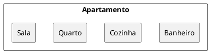

<figcaption> Um objeto como um conjuto de outros objetos.</figcaption>
</figure>


- Um Objeto é uma entidade independente que armazena dados, encapsula serviços, troca mensagens com outros objetos e é modelado para executar as funções do sistema
- Um Objeto pode ser descrito pela identificação de dois elementos básicos: estrutura e comportamento

::: tip Exemplo 
Objeto do tipo **Pessoa**
- **Estrutura** : nome, cpf, idade
- **Comportamento** : trabalhar, descansar
:::

::: tip Exemplo
Objeto do tipo **Conta**
- **Estrutura:** titular, código, saldo
- **Comportamento:** debitarValor, adicionarValor
:::

### Mensagens

- São estímulos enviados aos objetos solicitando que alguma operação seja realizada por um dado objeto
  - Nome da mensagem
  - Parâmetros
- Especifica O QUE deve ser feito
- O comportamento de um objeto é dado pelo conjunto de mensagens que ele pode responder
  
### Características dos Objetos
- Único
- Possui atributos que definem caraterísticas e/ou estado 
- Possuem capacidade de realizar ações que chamamos de métodos ou funções
- Normalmente se diz que um objeto é uma instância de uma Classe.
- O que é uma Classe ?

## Classe

### Origem do termo
- A palavra classe vem da taxonomia da biologia. 
  - Todos os seres vivos de uma mesma classe biológica têm uma série de atributos e comportamentos em comum, mas não são iguais, podem variar nos valores desses atributos e como realizam esses comportamentos.
- Homo Sapiens define um grupo de seres que possuem características em comum
  - Homo Sapiens é um ser humano?
  - Tudo está especificado na classe Homo Sapiens, mas se quisermos mandar alguém correr, comer, pular, precisaremos de uma instância de Homo Sapiens, ou então de um objeto do tipo Homo Sapiens.
### Analogias
- Uma receita de bolo. 
  - Você come uma receita de bolo? 
    - Precisamos instaciá-la, criar um objeto bolo a partir dessa especificação (a classe) para utilizá-la. 
    - Podemos criar centenas de bolos a partir dessa classe (a receita, no caso), eles podem ser bem semelhantes, alguns até idênticos, mas são objetos diferentes.
- A planta de uma casa é uma casa?...
### Conceito
- Uma classe é uma descrição de um conjunto que compartilham os mesmos atributos(características), operações, relacionamentos e semântica
- Todos os objetos são instâncias de classes, onde a classe descreve as propriedades e comportamentos daquele objeto
- **Atributos** são propriedades de uma classe, que descreve um intervalo de valores que as instâncias podem apresentar. Uma Classe pode ter qualquer número de atributos ou nenhum
- **Operações** correspondem aos processos que a classe pode realizar
  
<figure>

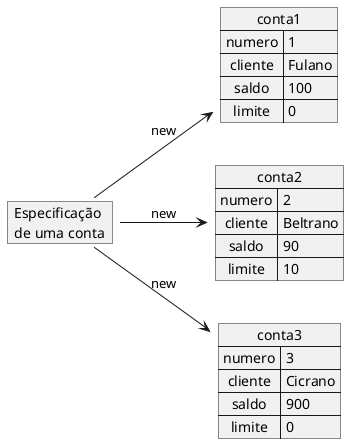

<figcaption> Representação de vários objetos de uma mesma estrutura.</figcaption>
</figure>

 - Estrutura (molde) que define os atributos e/ou estados de um conjunto de objetos com características similares.
 - Define o comportamento de seus objetos (ações que o objeto pode fazer) através de métodos. 
 - Descreve os serviços (ações) providos por seus objetos 
 - Quais informações eles podem armazenar

```java
class Conta{
  int numero;
  String cliente;
  double saldo;
  double limite;
}
```

#### Usando a classe

```java
class Programa{
  public static void main(String[] args){
    new Conta();
  }
}
```

- Objeto criado, mas como acessar?


```java
class Programa{
  public static void main(String[] args){
    Conta minhaConta;
    minhaConta = new Conta();
  }
}
```
- Através da variável minhaConta, podemos acessar o objeto recém criado para alterar seu cliente, seu saldo, etc

```java
class Programa{
  public static void main(String[] args){
    Conta minhaConta;
    minhaConta = new Conta();

    minhaConta.cliente = "Leandro";
    minhaConta.saldo = 10.0;

    System.out.println("Saldo atual: "+minhaConta.saldo);
  }
}
```


### Atributos de uma Classe


- Caraterísticas e/ou estado de uma classe
- Após a classe ser instanciada em um objeto os atributos vão receber valores (caraterísticas e/ou estados) que definem o objeto

```java{2-5}
class Conta{
  int numero;//atributo
  String cliente;//atributo
  double saldo;//atributo
  double limite;//atributo
}
```


### Métodos de uma Classe


- Conjunto de ações que um determinado objeto pode executar
- Definem o que um objeto pode fazer
- São acionados por outros objetos
  - Os objetos se comunicam através de métodos
  - Troca de mensagens

- Um método que saca uma determinada quantidade e não devolve nenhuma informação para quem acionar esse método

```java{7-10}
class Conta{
  int numero;
  String cliente;
  double saldo;
  double limite;

  void saca(double quantidade){//método
    double novoSaldo = this.saldo - quantidade;
    this.saldo = novoSaldo;
  }
}
```

 - Fazer um depósito
```java{7-10,12-14}
class Conta{
  int numero;
  String cliente;
  double saldo;
  double limite;

  void saca(double quantidade){//método
    double novoSaldo = this.saldo - quantidade;
    this.saldo = novoSaldo;
  }

  void deposita(double quantidade){//método
    this.saldo += quantidade;
  }
}
```


```java
class Programa{
  public static void main(String[] args){
    Conta minhaConta;
    minhaConta = new Conta();

    minhaConta.cliente = "Leandro";
    minhaConta.saldo = 100.0;

    //saca 20
    minhaConta.saca(20);
    //deposita 50
    minhaConta.deposita(50);

    System.out.println("Saldo atual: "+minhaConta.saldo);
  }
}
```


- Método com retorno
  - No caso do nosso método saca, podemos devolver um valor booleano indicando se a operação foi bem sucedida.


```java
class Conta{
  //...

  boolean saca(double valor){
    if(this.saldo<valor){
      return false;
    }else{
      this.saldo -= valor;
      return true;
    }
  }

}
```

```java
class Programa{
  public static void main(String[] args){
    //... 
    minhaConta.saldo = 100.0;

    boolean consegui=minhaConta.saca(20);
    if(consegui){
      System.out.println("Consegui sacar");
    }else{
      System.out.println("Não consegui sacar");
    }
  }
}
```

### Referência ao Objeto

```java
class Programa{
  public static void main(String[] args){
    Conta c1;
    c1 = new Conta();
    Conta c2;
    c2 = new Conta();
  }
}
```

- c1 uma variável que "aponta" para o objeto(referência).

<figure>

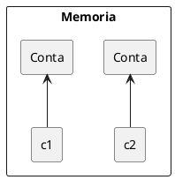

<figcaption> Representação da memória com duas instancias de Conta.</figcaption>
</figure>


```java
class Programa{
  public static void main(String[] args){
    Conta c1;
    c1 = new Conta();
    Conta c2 = c1;    
  }
}
```

<figure>

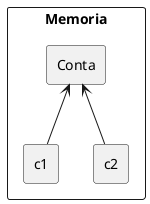

<figcaption> Representação da memória com apenas uma instancia de Conta.</figcaption>
</figure>

::: warning ?
Como seria a transferência de valores entre duas contas?
:::

#### Comparando

```java
public static void main(String args[]) {
  Conta c1 = new Conta();
  c1.cliente = "Leandro";    
  c1.saldo = 100.0;    
  Conta c2 = new Conta();    
  c2.cliente = "Leandro";    
  c2.saldo = 100.0;    
  if (c1 == c2) {
    System.out.println("Contas iguais");    
  }
}
```

- O operador `==` compara o conteúdo das variáveis
  - variáveis não guardam o objeto, e sim o endereço em que ele se encontra (referência)
  - As contas podem ser equivalentes no nosso critério de igualdade, porém elas não são o mesmo objeto.


##### equals

```java
public static void main(String args[]) {
  Conta c1 = new Conta();
  c1.cliente = "Leandro";    
  c1.saldo = 100.0;    
  Conta c2 = new Conta();    
  c2.cliente = "Leandro";    
  c2.saldo = 100.0;    
  if (c1.equals(c2)) {
    System.out.println("Contas iguais");    
  }
}
```

```java
class Conta {
  //...
  public boolean equals(Conta outraConta) {
    return this.cliente.equals(outraConta.cliente) && this.saldo == outraConta.saldo;
  }
  //...
  
}
```


## Construtor

- Método especial definido na classe e executado no momento que o objeto é instanciado
- Diferente de outro método pois não possui retorno
- Deve ter o mesmo nome da classe.
- Pode receber parâmetros
  - Normalmente utilizados para inicializar os valores dos atributos do objeto

```java{7-9}
class Conta{
  int numero;
  String cliente;
  double saldo;
  double limite;

  Conta(){

  }

  void saca(double quantidade){
    double novoSaldo = this.saldo - quantidade;
    this.saldo = novoSaldo;
  }

  void deposita(double quantidade){
    this.saldo += quantidade;
  }
}
```

### O que o new faz?

- A classe chamada é instanciada
- Memória é alocada
- Os passos definidos dentro do método construtor da classe são executados
  - Construtor é um método especial para criar e inicializar novas instâncias da classe. 
  - Construtores podem ser sobrecarregados


```java
class Conta{
  //...
  Conta(){
    this.limite = 100;
  }
  //...
}
```


### Sobrecarga 

- É a capacidade de definir métodos com o mesmo nome
  - Assinatura seja diferente. 
  - A mudança na assinatura ocorre alterando a quantidade e/ou tipo de parâmetros que um método recebe


- Sobrecarga é a capacidade de um objeto responder à mesma mensagem, com comportamentos (métodos) distintos, a depender dos tipos dos parâmetros recebidos
  - aplicarInjecao()
  - aplicarInjecao(String nomeRemedio)


```java
//...
public int somar(int v1, int v2){ 
    return v1 + v2; 
} 

public int operar(int v1, int v2){ 
    return operar('+', v1, v2); 
} 

public int operar(char op, int v1, int v2){ 
  switch(op){ 
    case '+': 
      return somar(v1, v2); 
      break; 
    case '-': 
      return subtrair(v1, v2); 
  } 
}
//...
```


```java
class Conta{
  //...
  Conta(int numero, String cliente){
    this.numero = numero;
    this.cliente = cliente;
    this.saldo = 0;
    this.limite = 0;
  }
  Conta(int numero, String cliente, double saldo, double limite){
    this(numero, cliente);
    this.saldo = saldo;
    this.limite = limite;
  }

  //...
}
```

```java
class Programa{
  public static void main(String[] args){
    Conta minhaConta1;
    minhaConta1 = new Conta(1, "Leandro1");
    minhaConta1.saldo = 100;
    Conta minhaConta2;
    minhaConta2 = new Conta(2, "Leandro2", 100, 0);   
  }
}
```

## Estereótipo de uma Classe em UML

<figure>

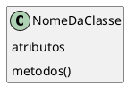

<figcaption>Modelo de uma classe em UML.</figcaption>
</figure>


### Estrutura básica de uma classe

```java{3-5,7-11,13-18}
public class Carro {

    private String cor;
    private String marca;
    private int velocidade;

    public Carro(String cor, String marca){
        this.cor = cor;
        this.marca = marca;
        velocidade = 0;
    }

    public void acelerar(){
        velocidade++;
    }
    public void parar(){
        velocidade = 0; 
    }
}

```

```java
class Programa{
  public static void main(String[] args){
    Carro c1 = new Carro("vermelha","BMW");
    //Carro c2 = new Carro();// ERRO
  }
}

```

### Representação UML

<figure>

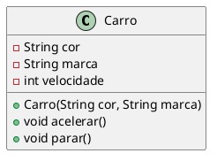

<figcaption> UML da classe carro.</figcaption>
</figure>

- A UML é uma notação que podemos utilizar para representar classes e objetos em modelos computacionais

- Linguagem para representação de modelos visuais com um significado especifico e padronizado

- UML não é uma linguagem de programação

- Os modelos são representados através de diagramas que possuem semântica própria
O diagrama que representa a descrição das classes é o **Diagrama de Classes**


### Domínio de Aplicação

- Um domínio é composto pelas entidades, informações e processos relacionados a um determinado contexto.
- Uma aplicação pode ser desenvolvida para automatizar ou tornar factível as tarefas de um domínio. 
- Portanto, uma aplicação é basicamente o "reflexo" de um domínio.
- Para exemplificar, suponha que estamos interessados em desenvolver uma aplicação para facilitar as tarefas do cotidiano de um banco. Podemos identificar clientes, funcionários, agências e contas como entidades desse domínio. Assim como podemos identificar as informações e os processos relacionados a essas entidades.

#### Outras classes do domínio de um sistema bancário

<figure>

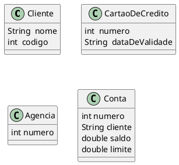

<figcaption> UML de classes do domínio bancários.</figcaption>
</figure>


## Membros de instância e Membros de classes


- Variáveis de Classe
  - Quando um número de objetos são criados a partir de uma mesma classe, cada um tem suas próprias cópias distintas de variáveis de instância. 
  - No caso de a classe de bicicleta, são as variáveis de instância engrenagem e velocidade. Cada objeto de bicicleta tem seus próprios valores para essas variáveis, armazenadas em diferentes locais de memória.
- Às vezes, é necessário ter variáveis que são comuns a todos os objetos. 
- Isto é conseguido com o modificador `static`. 
- Os campos que têm o modificador `static` em sua declaração são chamados de **campos estáticos ou variáveis de classe.** 
- Eles estão associados com a classe. Cada instância compartilha uma variável de classe, que está em um local fixo na memória. 
- Qualquer objeto pode alterar o valor de uma variável de classe, mas variáveis de classe também pode ser manipulado sem criar uma instância da classe.
  - exemplo:
    - Caso seja necessário criar um número de objetos de bicicleta e atribuir a cada um número de série, começando com 1 para o primeiro objeto. 
    - Esse número de identificação é única para cada objeto e é, portanto, uma variável de instância. 
    - Ao mesmo tempo, você precisa de um campo para manter o controle de quantos objetos bicicletas foram criadas para que você saiba o ID para atribuir ao próximo. 
    - Esse campo não está relacionada a qualquer objeto individual, mas para a classe como um todo. 
    - Para isso, você precisa de uma variável de classe, numeroDeBicicletas:

```java
public class Bicicleta {
  private int engrenagem;
  private int velocidade;
  private int id;
  private static int numeroDeBicicletas = 0;
  ...
}
```
- Variáveis de classe são referenciados pelo próprio nome da classe:
  ```java
  Bicicleta.numeroDeBicicletas
  ```
- Também é possível consultar a campos estáticos com uma referência de objeto como:
  ```java
  Bicicleta minhaBicicleta = new Bicicleta();
  minhaBicicleta.numeroDeBicicletas;
  ```
  mas isso não deixa claro que é um atributo de classe e não de instancia, é recomendado que sempre que for acessar um atributo de classe acessar pela classe.

- No construtor da Bicicleta pode ser setado o valor do atributo ID incrementar a variável de classe numeroDeBicicletas:
```java
public class Bicicleta {
  ... 
  private static int numeroDeBicicletas = 0;
  public Bicicleta(){
    this.id = ++numeroDeBicicletas;
  }
  public int getID() {
    return id;
  }
}
```

```java
public class Main {
    public static void main (String arg[]) {
      Bicicleta bicicleta1 = new Bicicleta();
      bicicleta1.setVelocidade(1);
      Bicicleta bicicleta2 = new Bicicleta();
      bicicleta2.setVelocidade(2);
    }
}
```

<figure>

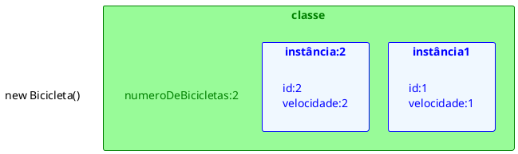

<figcaption>Atributos de classe e de instância.</figcaption>
</figure>

### Métodos estáticos
- A linguagem de programação Java suporta métodos estáticos, bem como variáveis estáticas. 
- Os métodos estáticos, que têm o modificador static em suas declarações, deve ser chamado com o nome da classe, sem a necessidade de criação de uma instância da classe

```java
ClassName.methodName(args)
```

- Um uso comum para métodos estáticos é acessar campos estáticos. Por exemplo, nós poderíamos adicionar um método estático para a classe de bicicleta para acessar o campo estático numeroDeBicicletas:

```java{10-12}
public class Bicicleta {
  //... 
  private static int numeroDeBicicletas = 0;
  public Bicicleta(){
    this.id = ++numeroDeBicicletas;
  }
  public int getID() {
    return id;
  }
  public static int getNumeroDeBicicletas() {
    return numeroDeBicicletas;
  }
}

```
- Nem todas as combinações de variáveis e métodos de classe e de instância são permitidas:
  - Métodos de instância podem acessar variáveis de instância e métodos de instância diretamente.
  - Métodos de instância podem acessar variáveis de classe e métodos de classe diretamente.
  - Métodos de classe podem acessar variáveis de classe e métodos de classe diretamente.
  - Métodos de classe não podem acessar variáveis de instância ou métodos de instância diretamente, eles devem usar uma referência de objeto. Além disso, métodos de classe não pode usar a palavra-chave `this`.

### Constantes

- O modificador *static,* em combinação com o modificador *final,* é também usado para definir constantes. 
- O modificador *final* indica que o valor deste campo não pode mudar.

#### Static final

- Por exemplo, a seguinte declaração variável define uma constante chamada PI, cujo valor é uma aproximação do pi

```java
static final double PI = 3.141592653589793;
```

- Constantes definidas desta forma não pode ser alteradas, um erro de compilação ocorrerá caso seu programa tenta fazer isso. 
- Por convenção, os nomes das constantes estão escritas em letras maiúsculas. 
- Se o nome for composto por mais de uma palavra, as palavras são separadas por um sublinhado (_).


## Associações
- Forma como uma classe se relaciona com outra classe
- Uma classe pode conter atributos que geram instâncias de outra classe
    - Uma classe pode conter outra classe como atributo
    - Quando isto ocorre dizemos que uma classe possui outra classe associada a ela

    
<figure>

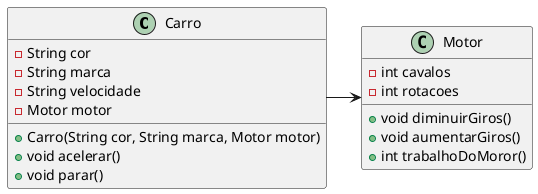

<figcaption>Exemplo de Associação.</figcaption>
</figure>

### Agregação
- A classe contida não é instanciada no escopo da classe principal
    - Não depende da principal para existir 
    - Normalmente é passada por parâmetro

- Agregação é uma associação em que um objeto é parte de outro, de tal forma que a parte pode existir sem o todo.
- Em mais baixo nível, uma agregação consiste de um objeto contendo referências para outros objetos, de tal forma que o primeiro seja o todo, e que os objetos referenciados sejam as partes do todo.

<figure>

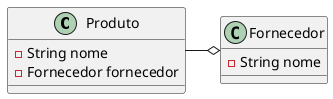

<figcaption>Exemplo de Agregação.</figcaption>
</figure>


### Composição
- A classe contida é instanciada pela classe principal 
- Quando uma classe principal é retirada da memória, as outras classes também são.
- O todo contém as partes (e não referências para as partes). Quando o todo desaparece, todas as partes também desaparecem.

<figure>

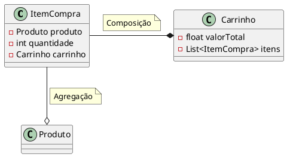

<figcaption>Exemplo de Composição.</figcaption>
</figure>


## Encapsulamento

- Separar o programa em partes, tornando cada parte mais isolada possível uma da outra
- A ideia é tornar o software mais flexível, fácil de modificar e de criar novas implementações
- Permite utilizar o objeto de uma classe sem necessariamente conhecer sua implementação
- Protege o acesso direto aos atributos de uma instância fora da classe onde estes foram criados
- Uma grande vantagem do encapsulamento é que toda parte encapsulada pode ser modificada sem que os usuários da classe em questão sejam afetados

### Pacotes
- Forma de organizar classes dentro de uma estrutura de árvores. 
- Podemos entender a estrutura de árvores como os diretórios do sistema operacional. 
- O nome completo de uma classe é definido pelo seu pacote e o nome. 
- Organiza suas classes e bibliotecas
    - Os diretórios estão diretamente relacionados aos chamados pacotes e costumam agrupar classes de funcionalidade parecida
- No pacote java.util por exemplo, temos as classes Date, SimpleDateFormat e GregorianCalendar; todas elas trabalham com datas de formas diferentes
    - Significa que essas classes estão no diretório java/util/

<figure>

```plantuml
@startuml
@startsalt

{
    {T
        + java
        ++ util
        +++ Date
    }
}

@endsalt
@enduml
```

<figcaption>Representação da estrutura de diretório.</figcaption>
</figure>

- A palavra chave *package* indica qual pacote que contém a classe

```java
package java.util;
```

- Para usar uma classe ou um pacote você precisa usar a import palavra-chave:

```java
import pacote.Class;   // Importa uma única classe
import pacotenovo.*;   // Importa todas as classes do pacote
```
<figure>
<div class="multicolumn">

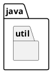


</div>
<figcaption>Visualizações diferentes de subpacotes</figcaption>
</figure>

- O nome da classe na verdade para o compilador é
    - java.util.Date
    - java.util.SimpleDateFormat
    - java.util.GregorianCalendar
    - java.io.File

<figure>

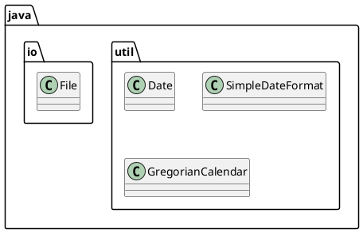

<figcaption>Representação de classes em seus pacotes.</figcaption>
</figure>

### Importar uma classe

Se você encontrar uma classe que deseja usar, por exemplo, a classe *Scanner*, que é usada para obter a entrada do usuário, escreva o seguinte código:

```java
import java.util.Scanner;
```
No exemplo acima, *java.util* é um pacote, enquanto *Scanner* é uma classe do pacote *java.util*.

Para usar a classe *Scanner*, crie um objeto da classe e use qualquer um dos métodos disponíveis encontrados na documentação da classe *Scanner*. Em nosso exemplo, usaremos o método *nextLine()*, que é usado para ler uma linha completa:

```java
import java.util.Scanner;

class Main {
  public static void main(String[] args) {
    Scanner scanner = new Scanner(System.in);
    System.out.println("Informe o nome");

    String nome = scanner.nextLine();
    System.out.println("nome é : " + nome);
  }
}
```
#### Usar uma classe sem import

Para utilizar uma classe sem a palavra reservada `import` você pode referenciar a classe pelo nome completo (pacote.nomeClasse). Exemplo:

```java{3}
class Main {
  public static void main(String[] args) {
    java.util.Scanner scanner = new java.util.Scanner(System.in);
    System.out.println("Informe o nome");

    String nome = scanner.nextLine();
    System.out.println("nome é : " + nome);
  }
}
```


### Modificadores de acesso
- private
- protected
- public
- <padrão> (package, quando não é especificado nenhum dos 3 acima)

<figure>

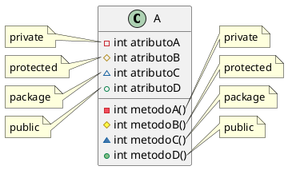

<figcaption>Modificadores de acesso.</figcaption>
</figure>

- São aplicados a atributos, métodos, construtores e classes
- As classes só podem ser declaradas como public ou padrão
    - Uma classe com acesso padrão só pode ser detectada por classes do mesmo pacote
    - Uma classe com acesso público pode ser detectada por classes de todos os pacotes

- Private
    - Os membros privados só podem ser acessados por um código da mesma classe 
- Protected
    - Os membros protegidos podem ser acessados por outras classes do mesmo pacote, além de subclasses independente do pacote 
- Public
    - Os membros públicos podem ser acessados por todas as outras classes, mesmo de pacotes diferentes
- Padrão
    - Os membros padrão só podem ser acessados por outras classes do mesmo pacote

#### Métodos de acesso (get e set)

Como os atributos/métodos privados ​​só podem ser acessadas dentro da mesma classe (uma classe externa não tem acesso a ela) é possível acessá-los se fornecermos métodos públicos *get* e *set*.

O *get* retorna o valor da variável e o *set* define o valor.

A sintaxe para ambos é que eles começam com *get* ou *set* seguido pelo nome do atributo com a primeira letra em maiúscula:

```java
public class Pessoa {
  private String nome; // private = acesso restrito
  // Get
  public String getNome() {
    return nome;
  }
  // Set
  public void setNome(String novoNome) {
    if(novoNome!= null && !novoNome.isEmpty() && !novoNome.isBlank()){
      this.nome = novoNome;
    }
  }
}
```
O método *get* retorna o valor da variável name.

O método *set* pega um parâmetro ( novoNome) e o atribui ao atributo *nome*. 

A palavra-chave `this` é usada para se referir ao objeto atual.

No entanto, como o atributo `name` é declarada como `private`, não podemos acessá-la de fora desta classe:

```java
public class Main {
  public static void main(String[] args) {
    Pessoa pessoa = new Pessoa();
    pessoa.nome = "João";  // error
    System.out.println(pessoa.nome); // error 
  }
}
```

Se o atributo foi declarada como *public,* esperaríamos a seguinte saída:
```shell
    João
```

No entanto, ao tentar acessar um atributo *private,* obtemos um erro:

```shell
    Main.java:4: error: nome has private access in Pessoa
        pessoa.nome = "João";
              ^
    Main.java:5: error: nome has private access in Pessoa
        System.out.println(pessoa.nome);
                                 ^
    2 errors
```
    
Em vez disso, usamos os métodos getNome()e setNome()para acessar e atualizar a variável:

Exemplo
```java
public class Main {
  public static void main(String[] args) {
    Pessoa pessoa = new Pessoa();
    pessoa.setNome("João"); // Seta o valor do atributo nome para "João"
    System.out.println(pessoa.getNome());
  }
}
```
saida 

```shell
    "João"
```
 
 
### Por que encapsulamento?

- Melhor controle dos atributos e métodos da classe
- Os atributos de classe podem ser somente leitura (se você usar apenas o método *get*) ou somente gravação (se você usar apenas o método *set*)
- Flexível: o programador pode alterar uma parte do código sem afetar outras partes
- Maior segurança de dados


## Referências

<!-- @include: ../bib/bib.md -->