# Revisão POO parte 2

## Herança

[^Takenami]

- É a capacidade de uma classe definir o seu comportamento e sua estrutura aproveitando definições de outra classe, normalmente conhecida como classe base ou classe pai
    - As subclasses herdam tudo o que a classe pai possui e acrescenta as suas características particulares
    - Através do mecanismo de herança é possível definirmos classes genéricas que agreguem um conjunto de definições comuns a um grande número de objetos(Generalização) 
    - A partir destas especializações genéricas podemos construir novas classes, mais específicas, que acrescentem novas características e comportamentos aos já existentes (Especialização)

- Capacidade que uma classe tem de herdar as características e comportamentos de outra classe
- Classe pai é chamada de superclasse e a filha de subclasse
- Em Java só é permitido herdar de uma única classe, ou seja, não permite herança múltipla
- O objetivo da herança é especializar o entendimento de uma classe criando novas características e comportamentos que vão além da superclasse 
- Ao mesmo tempo que a especialização amplia o entendimento de uma classe, a generalização vai no sentido inverso e define um modelo menos especializado  e  mais genérico


```java
public class Mamifero{
    private int altura;
    private double peso;
    public void mamar(){
        System.out.println("Mamifero mamando");
    }
}
```

```java
public class Morcego extends Mamifero{
    private double tamanhoPresa;
    public void voar(){
        System.out.println("Morcego voando");
    }
}
```
- Classe Morcego
    - Quais as características de morcego?
        - altura
        - peso
        - tamanhoPresa
    - Quais ações o morcego pode fazer?
        - mamar
        - voar
- Se usarmos os princípios de lógica podemos dizer que todo morcego é mamífero porém NÃO podemos afirmar que todo mamífero é morcego

```java
Mamifero animalMamifero = new Morcego();
Morcego batman = new Mamifero();//erro
```

- Com base no que foi dito até aqui podemos deduzir que o item 2 deve causar um erro já que não é possível garantir que todo mamífero seja um morcego
- Já o item 1 pode parecer estranho, pois a variável é do tipo Mamífero e o objeto para o qual a variável se refere é do tipo Morcego
    - Devemos saber que toda variável pode receber um objeto que seja compatível com o seu tipo e neste caso todo Morcego CERTAMENTE **é um** Mamífero

```java
Mamifero animalMamifero = new Morcego();
animalMamifero.mamar();
animalMamifero.voar();//erro
```
- Todo `Morcego` **é um** `Mamifero`, porem não pode realizar todas as ações de um `morcego`
- A variável `animalMamifero` que recebe o objeto é do tipo `Mamifero`
- Para o `Morcego` `voar` é necessário criar uma nova variável do tipo `Morcego` e atribuir o objeto que estava na variável `animalMamifero`
```java
Mamifero animalMamifero = new Morcego();
animalMamifero.mamar();
Morcego batman = (Morcego)animalMamifero;
batman.voar();
```
- Este tipo de operação recebe o nome de **TYPE CAST**

<figure>

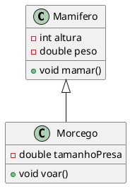

<figcaption> UML Herança Morcego e Mamifero.</figcaption>
</figure>

<figure>

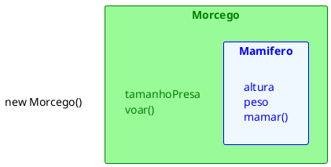

<figcaption>Criando um objeto a partir da subclasse.</figcaption>
</figure>


 ### Outros exemplos


#### Caelum 

[^caelumoo]

Como toda empresa, nosso Banco possui funcionários. Vamos modelar a classe `Funcionario`:

```java
class Funcionario {
    String nome;
    String cpf;
    double salario;
    // métodos devem vir aqui
}
```

Além de um funcionário comum, há também outros cargos, como os gerentes. Os gerentes guardam a mesma informação que um funcionário comum, mas possuem outras informações, além de ter funcionalidades um pouco diferentes. Um gerente no nosso banco possui também uma senha numérica que permite o acesso ao sistema interno do banco, além do número de funcionários que ele gerencia:


```java{2-4}
class Gerente {
    String nome;
    String cpf;
    double salario;
    int senha;
    int numeroDeFuncionariosGerenciados;
    public boolean autentica(int senha) {
        if (this.senha == senha) {
            System.out.println("Acesso Permitido!");
            return true;
        } else {
            System.out.println("Acesso Negado!");
            return false;
        }
    }
    // outros métodos
}
```

::: warning Precisamos mesmo de outra classe?
Poderíamos ter deixado a classe `Funcionario` mais genérica, mantendo nela senha de acesso, e o número de funcionários gerenciados. Caso o funcionário não fosse um gerente, deixaríamos estes atributos vazios.

Essa é uma possibilidade, porém podemos começar a ter muito atributos opcionais, e a classe ficaria estranha. E em relação aos métodos? A classe Gerente tem o método autentica, que não faz sentido existir em um funcionário que não é gerente
:::

Se tivéssemos um outro tipo de funcionário que tem características diferentes do funcionário comum, precisaríamos criar uma outra classe e copiar o código novamente!

Além disso, se um dia precisarmos adicionar uma nova informação para todos os funcionários, precisaremos passar por todas as classes de funcionário e adicionar esse atributo. O problema acontece novamente por não centralizarmos as informações principais do funcionário em um único lugar!

Existe um jeito, em Java, de relacionarmos uma classe de tal maneira que uma delas **herda** tudo que a outra tem. Isto é uma relação de classe mãe e classe filha. No nosso caso, gostaríamos de fazer com que o `Gerente` tivesse tudo que um `Funcionario` tem, gostaríamos que ela fosse uma **extensão** de `Funcionario`. Fazemos isto através da palavra chave `extends`.

```java
class Gerente extends Funcionario {
    int senha;
    int numeroDeFuncionariosGerenciados;
    public boolean autentica(int senha) {
        if (this.senha == senha) {
            System.out.println("Acesso Permitido!");
            return true;
        } else {
            System.out.println("Acesso Negado!");
            return false;
        }
    }
    // setter da senha omitido
}
```

Em todo momento que criarmos um objeto do tipo Gerente, este objeto possuirá também os atributos definidos na classe Funcionario, pois um Gerente **é um** Funcionario:

<figure>

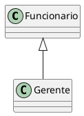

<figcaption>Herança entre Funcionario e Gerente.</figcaption>
</figure>


<figure>

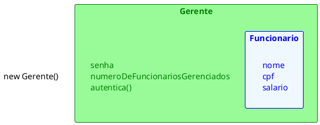

<figcaption>Criando um objeto a partir da subclasse.</figcaption>
</figure>


```java
class TestaGerente {
    public static void main(String[] args) {
        Gerente gerente = new Gerente();
        // podemos chamar métodos do Funcionario:
        gerente.setNome("João da Silva");
        // e também métodos do Gerente!
        gerente.setSenha(4231);
    }
}
```

Dizemos que a classe `Gerente` **herda** todos os atributos e métodos da classe mãe, no nosso caso, a `Funcionario`. Para ser mais preciso, ela também herda os atributos e métodos privados, porém não consegue acessá-los diretamente. Para acessar um membro privado na filha indiretamente, seria necessário que a mãe expusesse um outro método visível que invocasse esse atributo ou método privado.


::: tip Super e Sub classe
A nomenclatura mais encontrada é que `Funcionario` é a superclasse de `Gerente`, e `Gerente` é a subclasse de `Funcionario`. Dizemos também que todo `Gerente` **é um** `Funcionario`. Outra forma é dizer que `Funcionario` é classe mãe de `Gerente` e `Gerente` é classe filha de `Funcionario`.
:::

E se precisamos acessar os atributos que herdamos? Não gostaríamos de deixar os atributos de `Funcionario` **public**, pois dessa maneira qualquer um poderia alterar os atributos dos objetos deste tipo. Existe um outro modificador de acesso, o **protected**, que fica entre o **private** e o **public**. Um atributo **protected** só pode ser acessado (visível) pela própria classe e por suas subclasses (e mais algumas outras classes, mas veremos isso mais adiante).
```java
class Funcionario {
    protected String nome;
    protected String cpf;
    protected double salario;
    // métodos devem vir aqui
}
```

::: tip Sempre usar protected?

Então porque usar private? Depois de um tempo programando orientado a objetos, você vai começar a sentir que nem sempre é uma boa ideia deixar que a classe filha acesse os atributos da classe mãe, pois isso quebra um pouco a ideia de que só aquela classe deveria manipular seus atributos. Essa é uma discussão um pouco mais avançada.

Além disso, não só as subclasses, mas também as outras classes, podem acessar os atributos protected, que veremos mais a frente (mesmo pacote).
:::


Da mesma maneira, podemos ter uma classe `Diretor` que estenda `Gerente` e a classe `Presidente` pode estender diretamente de `Funcionario`.

Fique claro que essa é uma decisão de negócio. Se `Diretor` vai estender de `Gerente` ou não, vai depender se, para você, `Diretor` **é um** `Gerente`.

Uma classe pode ter várias filhas, mas pode ter apenas uma mãe, é a chamada herança simples do java.


<figure>

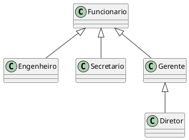

<figcaption>Herança de Diretor, Engenheiro, Secretario, Gerente com Funcionario</figcaption>
</figure>


#### K19

[^k19oo]

##### Reutilização de Código
Um banco oferece diversos serviços que podem ser contratados individualmente pelos clientes. Quando um serviço é contratado, o sistema do banco deve registrar quem foi o cliente que contratou o serviço, quem foi o funcionário responsável pelo atendimento ao cliente e a data de contratação.

Com o intuito de ser produtivo, a modelagem dos serviços do banco deve diminuir a repetição de código. A ideia é reaproveitar o máximo do código já criado. Essa ideia está diretamente relacionada ao conceito Don’t Repeat Yourself. Em outras palavras, devemos minimizar ao máximo a utilização do "copiar e colar". O aumento da produtividade e a diminuição do custo de manutenção são as principais motivações do DRY.

Em seguida, vamos discutir algumas modelagens possíveis para os serviços do banco. Buscaremos seguir a ideia do DRY na criação dessas modelagens.

##### Uma classe para todos os serviços

Poderíamos definir apenas uma classe para modelar todos os tipos de serviços que o banco oferece.

```java
class Servico {
    private Cliente contratante ;
    private Funcionario responsavel ;
    private LocalDate dataDeContratacao ;
    // métodos
}
```

###### Empréstimo

O empréstimo é um dos serviços que o banco oferece. Quando um cliente contrata esse serviço, são definidos o valor e a taxa de juros mensal do empréstimo. Devemos acrescentar dois atributos na classe `Servico`: um para o valor e outro para a taxa de juros do serviço de empréstimo.

```java
class Servico {
    // GERAL
    private Cliente contratante;
    private Funcionario responsavel;
    private LocalDate dataDeContratacao;
    // EMPRÉSTIMO
    private double valor;
    private double taxa;
    // métodos
}
```

###### Seguro de veículos

Outro serviço oferecido pelo banco é o seguro de veículos. Para esse serviço devem ser definidas as seguintes informações: veículo segurado, valor do seguro e a franquia. Devemos adicionar três atributos na classe `Servico`.

```java
class Servico {
    // GERAL
    private Cliente contratante ;
    private Funcionario responsavel ;
    private LocalDate dataDeContratacao ;
    // EMPRÉSTIMO
    private double valor ;
    private double taxa ;
    // SEGURO DE VEICULO
    private Veiculo veiculo ;
    private double valorDoSeguroDeVeiculo ;
    private double franquia ;
    // métodos
}
```

Apesar de seguir a ideia do DRY, modelar todos os serviços com apenas uma classe pode dificultar o desenvolvimento. Supondo que dois ou mais desenvolvedores são responsáveis pela implementação dos serviços, eles provavelmente modificariam a mesma classe concorrentemente. Além disso, os desenvolvedores, principalmente os recém chegados no projeto do banco, ficariam confusos com o código extenso da classe `Servico`.

Outro problema é que um objeto da classe `Servico` possui atributos para todos os serviços que o banco oferece. Na verdade, ele deveria possuir apenas os atributos relacionados a um serviço. Do ponto de vista de performance, essa abordagem causaria um consumo desnecessário de memória. 

##### Uma classe para cada serviço

Para modelar melhor os serviços, evitando uma quantidade grande de atributos e métodos desnecessários, criaremos uma classe para cada serviço.

```java
class SeguroDeVeiculo {
    // GERAL
    private Cliente contratante ;
    private Funcionario responsavel ;
    private LocalDate dataDeContratacao ;
    // SEGURO DE VEICULO
    private Veiculo veiculo ;
    private double valorDoSeguroDeVeiculo ;
    private double franquia ;
    // métodos
}
```

```java
class Emprestimo {
    // GERAL
    private Cliente contratante ;
    private Funcionario responsavel ;
    private LocalDate dataDeContratacao ;
    // EMPRÉSTIMO
    private double valor ;
    private double taxa ;
    // métodos
}
```


Criar uma classe para cada serviço torna o sistema mais flexível, pois qualquer alteração em um determinado serviço não causará efeitos colaterais nos outros. Mas, por outro lado, essas classes teriam bastante código repetido, contrariando a ideia do DRY. Além disso, qualquer alteração que deva ser realizada em todos os serviços precisa ser implementada em cada uma das classes.

##### Uma classe genérica e várias específicas

Na modelagem dos serviços do banco, podemos aplicar um conceito de orientação a objetos chamado Herança. A ideia é reutilizar o código de uma determinada classe em outras classes.

Aplicando herança, teríamos a classe `Servico` com os atributos e métodos que todos os serviços devem ter e uma classe para cada serviço com os atributos e métodos específicos do determinado serviço.

As classes específicas seriam "ligadas" de alguma forma à classe `Servico` para reaproveitar o código nela definido. Esse relacionamento entre as classes é representado em UML pelo diagrama abaixo

<figure>

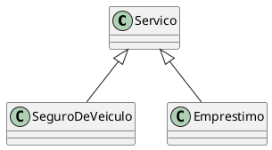

<figcaption>Árvore de herança dos serviços</figcaption>
</figure>


Os objetos das classes específicas `Emprestimo` e `SeguroDeVeiculo` possuiriam tanto os atributos e métodos definidos nessas classes quanto os definidos na classe `Servico`.

```java
Emprestimo e = new Emprestimo() ;
// Chamando um método da classe Servico
e.setDataDeContratacao(LocalDate.of(2020, Month.JANUARY, 8)) ;
// Chamando um método da classe Emprestimo
e.setValor(10000) ;
```

As classes específicas são vinculadas a classe genérica utilizando o comando extends. Não é necessário redefinir o conteúdo já declarado na classe genérica.

```java
class Servico {
    private Cliente contratante;
    private Funcionario responsavel;
    private LocalDate dataDeContratacao;
}
```

```java{1}
class Emprestimo extends Servico {
    private double valor;
    private double taxa;
}
```
```java{1}
class SeguroDeVeiculo extends Servico {
    private Veiculo veiculo;
    private double valorDoSeguroDeVeiculo;
    private double franquia;
}
```

A classe genérica é denominada super classe, classe base ou classe mãe. As classes específicas são denominadas sub classes, classes derivadas ou classes filhas.

Quando o operador `new` é aplicado em uma sub classe, o objeto construído possuirá os atributos e métodos definidos na sub classe e na super classe.

<figure>

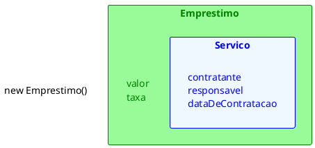

<figcaption>Criando um objeto a partir da subclasse.</figcaption>
</figure>


### Sobrecrita de Métodos

#### Caelum

[^caelumoo]

Todo fim de ano, os funcionários do nosso banco recebem uma bonificação. Os funcionários comuns recebem 10% do valor do salário e os gerentes, 15%.

Vamos ver como fica a classe Funcionario:

```java
class Funcionario {
    protected String nome;
    protected String cpf;
    protected double salario;
    public double getBonificacao() {
        return this.salario * 0.10;
    }
    // métodos
}
```

Se deixarmos a classe `Gerente` como ela está, ela vai herdar o método `getBonificacao`.

```java
Gerente gerente = new Gerente();
gerente.setSalario(5000.0);
System.out.println(gerente.getBonificacao());
```

O resultado aqui será `500`. Não queremos essa resposta, pois o gerente deveria ter `750` de bônus nesse caso. Para consertar isso, uma das opções seria criar um novo método na classe Gerente, chamado, por exemplo, `getBonificacaoDoGerente`. O problema é que teríamos dois métodos em Gerente, confundindo bastante quem for usar essa classe, além de que cada um da uma resposta diferente.

No Java, quando herdamos um método, podemos alterar seu comportamento. Podemos reescrever (reescrever, sobrescrever, override) este método:

```java
class Gerente extends Funcionario {
    int senha;
    int numeroDeFuncionariosGerenciados;
    public double getBonificacao() {
        return this.salario * 0.15;
    }
    // ...
}
```

Agora o método está correto para o `Gerente`. Refaça o teste e veja que o valor impresso é o correto `750`:
```java
Gerente gerente = new Gerente();
gerente.setSalario(5000.0);
System.out.println(gerente.getBonificacao());
```

:::tip  A anotação @Override
Há como deixar explícito no seu código que determinador método é a reescrita de um método da sua classe mãe. Fazemos isso colocando `@Override` em cima do método. Isso é chamado **anotação**. Existem diversas anotações e cada uma vai ter um efeito diferente sobre seu código.

```java
@Override
public double getBonificacao() {
    return this.salario * 0.15;
}
```

Perceba que, por questões de compatibilidade, isso não é obrigatório. Mas caso um método esteja anotado com `@Override`, ele necessariamente precisa estar reescrevendo um método da classe mãe.
:::

##### Invocando o método reescrito
Depois de reescrito, não podemos mais chamar o método antigo que fora herdado da classe mãe: realmente alteramos o seu comportamento. Mas podemos invocá-lo no caso de estarmos dentro da classe.

Imagine que para calcular a bonificação de um Gerente devemos fazer igual ao cálculo de um `Funcionario` porem adicionando R$ 1000. Poderíamos fazer assim:
```java
class Gerente extends Funcionario {
    int senha;
    int numeroDeFuncionariosGerenciados;
    public double getBonificacao() {
        return this.salario * 0.10 + 1000;
    }
    // ...
}
```

Aqui teríamos um problema: o dia que o `getBonificacao` do `Funcionario` mudar, precisaremos mudar o método do `Gerente` para acompanhar a nova bonificação. Para evitar isso, o `getBonificacao` do `Gerente` pode chamar o do `Funcionario` utilizando a palavra chave **super**.

```java
class Gerente extends Funcionario {
    int senha;
    int numeroDeFuncionariosGerenciados;
    public double getBonificacao() {
        return super.getBonificacao() + 1000;
    }
    // ...
}
```

Essa invocação vai procurar o método com o nome `getBonificacao` de uma super classe de `Gerente`. No caso ele logo vai encontrar esse método em `Funcionario`.

Essa é uma prática comum, pois muitos casos o método reescrito geralmente faz "algo a mais" que o método da classe mãe. Chamar ou não o método de cima é uma decisão sua e depende do seu problema. Algumas vezes não faz sentido invocar o método que reescrevemos.

#### K19

[^k19oo]

Suponha que o valor da taxa administrativa do serviço de empréstimo é diferente dos outros serviços, pois ele é calculado a partir do valor emprestado ao cliente. Como esta lógica é específica para o serviço de empréstimo, devemos acrescentar um método para implementar esse cálculo na classe `Emprestimo`.
```java
class Emprestimo extends Servico {
    // ATRIBUTOS
    public double calculaTaxaDeEmprestimo(){
        return this.valor * 0.1;
    }
}
```

Para os objetos da classe `Emprestimo`, devemos chamar o método `calculaTaxaDeEmprestimo()`.
Para todos os outros serviços, devemos chamar o método `calculaTaxa()`.

Mesmo assim, nada impediria que o método `calculaTaxa()` fosse chamado em um objeto da
classe `Emprestimo`, pois ela herda esse método da classe `Servico`. Dessa forma, existe o risco de alguém erroneamente chamar o método incorreto.

Seria mais seguro "substituir" a implementação do método `calculaTaxa()` herdado da classe
`Servico` na classe `Emprestimo`. Para isso, basta escrever o método `calculaTaxa()` também na classe `Emprestimo` com a mesma assinatura que ele possui na classe `Servico`.
```java
class Emprestimo extends Servico {
    // ATRIBUTOS
    public double calculaTaxa(){
        return this.valor * 0.1;
    }
}
```

Os métodos das classes específicas têm prioridade sobre os métodos das classes genéricas. Em outras palavras, se o método chamado existe na classe filha ele será chamado, caso contrário o método será procurado na classe mãe.

Quando definimos um método com a mesma assinatura na classe base e em alguma classe derivada, estamos aplicando o conceito de Reescrita de Método.

##### Fixo + Específico

Suponha que o preço de um serviço é a soma de um valor fixo mais um valor que depende do tipo
do serviço. Por exemplo, o preço do serviço de empréstimo é 5 reais mais uma porcentagem do valor emprestado ao cliente. O preço do serviço de seguro de veículo é 5 reais mais uma porcentagem do valor do veículo segurado. Em cada classe específica, podemos reescrever o método `calculaTaxa()`.

```java
class Emprestimo extends Servico {
    // ATRIBUTOS
    public double calculaTaxa(){
        return 5 + this.valor * 0.1;
    }
}
```

```java
class SeguraDeVeiculo extends Servico {
// ATRIBUTOS
    public double calculaTaxa(){
        return 5 + this.veiculo.getTaxa()* 0.05;
    }
}
```

Se o valor fixo dos serviços for atualizado, todas as classes específicas devem ser modificadas. Outra alternativa seria criar um método na classe `Servico` para calcular o valor fixo de todos os serviços e chamá-lo dos métodos reescritos nas classes específicas.

```java
class Servico {
    public double calculaTaxa(){
        return 5 ;
    }
}
```

```java
class Emprestimo extends Servico {
// ATRIBUTOS
    public double calculaTaxa(){
        return super.calculaTaxa()+ this.valor * 0.1;
    }
}
```

Dessa forma, quando o valor padrão do preço dos serviços é alterado, basta modificar o método
na classe `Servico`.

### Construtores e Herança

Quando temos uma hierarquia de classes, as chamadas dos construtores são mais complexas do que o normal. Pelo menos um construtor de cada classe de uma mesma sequência hierárquica deve ser chamado ao instanciar um objeto. Por exemplo, quando um objeto da classe Emprestimo é criado, pelo menos um construtor da própria classe Emprestimo e um da classe Servico devem ser executados. Além disso, os construtores das classes mais genéricas são chamados antes dos construtores das classes específicas.

```java
class Servico {
    // ATRIBUTOS
    public Servico(){
        System.out.println("Servico");
    }
}
```

```java
class Emprestimo extends Servico {
    // ATRIBUTOS
    public Emprestimo(){
        System.out.println("Emprestimo");
    }
}
```

Por padrão, todo construtor chama o construtor sem argumentos da classe mãe se não existir nenhuma chamada de construtor explícita.

```java
class TesteConstrutor {
    public static void main(String[] args) {
        new Emprestimo();
    }
}
```

<figure>
<div class="multicolumn">

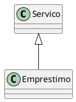

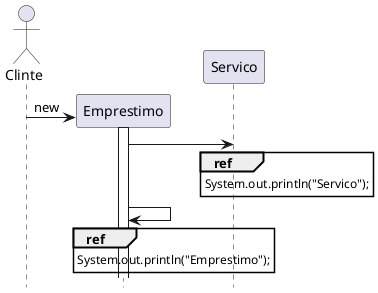
</div>
<figcaption>Execução do construtor com Herança</figcaption>
</figure>


## Polimorfismo

- É a possibilidade de se solicitar um serviço a um objeto, cuja execução vai depender do tipo de objeto instanciado

<figure>

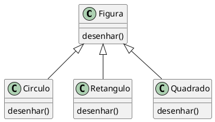

<figcaption>UML da relação entre Figura, Circulo, Retangulo e Quadrado.</figcaption>
</figure>

- `Círculo`, `Retangulo` e `Quadrado` são do tipo `Figura`. 
    - Método desenhar()
- O resultado depende do tipo de figura que receber a mensagem

- O polimorfismo permite escrever programas que processam objetos que compartilham a mesma superclasse em uma hierarquia de classe como se todas fossem objetos da superclasse.

- Sistema de simulação de movimento de Animais

<figure>

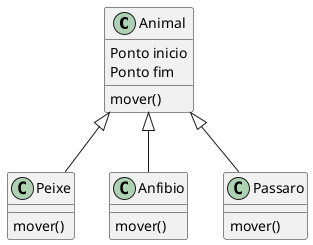

<figcaption>UML da relação entre Animal, Peixe, Anfíbio e Pássaro.</figcaption>
</figure>

- Peixes, Anfíbios, Pássaros
    - Superclasse Animal
        - Método mover
        - Localização x,y
    - Todas as subclasses implementam o método mover
- O programa envia a mensagem "mover" para os 3 objetos

```java
//...
Animal animal[] = new Animal[3];
//...
for(int i = 0; i < 3 ; i++){
    animal[i].mover();//como será o movimento desse animal?
}
//...
```

- Cada animal responde ao método mover de uma maneira diferente
    - O peixe pode nadar 2 metros
    - Anfíbio pular 1 metro
    - Pássaro voar 3 metros
- Cada objeto irá responder a mensagem "mover" de acordo com sua instancia
- Apesar de todos serem Animais o fato do método "mover" ter "muitas formas" é a chave do polimorfismo 
    - Polimorfismo vem de Polimorfo, "Que é sujeito a mudar de forma"


::: tip Definição
Polimorfismo possibilita tratar objetos de tipos mais especializados de forma genérica
:::

### Caelum 

[^caelumoo]

O que guarda uma variável do tipo `Funcionario`? Uma referência para um `Funcionario`, nunca o objeto em
si.

Na herança, vimos que todo `Gerente` **é um** `Funcionario`, pois é uma extensão deste. Podemos nos referir a um `Gerente` como sendo um `Funcionario`. Se alguém precisa falar com um `Funcionario` do banco, pode falar com um `Gerente`! Porque? Pois `Gerente` **é um** `Funcionario`. Essa é a semântica da herança.

```java
Gerente gerente = new Gerente();
Funcionario funcionario = gerente;
funcionario.setSalario(5000.0);
```

<figure>

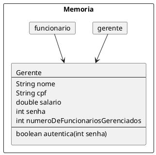


<figcaption>Representação da memória de duas variáveis para a mesmo referência.</figcaption>
</figure>


Polimorfismo é a capacidade de um objeto poder ser referenciado de várias formas. (cuidado, polimorfismo não quer dizer que o objeto fica se transformando, muito pelo contrário, um objeto nasce de um tipo e morre daquele tipo, o que pode mudar é a maneira como nos referimos a ele).

Até aqui tudo bem, mas e se eu tentar:

```java
funcionario.getBonificacao();
```

Qual é o retorno desse método? `500` ou `750`? No Java, a invocação de método sempre vai ser **decidida em tempo de execução**. O Java vai procurar o objeto na memória e, aí sim, decidir qual método deve ser chamado, sempre relacionando com sua classe de verdade, e não com a que estamos usando para referenciá-lo. Apesar de estarmos nos referenciando a esse `Gerente` como sendo um `Funcionario`, o método executado é o do `Gerente`. O retorno é `750`.

Parece estranho criar um gerente e referenciá-lo como apenas um funcionário. Por que faríamos isso? Na verdade, a situação que costuma aparecer é a que temos um método que recebe um argumento do tipo `Funcionario`:
```java
class ControleDeBonificacoes {
    private double totalDeBonificacoes = 0;
    public void registra(Funcionario funcionario) {
        this.totalDeBonificacoes += funcionario.getBonificacao();
    }
    public double getTotalDeBonificacoes() {
        return this.totalDeBonificacoes;
    }
}
```

E, em algum lugar da minha aplicação (ou no main, se for apenas para testes):
```java
ControleDeBonificacoes controle = new ControleDeBonificacoes();

Gerente funcionario1 = new Gerente();

funcionario1.setSalario(5000.0);
controle.registra(funcionario1);
Funcionario funcionario2 = new Funcionario();
funcionario2.setSalario(1000.0);
controle.registra(funcionario2);
System.out.println(controle.getTotalDeBonificacoes());
```


Perceba que conseguimos passar um `Gerente` para um método que recebe um `Funcionario` como argumento. Pense como numa porta na agência bancária com o seguinte aviso: "“Permitida a entrada apenas de Funcionários”". Um gerente pode passar nessa porta? Sim, pois `Gerente` **é um** `Funcionario`.

Qual será o valor resultante? Não importa que dentro do método registra do  `ControleDeBonificacoes` receba `Funcionario`. Quando ele receber um objeto que realmente é um `Gerente`, o seu método reescrito será invocado. Reafirmando: não importa como nos referenciamos a um objeto, o método que será invocado é sempre o que é dele.

No dia em que criarmos uma classe `Secretaria`, por exemplo, que é filha de `Funcionario`, precisaremos mudar a classe de `ControleDeBonificacoes`? Não. Basta a classe `Secretaria` reescrever os métodos que lhe parecerem necessários. É exatamente esse o poder do polimorfismo, juntamente com a reescrita de método: diminuir o acoplamento entre as classes, para evitar que novos códigos resultem em modificações em inúmeros lugares.

Perceba que quem criou `ControleDeBonificacoes` pode nunca ter imaginado a criação da classe `Secretaria` ou `Engenheiro`. Contudo, não será necessário reimplementar esse controle em cada nova classe: reaproveitamos aquele código


::: warning Herança versus acoplamento
Note que o uso de herança aumenta o acoplamento entre as classes, isto é, o quanto uma classe depende de outra. A relação entre classe mãe e filha é muito forte e isso acaba fazendo com que o programador das classes filhas tenha que conhecer a implementação da classe pai e vice-versa. Fica difícil fazer uma mudança pontual no sistema.

Por exemplo, imagine se tivermos que mudar algo na nossa classe Funcionario, mas não quiséssemos que todos os funcionários sofressem a mesma mudança. Precisaríamos passar por cada uma das filhas de Funcionario verificando se ela se comporta como deveria ou se devemos sobrescrever o tal método modificado.

Esse é um problema da herança, e não do polimorfismo, que resolveremos mais tarde com a
ajuda de Interfaces.
:::


#### Um outro exemplo

Imagine que vamos modelar um sistema para a faculdade que controle as despesas com funcionários e professores. Nosso funcionário fica assim:
```java
class EmpregadoDaFaculdade {
    private String nome;
    private double salario;
    double getGastos() {
        return this.salario;
    }
    String getInfo() {
        return "nome: " + this.nome + " com salário " + this.salario;
    }
    // métodos de get, set e outros
}
```

O gasto que temos com o professor não é apenas seu salário. Temos de somar um bônus de 10 reais por hora/aula. O que fazemos então? Reescrevemos o método. Assim como o `getGastos` é diferente, o `getInfo` também será, pois temos de mostrar as horas/aula também.
```java
class ProfessorDaFaculdade extends EmpregadoDaFaculdade {
    private int horasDeAula;
    double getGastos() {
        return this.getSalario() + this.horasDeAula * 10;
    }
    String getInfo() {
        String informacaoBasica = super.getInfo();
        String informacao = informacaoBasica + " horas de aula: " + this.horasDeAula;
        return informacao;
    }
    // métodos de get, set e outros que forem necessários
}
```

A novidade, aqui, é a palavra chave super. Apesar do método ter sido reescrito, gostaríamos de acessar o método da classe mãe, para não ter de copiar e colocar o conteúdo desse método e depois concatenar com a informação das horas de aula.

Como tiramos proveito do polimorfismo? Imagine que temos uma classe de relatório:
```java
class GeradorDeRelatorio {
    public void adiciona(EmpregadoDaFaculdade f) {
        System.out.println(f.getInfo());
        System.out.println(f.getGastos());
    }
}
```

Podemos passar para nossa classe qualquer `EmpregadoDaFaculdade`! Vai funcionar tanto para professor, quanto para outros funcionários.

Um certo dia, muito depois de terminar essa classe de relatório, resolvemos aumentar nosso sistema, e colocar uma classe nova, que representa o `Reitor`. Como ele também é um `EmpregadoDaFaculdade`, será que vamos precisar alterar algo na nossa classe de `Relatorio`? Não. Essa é a ideia! Quem programou a classe `GeradorDeRelatorio` nunca imaginou que existiria uma classe `Reitor` e, mesmo assim, o sistema funciona.

```java
class Reitor extends EmpregadoDaFaculdade {
    // informações extras
    String getInfo() {
        return super.getInfo() + " e ele é um reitor";
    }
    // não sobrescrevemos o getGastos!!!
}
```

### K19

[^k19oo]

#### Controle de Ponto

O sistema do banco deve possuir um controle de ponto para registrar a entrada e saída dos funcionários. O pagamento dos funcionários depende dessas informações. Podemos definir uma classe para implementar o funcionamento de um relógio de ponto.
```java
class ControleDePonto {
    public void registraEntrada(Gerente g) {
        SimpleDateFormat sdf = new SimpleDateFormat("dd/MM/ yyyy HH:mm:ss") ;
        Date agora = new Date();
        System.out.println("ENTRADA:"+g.getCodigo());
        System.out.println("DATA:"+sdf.format(agora));
    }
    public void registraSaida(Gerente g) {
        SimpleDateFormat sdf = new SimpleDateFormat("dd/MM/ yyyy HH:mm:ss") ;
        Date agora = new Date() ;
        System.out.println("SAÍDA:"+g.getCodigo());
        System.out.println("DATA:"+sdf.format(agora));
    }
}
```
A classe acima possui dois métodos: o primeiro para registrar a entrada e o segundo para registrar a saída dos gerentes do banco. Contudo, esses dois métodos não são aplicáveis aos outros tipos de funcionários.

Seguindo essa abordagem, a classe `ControleDePonto` precisaria de um par de métodos para cada cargo. Então, a quantidade de métodos dessa classe seria igual a quantidade de cargos multiplicada por dois. Imagine que no banco exista 30 cargos distintos. Teríamos 60 métodos na classe `ControleDePonto`.

Os procedimentos de registro de entrada e saída são idênticos para todos os funcionários. Consequentemente, qualquer alteração na lógica desses procedimentos implicaria na modificação de todos os métodos da classe `ControleDePonto`.

Além disso, se o banco definir um novo tipo de funcionário, dois novos métodos praticamente
idênticos aos que já existem teriam de ser adicionados na classe `ControleDePonto`. Analogamente, se um cargo deixar de existir, os dois métodos correspondentes da classe `ControleDePonto` deverão ser retirados.

#### Modelagem dos funcionários

Com o intuito inicial de reutilizar código, podemos modelar os diversos tipos de funcionários do banco utilizando o conceito de herança.

```java
class Funcionario {
    private int codigo ;
    // GETTERS AND SETTERS
}
```
```java
class Gerente extends Funcionario {
    private String usuario ;
    private String senha ;
    // GETTERS AND SETTERS
}
```
```java
class Telefonista extends Funcionario {
    private int ramal ;
    // GETTERS AND SETTERS
}
```

##### É UM (extends)

Além de gerar reaproveitamento de código, a utilização de herança permite que objetos criados a partir das classes específicas sejam tratados como objetos da classe genérica.

Em outras palavras, a herança entre as classes que modelam os funcionários permite que objetos criados a partir das classes `Gerente` ou `Telefonista` sejam tratados como objetos da classe `Funcionario`.

No código da classe `Gerente` utilizamos a palavra **extends**. Ela pode ser interpretada como a
expressão: **É UM** ou **É UMA**.

```java
class Gerente extends Funcionario
// TODO Gerente É UM Funcionario
```

Como está explícito no código que todo gerente é um funcionário então podemos criar um objeto da classe `Gerente` e tratá-lo como um objeto da classe `Funcionario` também.
```java
// Criando um objeto da classe Gerente
Gerente g = new Gerente();
// Tratando um gerente como um objeto da classe Funcionario
Funcionario f = g ;
```

Em alguns lugares do sistema do banco será mais vantajoso tratar um objeto da classe `Gerente` como um objeto da classe `Funcionario`. 

##### Melhorando o controle de ponto

O registro da entrada ou saída não depende do cargo do funcionário. Não faz sentido criar um  método que registre a entrada para cada tipo de funcionário, pois eles serão sempre idênticos. Analogamente, não faz sentido criar um método que registre a saída para cada tipo de funcionário.

Dado que podemos tratar os objetos das classes derivadas de `Funcionario` como sendo objetos dessa classe, podemos implementar um método que seja capaz de registrar a entrada de qualquer funcionário independentemente do cargo. Analogamente, podemos fazer o mesmo para o procedimento de saída.
```java
class ControleDePonto {
    public void registraEntrada(Funcionario f) {
    SimpleDateFormat sdf = new SimpleDateFormat("dd/MM/ yyyy HH:mm:ss") ;
    Date agora = new Date() ;
        System.out.println("ENTRADA:"+f.getCodigo());
        System.out.println("DATA:"+sdf.format(agora));
    }
    public void registraSaida(Funcionario f) {
        SimpleDateFormat sdf = new SimpleDateFormat("dd/MM/ yyyy HH:mm:ss") ;
        Date agora = new Date() ;
        System.out.println("SAÍDA:"+f.getCodigo());
        System.out.println("DATA:"+sdf.format(agora));
    }
}
```

Os métodos `registraEntrada()` e `registraSaida()` recebem referências de objetos da classe `Funcionario` como parâmetro. Consequentemente, podem receber referências de objetos de qualquer classe que deriva direta ou indiretamente da classe Funcionario.

A capacidade de tratar objetos criados a partir das classes específicas como objetos de uma classe genérica é chamada de polimorfismo.

Aplicando a ideia do polimorfismo no controle de ponto, facilitamos a manutenção da classe `ControleDePonto`. Qualquer alteração no procedimento de entrada ou saída implica em alterações em métodos únicos.

Além disso, novos tipos de funcionários podem ser definidos sem a necessidade de qualquer alteração na classe `ControleDePonto`. Analogamente, se algum cargo deixar de existir, nada precisará ser modificado na classe `ControleDePonto`.


## Classes Abstratas


- Classes abstratas são classes que não produzem instâncias. Elas agrupam características e comportamentos que serão herdados por outras classes
- Fornecem padrões de comportamento que serão implementados nas suas subclasses
- Podem ter métodos com implementação definida
- Não pode ser instanciada diretamente (`new`).
- Uma classe abstrata possui características que devem ser implementadas por classes filhas
- Os métodos abstratos são obrigatoriamente implementados pelas classes filhas concretas, quando a mesma herda de uma classe abstrata. 

```java
public abstract class Pessoa { 
    int matricula; 
    String nome; 
    public abstract void estacionar(); 
    public void entrar(){ 
        System.out.println("Entrando na Faculdade"); 
    } 
}
```

```java
public class Aluno extends Pessoa { 
    double media; 

    public void estacionar(){ 
        System.out.println("Estacionando na área para estudante..."); 
    } 
} 
```

```java
public class Professor extends Pessoa { 
    double salario;
    public void estacionar(){ 
        System.out.println("Estacionando nas vagas de professor"); 
    } 
}
```

<figure>

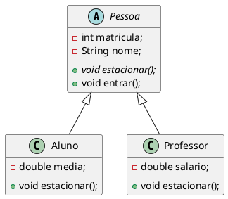

<figcaption>UML Classe abstrata Pessoa e classes concretas Aluno e Professor.</figcaption>
</figure>

### Outros Exemplos

#### Caelum 

[^caelumoo]

Vamos recordar em como pode estar nossa classe `Funcionario`:

```java
class Funcionario {
    protected String nome;
    protected String cpf;
    protected double salario;
    public double getBonificacao() {
        return this.salario * 1.2;
    }
    // outros métodos aqui
}
```

Considere o nosso `ControleDeBonificacao`:

```java
class ControleDeBonificacoes {
    private double totalDeBonificacoes = 0;
    public void registra(Funcionario f) {
        System.out.println("Adicionando bonificação do funcionario: " + f);
        this.totalDeBonificacoes += f.getBonificacao();
    }
    public double getTotalDeBonificacoes() {
        return this.totalDeBonificacoes;
    }
}
```

Nosso método `registra` recebe qualquer referência do tipo `Funcionario`, isto é, podem ser objetos do tipo `Funcionario` e qualquer de seus subtipos: `Gerente`, `Diretor` e, eventualmente, alguma nova subclasse que venha ser escrita, sem prévio conhecimento do autor da `ControleDeBonificacao`.

Estamos utilizando aqui a classe `Funcionario` para o polimorfismo. Se não fosse ela, teríamos um grande prejuízo: precisaríamos criar um método `registra` para receber cada um dos tipos de `Funcionario`, um para `Gerente`, um para `Diretor`, etc. Repare que perder esse poder é muito pior do que a pequena vantagem que a herança traz em herdar código.

Porém, em alguns sistemas, como é o nosso caso, usamos uma classe com apenas esses intuitos: de economizar um pouco código e ganhar polimorsmo para criar métodos mais genéricos, que se encaixem a diversos objetos.

Faz sentido ter uma referência do tipo `Funcionario`? Essa pergunta é diferente de saber se faz sentido ter um objeto do tipo `Funcionario:` nesse caso, faz sim e é muito útil.

Referenciando `Funcionario` temos o polimorfismo de referência, já que podemos receber qualquer objeto que seja um `Funcionario`. Porém, dar `new` em `Funcionario` pode não fazer sentido, isto é, não queremos receber um objeto do tipo `Funcionario`, mas sim que aquela referência seja ou um `Gerente`, ou um `Diretor`, etc. Algo mais **concreto** que um `Funcionario`.

```java
ControleDeBonificacoes cdb = new ControleDeBonificacoes();
Funcionario f = new Funcionario();
cdb.adiciona(f); // faz sentido?
```

Vejamos um outro caso em que não faz sentido ter um objeto daquele tipo, apesar da classe existir: imagine a classe `Pessoa` e duas filhas, `PessoaFisica` e `PessoaJuridica`. Quando puxamos um relatório de nossos clientes (uma `array` de `Pessoa` por exemplo), queremos que cada um deles seja ou uma `PessoaFisica`, ou uma `PessoaJuridica`. A classe `Pessoa`, nesse caso, estaria sendo usada apenas para ganhar o polimorfismo e herdar algumas coisas: não faz sentido permitir instanciá-la.

Para resolver esses problemas, temos as *classes abstratas*.


##### Classe abstrata

O que, exatamente, vem a ser a nossa classe `Funcionario`? Nossa empresa tem apenas Diretores, Gerentes, Secretárias, etc. Ela é uma classe que apenas idealiza um tipo, define apenas um rascunho.

Para o nosso sistema, é inadmissível que um objeto seja apenas do tipo `Funcionario` (pode existir um sistema em que faça sentido ter objetos do tipo Funcionario ou apenas `Pessoa`, mas, no nosso caso, não).

Usamos a palavra chave *abstract* para impedir que ela possa ser instanciada. Esse é o efeito direto de se usar o modificador `abstract` na declaração de uma classe:

```java
abstract class Funcionario {
    protected double salario;
    public double getBonificacao() {
        return this.salario * 1.2;
    }
    // outros atributos e métodos comuns a todos Funcionarios
}
```

E, no meio de um código:

```java
Funcionario f = new Funcionario(); // não compila!!!
```

O código acima não compila. O problema é instanciar a classe - criar referência, você pode. Se ela não pode ser instanciada, para que serve? Serve para o polimorfismo e herança dos atributos e métodos, que são recursos muito poderosos, como já vimos.

Vamos então herdar dessa classe, reescrevendo o método `getBonificacao`

```java
class Gerente extends Funcionario {
    public double getBonificacao() {
        return this.salario * 1.4 + 1000;
    }
}
```

<figure>

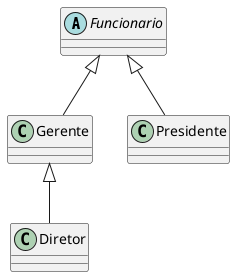

<figcaption>UML da classe abstrata Funcionario e das classes concretas Gerente, Presidente e Diretor.</figcaption>

</figure>

Mas qual é a real vantagem de uma classe abstrata? Poderíamos ter feito isto com uma herança comum. Por enquanto, a única diferença é que não podemos instanciar um objeto do tipo `Funcionario`, que já é de grande valia, dando mais consistência ao sistema.

Fique claro que a nossa decisão de transformar `Funcionario` em uma classe abstrata dependeu do nosso domínio. Pode ser que, em um sistema com classes similares, faça sentido que uma classe análoga a `Funcionario` seja concreta.

##### Métodos abstratos
Se o método `getBonificacao` não fosse reescrito, ele seria herdado da classe mãe, fazendo com que devolvesse o salário mais 20%.

Levando em consideração que cada funcionário em nosso sistema tem uma regra totalmente diferente para
ser bonificado, faz algum sentido ter esse método na classe `Funcionario`? Será que existe uma bonificação
padrão para todo tipo de `Funcionario`? Parece que não, cada classe filha terá um método diferente de bonificação pois, de acordo com nosso sistema, não existe uma regra geral: queremos que cada pessoa que escreve
a classe de um `Funcionario` diferente (subclasses de `Funcionario`) reescreva o método `getBonificacao` de
acordo com as suas regras.

Poderíamos, então, jogar fora esse método da classe `Funcionario`? O problema é que, se ele não existisse,
não poderíamos chamar o método apenas com uma referência a um `Funcionario`, pois ninguém garante
que essa referência aponta para um objeto que possui esse método. Será que então devemos retornar um
código, como um número negativo? Isso não resolve o problema: se esquecermos de reescrever esse método,
teremos dados errados sendo utilizados como bônus.

Existe um recurso em Java que, em uma classe abstrata, podemos escrever que determinado método será
sempre escrito pelas classes filhas. Isto é, um **método abstrato**.

Ele indica que todas as classes filhas (concretas, isto é, que não forem abstratas) devem reescrever esse método
ou não compilarão. É como se você herdasse a responsabilidade de ter aquele método.

::: tip Como declarar um método abstrato
Às vezes, não fica claro como declarar um método abstrato.

Basta escrever a palavra chave *abstract* na assinatura do mesmo e colocar um ponto e vírgula
em vez de abre e fecha chaves!
:::

```java
abstract class Funcionario {
    abstract double getBonificacao();
    // outros atributos e métodos
}
```


#### K19

[^k19oo]


##### Classes Abstratas

No banco, todas as contas são de um tipo específico. Por exemplo, conta poupança, conta corrente ou conta salário. Essas contas poderiam ser modeladas através das seguintes classes utilizando o conceito de herança:

```java
class Conta {
    // Atributos
    // Construtores
    // Métodos
}
```

```java
class ContaPoupanca extends Conta {
    // Atributos
    // Construtores
    // Métodos
}
```

```java
class ContaCorrente extends Conta {
    // Atributos
    // Construtores
    // Métodos
}
```

Para cada conta do domínio do banco devemos criar um objeto da classe correspondente ao tipo da conta. Por exemplo, se existe uma conta poupança no domínio do banco devemos criar um objeto da classe `ContaPoupanca`.

```java
ContaPoupanca cp = new ContaPoupanca();
```

Faz sentido criar objetos da classe `ContaPoupanca` pois existem contas poupança no domínio do banco. Dizemos que a classe `ContaPoupanca` é uma classe concreta pois criaremos objetos a partir dela.

Por outro lado, a classe `Conta` não define uma conta que de fato existe no domínio do banco. Ela apenas serve como "base" para definir as contas concretos.

Não faz sentido criar um objeto da classe `Conta` pois estaríamos instanciado um objeto que não é suficiente para representar uma conta que pertença ao domínio do banco. Mas, a princípio, não há nada proibindo a criação de objetos dessa classe. Para adicionar essa restrição no sistema, devemos tornar a classe `Conta` **abstrata**.

Uma classe concreta pode ser diretamente utilizada para instanciar objetos. Por outro lado, uma classe abstrata não pode. Para definir uma classe abstrata, basta adicionar o modificador abstract.

```java
abstract class Conta {
    // Atributos
    // Construtores
    // Métodos
}
```

Todo código que tenta criar um objeto de uma classe abstrata não compila.

```java
// Erro de compilação
Conta c = new Conta();
```

##### Métodos Abstratos
Suponha que o banco ofereça extrato detalhado das contas e para cada tipo de conta as informações e o formato desse extrato detalhado são diferentes. Além disso, a qualquer momento o banco pode mudar os dados e o formato do extrato detalhado de um dos tipos de conta.

Neste caso, parece não fazer sentido ter um método na classe `Conta` para gerar extratos detalhados pois ele seria reescrito nas classes específicas sem nem ser reaproveitado.

Poderíamos, simplesmente, não definir nenhum método para gerar extratos detalhados na classe `Conta`. Porém, não haveria nenhuma garantia que as classes que derivam direta ou indiretamente da classe `Conta` implementem métodos para gerar extratos detalhados.

Mas, mesmo supondo que toda classe derivada implemente um método para gerar os extratos que desejamos, ainda não haveria nenhuma garantia em relação as assinaturas desses métodos. As classes derivadas poderiam definir métodos com nomes ou parâmetros diferentes. Isso prejudicaria a utilização dos objetos que representam as contas devido a falta de padronização das operações.

Para garantir que toda classe concreta que deriva direta ou indiretamente da classe `Conta` tenha uma implementação de método para gerar extratos detalhados e além disso que uma mesma assinatura de método seja utilizada, devemos utilizar o conceito de métodos abstratos.

Na classe `Conta`, definimos um método abstrato para gerar extratos detalhados. Um método abstrato não possui corpo (implementação).

```java
abstract class Conta {
    // Atributos
    // Construtores
    // Métodos
    public abstract void imprimeExtratoDetalhado();
}
```

As classes concretas que derivam direta ou indiretamente da classe Conta devem possuir uma implementação para o método `imprimeExtratoDetalhado()`.

```java
class ContaPoupanca extends Conta {
    private int diaDoAniversario ;
    public void imprimeExtratoDetalhado(){
        System.out.println("EXTRATO DETALHADO DE CONTA POUPANÇA") ;
        SimpleDateFormat sdf = new SimpleDateFormat ("dd/MM/yyyy HH:mm:ss") ;
        Date agora = new Date();
        System.out.println("DATA:"+sdf.format(agora));
        System.out.println("SALDO:"+this.getSaldo());
        System.out.println("ANIVERSÁRIO:"+this.diaDoAniversario);
    }
}
```

Se uma classe concreta derivada da classe `Conta` não possuir uma implementação do método `imprimeExtratoDetalhado()` ela não compilará.

```java
// ESSA CLASSE NÃO COMPILA
class ContaPoupanca extends Conta {
}
```

### Interface

##### Padronização

No dia a dia, estamos acostumados a utilizar aparelhos que dependem de energia elétrica. Esses aparelhos possuem um plugue que deve ser conectado a uma tomada para obter a energia necessária.

Diversas empresas fabricam aparelhos elétricos com plugues. Analogamente, diversas empresas fabricam tomadas elétricas. Suponha que cada empresa decida por conta própria o formato dos plugues ou das tomadas que fabricará. Teríamos uma infinidade de tipos de plugues e tomadas que tornaria a utilização dos aparelhos elétricos uma experiência extremamente desagradável.

Inclusive, essa falta de padrão pode gerar problemas de segurança aos usuários. Os formatos dos plugues ou das tomadas pode aumentar o risco de uma pessoa tomar um choque elétrico.

Com o intuito de facilitar a utilização dos consumidores e aumentar a segurança dos mesmos, o governo através dos órgãos responsáveis estabelece padrões para os plugues e tomadas. Esses padrões estabelecem restrições que devem ser respeitadas pelos fabricantes dos aparelhos e das tomadas.

Em diversos contextos, padronizar pode trazer grandes benefícios. Inclusive, no desenvolvimento de aplicações. Mostraremos como a ideia de padronização pode ser contextualizada nos conceitos de orientação a objetos.

##### Contratos
Num sistema orientado a objetos, os objetos interagem entre si através de chamadas de métodos (troca de mensagens). Podemos dizer que os objetos se “encaixam” através dos métodos públicos assim como um plugue se encaixa em uma tomada através dos pinos.

Para os objetos de uma aplicação “conversarem” entre si mais facilmente é importante padronizar o conjunto de métodos oferecidos por eles. Assim como os plugues encaixam nas tomadas mais facilmente graças aos padrões definidos pelo governo.

Um padrão é definido através de especificações ou contratos. Nas aplicações orientadas a objetos, podemos criar um “contrato” para definir um determinado conjunto de métodos que deve ser implementado pelas classes que “assinarem” este contrato. Em orientação a objetos, um contrato é chamado de interface. Um interface é composta basicamente por métodos abstratos.


##### Exemplo
No sistema do banco, podemos definir uma interface (contrato) para padronizar as assinaturas dos métodos oferecidos pelos objetos que representam as contas do banco.

```java
interface Conta {
    void deposita ( double valor ) ;
    void saca ( double valor ) ;
}
```

Os métodos de uma interface não possuem corpo (implementação) pois serão implementados nas classes vinculadas a essa interface. Todos os métodos de uma interface devem ser públicos e abstratos. Os modificadores public e **abstract** são opcionais.

As classes que definem os diversos tipos de contas que existem no banco devem implementar (assinar) a interface Conta.

```java
class ContaPoupanca implements Conta {
    public void deposita ( double valor ) {
    // implementacao
    }
    public void saca ( double valor ) {
    // implementacao
    }
}
```

```java
class ContaCorrente implements Conta {
    public void deposita ( double valor ) {
    // implementacao
    }
    public void saca ( double valor ) {
    // implementacao
    }
}
```

As classes concretas que implementam uma interface são obrigadas a possuir uma implementação para cada método declarado na interface. Caso contrário, ocorrerá um erro de compilação.

```java
// Esta classe não compila porque ela não implementou o método saca ()
class ContaCorrente implements Conta {
    public void deposita ( double valor ) {
    // implementacao
    }
}
```

A primeira vantagem de utilizar uma interface é a padronização das assinaturas dos métodos oferecidos por um determinado conjunto de classes. A segunda vantagem é garantir que determinadas classes implementem certos métodos.

##### Polimorfismo

Se uma classe implementa uma interface, podemos aplicar a ideia do polimorfismo assim como quando aplicamos herança. Dessa forma, outra vantagem da utilização de interfaces é o ganho do polimorfismo.

Como exemplo, suponha que a classe ContaCorrente implemente a interface Conta. Podemos guardar a referência de um objeto do tipo ContaCorrente em uma variável do tipo Conta.

```java
Conta c = new ContaCorrente();
```

Além disso, podemos passar uma variável do tipo ContaCorrente para um método que o parâmetro seja do tipo Conta.

```java
class GeradorDeExtrato {
    public void geraExtrato ( Conta c ) {
    // implementação
    }
}
```

```java
GeradorDeExtrato g = new GeradorDeExtrato();
ContaCorrente c = new ContaCorrente();
g.geraExtrato(c) ;
```

O método `geraExtrato()` pode ser utilizado para objetos criados a partir de classes que implementam direta ou indiretamente a interface Conta.


##### Interface e Herança

As vantagens e desvantagens entre interface e herança, provavelmente, é um dos temas mais discutido nos blogs, fóruns e revistas que abordam desenvolvimento de software orientado a objetos.

Muitas vezes, os debates sobre este assunto se estendem mais do que a própria importância desse tópico. Muitas pessoas se posicionam de forma radical defendendo a utilização de interfaces ao invés de herança em qualquer situação.

Normalmente, esses debates são direcionados na análise do que é melhor para manutenção das aplicações: utilizar interfaces ou aplicar herança.

A grosso modo, priorizar a utilização de interfaces permite que alterações pontuais em determinados trechos do código fonte sejam feitas mais facilmente pois diminui as ocorrências de efeitos colaterais indesejados no resto da aplicação. Por outro lado, priorizar a utilização de herança pode diminuir a quantidade de código escrito no início do desenvolvimento de um projeto.

Algumas pessoas propõem a utilização de interfaces juntamente com composição para substituir totalmente o uso de herança. De fato, esta é uma alternativa interessante pois possibilita que um trecho do código fonte de uma aplicação possa ser alterado sem causar efeito colateral no restante do sistema além de permitir a reutilização de código mais facilmente.

Em Java, como não há herança múltipla, muitas vezes, interfaces são apresentadas como uma alternativa para obter um grau maior de polimorfismo.

Por exemplo, suponha duas árvores de herança independentes


<figure>

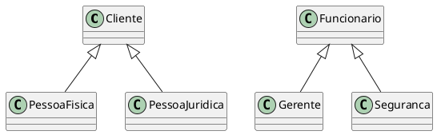

<figcaption>Duas árvores de herança independentes.</figcaption>
</figure>

Suponha que os gerentes e as empresas possam acessar o sistema do banco com um nome de usuário e uma senha. Seria interessante utilizar um único método para implementar a autenticação desses dois tipos de objetos. Mas, qual seria o tipo de parâmetro deste método? Lembrando que ele deve aceitar gerentes e empresas.

```java
class AutenticadorDeUsuario {
    public boolean autentica (??? u ) {
    // implementação
    }
}
```

De acordo com as árvores de herança, não há polimorfismo entre objetos da classe Gerente e da classe Empresa. Para obter polimorfismo entre os objetos dessas duas classes somente com herança, deveríamos colocá-las na mesma árvore de herança. Mas, isso não faz sentido pois uma empresa não é um funcionário e o gerente não é cliente. Neste caso, a solução é utilizar interfaces para obter o polimorfismo desejado


<figure>

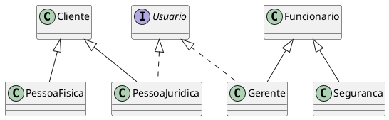

<figcaption>Obtendo mais polimorfismo.</figcaption>
</figure>


Agora, conseguimos definir o que o método autentica() deve receber como parâmetro para trabalhar tanto com gerentes quanto com empresas. Ele deve receber um parâmetro do tipo Usuario.


@[code](./code/poo/Usuario.java)
@[code](./code/poo/Cliente.java)
@[code](./code/poo/PessoaFisica.java)
@[code](./code/poo/PessoaJuridica.java)
@[code](./code/poo/Funcionario.java)
@[code](./code/poo/Gerente.java)
@[code](./code/poo/Seguranca.java)
@[code](./code/poo/AutenticadorDeUsuario.java)


###### Mais sobre herança e interface

```java
public interface Conta {
    public double getSaldo();
    public void deposita(double valor);
    public void saca(double valor);
    public void atualiza(double taxaSelic);
}

class ContaCorrente implements Conta {
// ...
}
class ContaPoupanca implements Conta {
// ...
}
``` 

Às vezes, é interessante criarmos uma interface que herda de outras interfaces: essas, são chamadas subinterfaces. Essas, nada mais são do que um agrupamento de obrigações para a classe que a implementar

```java
interface  Tributavel {
    //...
    public void calcularTributo();
}
```

```java
interface ContaTributavel extends Conta, Tributavel {

}
```
Dessa maneira, quem for implementar essa nova interface precisa implementar todos os métodos herdados das suas superinterfaces (e talvez ainda novos métodos declarados dentro dela):

```java
class ContaInvestimento implements ContaTributavel {
// métodos
}

``` 

```java
ContaTributavel ct = new ContaInvestimento();
Conta c = new ContaInvestimento();
Tributavel t = new ContaInvestimento();
```

Perceba que o código pode parecer estranho, pois a interface não declara método algum, só herda os
métodos abstratos declarados nas outras interfaces. Ao mesmo tempo que uma interface pode herdar de mais de uma outra interface, classes só podem possuir uma classe mãe (herança simples).

<figure>

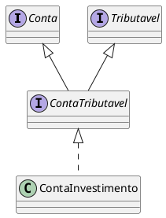

<figcaption>Representação da herança entre interfaces.</figcaption>
</figure>

#### Interfaces = Classe Abstratas 

Em algumas linguagens de programação não existe o conceito de `interface`. 

A `interface` é um tipo específico de classe abstrata onde existe apenas as definições de comportamentos.


## Referências

<!-- @include: ../bib/bib.md -->