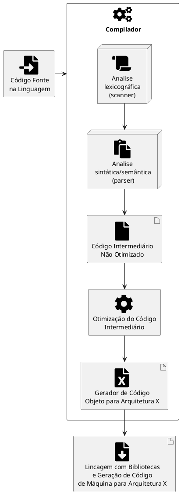

# Linguagem de programação

A linguagem de programação é uma das bases fundamentais da computação e da tecnologia moderna. Nos dias de hoje, a demanda por soluções tecnológicas em quase todos os setores da economia tem crescido de forma exponencial, tornando a habilidade de programar uma competência altamente valorizada no mercado de trabalho.


Existe uma extensa aplicabilidade para as linguagens de programação, desde o desenvolvimento de aplicativos móveis e desktop, a criação de sites ou sistemas operacionais e softwares corporativos. Além disso, muitas linguagens de programação são usadas para resolver problemas complexos em áreas como ciência de dados, inteligência artificial e aprendizado de máquina.

## O que é Linguagem de Programação?

A linguagem de programação é um método padronizado que permite a criação de um código fonte que pode ser compilado e transformado em um programa de computador ou interpretado, para informar instruções de processamento ao computador. É uma linguagem formal, que segue uma gramática e sintaxe específicas e é composta por um conjunto de regras de semânticas que permitem especificar quais dados o computador irá atuar, como estes dados serão armazenados ou transmitidos e quais ações devem ser tomadas de acordo com as circunstâncias.

As linguagens de programação têm como principal objetivo permitir que os programadores tenham uma maior produtividade, facilitando a expressão de suas intenções em relação ao processamento de dados. Para isso, elas adotam uma sintaxe de nível mais alto, que pode ser mais facilmente entendida por programadores humanos. Dessa forma, elas são ferramentas importantes para que programadores e engenheiros de software possam escrever programas mais organizados e com maior rapidez.

Outra importante característica das linguagens de programação é a portabilidade. Programas escritos em linguagens de programação são menos dependentes de computadores ou ambientes computacionais específicos, pois são traduzidos para o código de máquina do computador no qual serão executados. Essa propriedade permite que um mesmo programa possa ser executado em diferentes sistemas operacionais e arquiteturas de processadores, desde que haja um compilador adequado para cada plataforma.

## História

Ada Lovelace é amplamente considerada a primeira programadora da história. Ela nasceu em 1815 na Inglaterra e era filha do famoso poeta Lord Byron. Lovelace foi educada em matemática e lógica por seu tutor William Frend, que a encorajou a desenvolver seu interesse em ciência e tecnologia.

Foi em 1842 que Lovelace traduziu e expandiu um artigo sobre a máquina analítica de Charles Babbage, um engenheiro britânico que projetou o que poderia ter sido o primeiro computador mecânico. Lovelace acrescentou notas extensas ao artigo, nas quais descreveu o algoritmo para a máquina analítica computar a Sequência de Bernoulli o que se tornou conhecido como o primeiro algoritmo destinado a ser executado em uma máquina, tornando-se a primeira pessoa a escrever um programa de computador.

O trabalho de Lovelace foi redescoberto no século XX e a linguagem de programação Ada, usada principalmente em sistemas militares, foi nomeada em sua homenagem. Ada é uma Linguagem de programação estruturada, de tipagem estática, imperativa, orientada a objetos e é uma linguagem de alto nível, originada de Pascal, Simula e outras linguagens. Foi originalmente produzida por uma equipe contrata pelo Departamento de Defesa dos Estados Unidos durante a década de 70.

## Interpretação e compilação

A tradução do código fonte escrito pelo programador pode ocorrer por meio de compilação ou interpretação. Em ambos os processos, o código fonte é traduzido para o código de máquina.

No processo de compilação, todo o texto do programa é traduzido para código de máquina antes da execução. Para isso, é utilizado um compilador, que é um programa responsável por realizar essa tradução. A versão compilada do programa é armazenada e pode ser executada várias vezes sem necessidade de nova compilação, o que economiza tempo. Linguagens como Pascal e C utilizam esse processo.

<figure>



<figcaption>Processo de compilação de uma linguagem de programação</figcaption>
</figure>

O diagrama acima representa os passos do processo de compilação de uma linguagem de programação, começando com o código fonte, que é passado para o compilador. O compilador faz a análise léxica, análise sintática/semântica e gera o código intermediário não otimizado para a arquitetura X. O código intermediário é então passado para o passo de otimização. Em seguida, o gerador de código objeto é usado para gerar o código objeto para a arquitetura X.

Por fim, é feita a lincagem com bibliotecas e é gerado o código de máquina final para a arquitetura X.


Já o processo de interpretação são feitos por programas que têm a capacidade de ler o código fonte de uma linguagem de programação e chamar as instruções do sistema operacional. A forma como os interpretadores operam pode variar de acordo com a implementação do programa interpretador. Em algumas situações, o interpretador analisa o código fonte linha por linha e converte-o em código objeto ou bytecode à medida que executa, enquanto em outros casos, o código fonte é convertido inteiramente antes da execução.

Em teoria, é possível implementar tanto compiladores quanto interpretadores para qualquer linguagem de programação. Entretanto, a escolha entre criar um interpretador ou um compilador depende das necessidades específicas da linguagem e do projeto em questão.

### Máquinas Virtuais

Os compiladores produzem executáveis específicos para um sistema operacional e arquitetura de processador específicos. Isso pode ter um impacto significativo para aqueles que desenvolvem sistemas para múltiplas plataformas.

Se uma empresa deseja disponibilizar uma aplicação para vários sistemas operacionais (como Windows, Linux e Mac OS X) e arquiteturas de processador (como Intel, ARM e PowerPC), ela deve criar e manter um código fonte para cada plataforma. Isso pode resultar em custos significativos para a empresa.


Podemos reduzir os custos e aumentar a eficiência ao utilizarmos máquinas virtuais. Em um ambiente com máquina virtual, quando o código fonte é compilado, ele é traduzido para um código na linguagem da máquina virtual. A linguagem da máquina virtual também é considerada uma linguagem de máquina. Durante a execução, a máquina virtual traduz os comandos da linguagem de máquina virtual para a linguagem de máquina correspondente à plataforma utilizada (máquina hospedeira).


<figure>

```plantuml
@startuml

!define SPRITESURL https://raw.githubusercontent.com/plantuml-stdlib/gilbarbara-plantuml-sprites/v1.0/sprites
!includeurl SPRITESURL/microsoft-windows.puml
!includeurl SPRITESURL/ubuntu.puml
!includeurl SPRITESURL/apple.puml
!includeurl SPRITESURL/java.puml


skinparam monochrome false

artifact f1 as "Código fonte \nem Java"

node "Bytecode" as b1

rectangle "<$java>\n   JVM" as jvm


rectangle "<$microsoft-windows>" as exe
rectangle "<$ubuntu>" as bin
rectangle "<$apple>" as app
f1->b1
b1->jvm
jvm-->exe
jvm-->bin
jvm-->app
@enduml
```

<figcaption> Aplicação rodando em JVM.</figcaption>
</figure>

Observa-se que o conceito de máquina virtual é muito mais abrangente do que o de um interpretador. Conforme o próprio nome sugere, uma máquina virtual é similar a um "computador fictício": possui todas as características de um computador. Em outras palavras, sua função é gerenciar a memória, as threads, a pilha de execução, e outros aspectos relevantes.

A responsabilidade de implementar a máquina virtual não é tarefa dos programadores que desenvolvem as aplicações que serão executados nas máquinas virtuais. A implementação da máquina virtual é responsabilidade dos fornecedores da linguagem de programação. Os maiores exemplos são a Oracle JVM (Java Virtual Machine), OpenJDK JVM, Microsoft CLR (Common Language Runtime) e Mono CLR.


## Características das linguagens de programação


As linguagens de programação são usadas para comunicar instruções a um computador para que ele possa executar tarefas específicas. Existem diversas linguagens de programação disponíveis, cada uma com suas próprias características e finalidades. Algumas das características mais comuns encontradas em linguagens de programação incluem:

**Sintaxe**: a sintaxe de uma linguagem de programação se refere às regras que determinam como as instruções devem ser escritas. Uma sintaxe clara e fácil de entender é importante para garantir que os programadores possam escrever códigos sem erros.

**Tipagem**: a tipagem de uma linguagem de programação se refere ao tipo de dados que pode ser usado em uma variável ou expressão. Algumas linguagens de programação usam tipagem estática, o que significa que as variáveis têm um tipo fixo que não pode ser alterado durante a execução do programa. Outras linguagens usam tipagem dinâmica, o que significa que as variáveis podem ter tipos diferentes durante a execução do programa.

**Paradigma**: o paradigma de programação se refere ao estilo de programação suportado pela linguagem. Algumas das principais paradigmas de programação incluem programação procedural, programação orientada a objetos e programação funcional.

**Eficiência**: a eficiência de uma linguagem de programação se refere à velocidade e ao uso eficiente dos recursos de hardware. Algumas linguagens de programação são mais eficientes do que outras para tarefas específicas.

**Bibliotecas**: as bibliotecas de uma linguagem de programação são coleções de funções pré-construídas que podem ser usadas em um programa. Algumas linguagens de programação têm uma ampla variedade de bibliotecas disponíveis, o que facilita o desenvolvimento de aplicativos complexos.

**Portabilidade**: a portabilidade de uma linguagem de programação se refere à facilidade de transferir um programa escrito em uma plataforma para outra. Algumas linguagens de programação são mais portáteis do que outras e podem ser usadas em uma ampla variedade de plataformas.

**Suporte**: o suporte de uma linguagem de programação se refere à quantidade e qualidade de documentação, tutoriais e comunidade de programadores disponíveis para ajudar os usuários a aprender e usar a linguagem.

Essas são apenas algumas das características mais comuns encontradas em linguagens de programação. É importante escolher a linguagem de programação certa para uma tarefa específica, levando em consideração as necessidades e os requisitos do projeto.