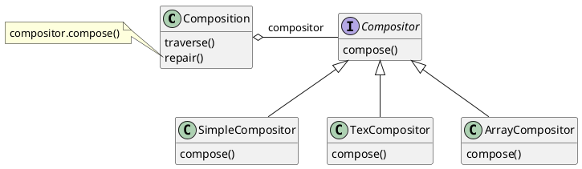
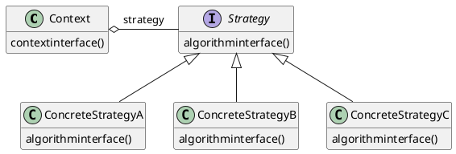

# Strategy (GOF)

[^GAMMA]

## Intenção

Definir uma família de algoritmos, encapsular cada uma delas e torná-las intercambiáveis. Strategy permite que o algoritmo varie independentemente dos clientes que o utilizam

## Também conhecido como

Policy

## Motivação

Existem muitos algoritmos para quebrar um stream de texto em linhas. Codificar de maneira fixa e rígida tais algoritmos nas classes que os utilizam não é desejável, por várias razões:

- clientes que necessitam de quebras de linhas se tornam mais complexos se incluirem o código de quebra de linhas. Isso os torna maiores e mais difíceis de manter, especialmente se suportam múltiplos algoritmos de quebra de linhas;
- diferentes algoritmos serão apropriados em diferentes situações. Não queremos suportar múltiplos algoritmos de quebra de linhas se não usarmos todos eles;
- é difícil adicionar novos algoritmos e variar os existentes quando a quebra de linha é parte integrante de um cliente. 

Podemos evitar esses problemas definindo classes que encapsulam diferentes algoritmos de quebra de linhas. Um algoritmo encapsulado dessa maneira é chamado **strategy** (estratégia).

<figure>



<figcaption>Exemplo Strategy.</figcaption>
</figure>

Suponha que uma classe Composition seja responsável pela manutenção e atualização das quebras de linhas de texto exibidas num visualizador de texto. As estratégias de quebra de linhas não são implementadas pela classe Composition. Em vez disso, são implementadas separadamente por subclasses da classe abstrata Compositor. Subclasses de Compositor implementam diferentes estratégias:

- **SimpleCompositor**:  Implementa uma estratégia simples que determina quebras de linha, uma por vez.
- **TeXCompositor**:  Implementa o algoritmo TEX para encontrar quebras de linhas. Esta estratégia tenta otimizar globalmente as quebras de linhas, ou seja, um parágrafo por vez.
- **ArrayCompositor**:  Implementa uma estratégia que seleciona quebras de maneira que cada linha tenha um número fixo de itens. Por exemplo, é útil para quebrar uma coleção de ícones em linhas.
 
Uma Composition mantém uma referência para um objeto Compositor. Sempre que uma Composition reformata seu texto, repassa essa responsabilidade para o seu objeto Compositor. O cliente de Composition especifica qual Compositor deveria ser usado pela instalação do Compositor que ele deseja em Composition.

## Aplicabilidade

Use o padrão Strategy quando:

- muitas classes relacionadas diferem somente no seu comportamento. As estratégias fornecem uma maneira de configurar uma classe com um dentre muitos comportamentos;
- você necessita de variantes de um algoritmo. Por exemplo, pode definir algoritmos que refletem diferentes soluções de compromisso entre espaço/ tempo. As estratégias podem ser usadas quando essas variantes são implementadas como uma hierarquia de classes de algoritmos [HO871];
- um algoritmo usa dados dos quais os clientes não deveriam ter conhecimento. Use o padrão Strategy para evitar a exposição das estruturas de dados complexas, específicas do algoritmo;
- uma classe define muitos comportamentos, e estes aparecem em suas operações como múltiplos comandos condicionais da linguagem. Em vez de usar muitos comandos condicionais, mova os ramos condicionais relacionados para a sua própria classe Strategy.


## Estrutura

<figure>



<figcaption>Estrutura Strategy.</figcaption>
</figure>


## Participantes

- **Strategy** (Compositor)
    - define uma interface comum para todos os algoritmos suportados. Context usa esta interface para chamar o algoritmo definido por uma Concrete Strategy
- **ConcreteStrategy** (SimpleCompositor, TexCompositor, ArrayCompositor)
    - implementa o algoritmo usando a interface de Strategy.
- **Context** (Composition)
    - é configurado com um objeto Concrete Strategy;
    - mantém uma referência para um objeto Strategy,
    - pode definir uma interface que permite a Strategy acessar seus dados.

## Colaborações

- Strategy e Context interagem para implementar o algoritmo escolhido. Um contexto pode passar todos os dados requeridos pelo algoritmo para a estratégia quando o algoritmo é chamado. Alternativamente, o contexto pode passar a si próprio como argumento para operações de Strategy. Isto permite à estratégia chamar de volta o contexto conforme requerido.
- Um contexto repassa solicitações dos seus clientes para sua estratégia. Os clientes usualmente criam e passam um objeto Concrete Strategy para o contexto; após isso, interagem exclusivamente com o contexto. Freqüentemente existe uma família de classes Concrete Strategy para um cliente fazer sua escolha.

## Consequências

O padrão Strategy tem os seguintes benefícios e desvantagens:

1. Famílias de algoritmos relacionados. Hierarquias de classes Strategy definem uma família de algoritmos e comportamentos para os contextos reutilizarem. A herança pode ajudar a fatorar a funcionalidade comum dos algoritmos.
1. Uma alternativa ao uso de subclasses. A herança oferece uma outra maneira de suportar uma variedade de algoritmos ou comportamentos. Você pode especializar uma classe Context para lhe dar diferentes comportamentos. Mas isso congela o comportamentoem Context, misturando a implementação do algoritmo coma de Context, tornando Context mais difícil de compreender, manter e estender. E não se pode variar de algoritmo dinamicamente. Você acaba tendo muitas classes relacionadas cuja única diferença é o algoritmo ou comportamento que elas empregam. Encapsular os algoritmos em classes Strategy separadas permite variar o algoritmo independentemente do seu contexto, tornando mais fácil trocá-los, compreendê-los e estendê-los.
1. Estratégias eliminam comandos condicionais da linguagem de programação. O padrão Strategy oferece uma alternativa ao uso de comandos condicionais para a seleção de comportamentos desejados. Quando diferentes comportamentos são agrupados em uma classe é difícil evitar o uso de comandos condicionais para a seleção do comportamento correto. O encapsulamento do comportamento em classes Strategy separadas elimina estes comandos condicionais. Por exemplo, sem usar estratégias, o código para quebrar o texto em linhas se pareceria com
```java
void repair () {
    switch (breakingStrategy) {
        case SimpleStrategy:
            composeWithSimpleCompositor();
            break;
        case TexStrategy:
            composeWithTexCompositor();
            break;
    }
// junta os resultados com a composição existente, se necessário
}
```
O padrão Strategy elimina este comando case pela delegação da tarefa de quebra de linhas para um objeto Strategy:

```java
void repair () {
    compositor.compose();
    // junta os resultados com a composição existente, se necessário
}
```
Um código que contém muitos estados freqüentemente indica a necessidade de aplicar o padrão Strategy.

4. A possibilidade de escolha de implementações. As estratégias podem fornecer diferentes implementações do mesmo comportamento. O cliente pode escolher entre estratégias com diferentes compromissos entre tempo e espaço.
5. Os clientes devem conhecer diferentes Strategies. O padrão tem uma deficiência potencial no fato de que um cliente deve compreender como Strategies diferem, antes que ele possa selecionar o mais apropriado. Os clientes podem ser expostos a detalhes e aspectos de implementação. Portanto, você deveria usar o padrão Strategy somente quando a variação em comportamento é relevante para os clientes.
6. Custo de comunicação entre Strategye Context. A interface de Strategy é compartilhada por todas as classes Concrete Strategy, quer os algoritmos que elas implementem sejam triviais ou complexos. Daí ser provável que alguns Concrete Strategy nãousem toda a informação passada através desta interface; Concrete Strategies simples podem não usar quaisquer dessas informações! Isso significa que existirão situações em que o contexto criará e iniciará parâmetros que nunca serão usados. Se esse forum problema, você necessitará de um acoplamento maior entre Strategy e Context.
7. Aumento do número de objetos. Strategies aumentam o número de objetos numa aplicação. Algumas vezes, você pode reduzir esse custo pela implementação de estratégias como objetos sem estados que os contextos possam compartilhar. Qualquer estado residual é mantido pelo contexto, que o passa em cada solicitação para o objeto Strategy.

## Implementação

Considere os seguintes aspectos de implementação:

1. Definindo as interfaces de Strategy e Context. As interfaces de Strategy e Context podem fornecer a uma Concrete Strategy um acesso eficiente a quaisquer dados que necessite de um contexto, e vice-versa. Uma solução é fazer com que context passe dados através de parâmetros para as operações de Strategy - em outras palavras, levar os dados para a estratégia. Isso mantém Strategy e Context desacoplados. Por outro lado, Context pode passar dados de que Strategy não necessita. Uma outra técnica é fazer um contexto passar a si próprio como um argumento, e então a estratégia solicitar dados do contexto explicitamente. Alternativamente, a estratégia pode armazenar uma referência para o seu contexto, eliminando de todo a necessidade de passar qualquer coisa. De ambas as maneiras, a estratégia pode solicitar exatamente o que ela necessita. Porém, agora, Context deve definir uma interface mais elaborada para os seus dados, o que acopla Strategy e Context mais fortemente. As necessidades de um algoritmo específico e seus requisitos de dados determinarão qual a melhor técnica.
2. Estratégias como parâmetros template. Em C++, templates podem ser usados para configurar uma classe com uma estratégia. Esta técnica somente é aplicável se: (1) Strategy pode ser selecionada em tempo de compilação e (2) ela não tem que ser mudada em tempo de execução. Nesse caso, a classe a ser configurada (por exemplo, Context) é definida como uma classe template que tem como parâmetro uma classe *Strategy:* 
```objectivec
template <class AStrategy>
class Context
    void Operation () { theStrategy.DoAlgorithm(); }
    // ...
private:
    Astrategy theStrategy;
);
```
A classe é então configurada com uma classe Strategy quando é instanciada:
```objectivec
class MyStrategy {
public:
    void DoAlgorithm();
};
Context<MyStrategy> acontext;
```
Com *templates,* não há necessidade de definir uma classe abstrata que defina a interface para Strategy. Usar Strategy como um parâmetro de template também permite vincular uma Strategy ao seu context estaticamente, o que pode melhorar a eficiência.

3. Tornando os objetos Strategy opcionais. A classe Context pode ser simplificada se fizer sentido não ter um objeto Strategy. Context verifica se ele tem o objeto Strategy antes de acessá-lo. Se existir um, então Contexto utiliza normalmente. Se não houver uma estratégia, então Context executa o comportamento-padrão. O benefício dessa solução é que os clientes não têm que lidar com nenhum objeto Strategy a menos que eles não queiram o comportamento padrão.

## Exemplo de código

Daremos o código de alto nível para o exemplo da seção Motivação, o qual está baseado na implementação das classes Composition e Compositor em Inter Views [LCI+92].

A classe Composition mantém uma coleção de Component, a qual representa texto e elementos gráficos num documento. Uma composição arruma os objetos componentes em linhas usando uma instância da subclasse Compositor, a qual encapsula uma estratégia de quebra de linhas. Cada componente tem associados um tamanho natural, uma extensibilidade e uma compressibilidade. A extensibilidade define quanto o componente pode crescer além do seu tamanho natural;compressibilidade é quanto ele pode ser comprimido. A composição passa esses valores para um compositor, o qual os utiliza para determinar a melhor localização para quebras de linha.

```java
public class Composition {
    private Compositor compositor;
    private List<Component> components;// a lista de componentes
    private int componentCount; // o número de componentes
    private int lineWidth; // largura da linha
    private int lineBreaks: // posição das quebras das linhas em componentes
    private int lineCount; // número de linhas

    public Composition (Compositor compositor){
        this.compositor = compositor;
    }
    void repair(){}
}
```
Quando um novo layout é requerido, a composição solicita ao seu compositor determinar onde colocar as quebras de linha. A composição passa para o compositor três vetores que definem tamanhos naturais, extensibilidades e compressibilidades dos componentes. Ela também passa o número de componentes, a largura da linha e um vetor que o compositor preenche com a posição de cada quebra de linha. O compositor devolve o número de quebras calculadas.

A interface de Compositor permite à composição passar ao compositor toda a informação de que ele necessita. Isso é um exemplo da abordagem do tipo "levando os dados para a estratégia":

```java
public interface Compositor {
public int compose(Coord natural[], Coord stretch[], Coord shrink[], int componentCount, int lineWidth, int breaks[]);
```
Note que compositor é uma classe abstrata (ou interface). As subclasses concretas definem estratégias específicas de quebras de linha.

A composição chama a operação *repair* do seu compositor. *repair* primeiramente inicia vetores com tamanho, extensibilidade e compressibilidade naturais de cada componente (cujos detalhes omitiremos). Então, ela chama o compositor para obter as quebras de linha e finalmente estabelece o layout dos componentes de acordo com as quebras (também omitido):
```java
void repair(){
    Coord[] natural;
    Coord[] stretchability:
    Coord[] shrinkability;
    int componentCount;
    int[] breaks;
    // prepara os arrays com os tamanhos desejados dos componentes
    //...
    // determina onde estão as quebras:
    int breakCount;
    breakCount = compositor.compose(natural, stretchability, shrinkability,componentCount, this.lineWidth, breaks);
    // dispõe os componentes de acordo com as quebras
}
```
Examinemos agora as subclasses de Compositor. A classe SimpleCompositor examina componentes uma linha por vez para determinar onde as quebras deveriam ser colocadas:

```java
public class SimpleCompositor implements Compositor{
    public SimpleCompositor{
    }
    public int compose(Coord natural[], Coord stretch[], Coord shrink[], int componentCount, int lineWidth, int breaks[]){
        //...    
    };
};
```

O *TexCompositor* utiliza uma estratégia mais global. Ele examina um parágrafo por vez, levando em conta o tamanho dos componentes e sua extensibilidade. Ele também tenta dar um "aspecto" uniforme ao parágrafo através da minimização dos espaços em branco entre componentes.

```java
public class TexCompositor implements Compositor{
    public TexCompositor{
    }
    public int compose(Coord natural[], Coord stretch[], Coord shrink[], int componentCount, int lineWidth, int breaks[]){
        //...    
    };
};
```

ArrayCompositor quebra os componentes em linhas a intervalos regulares.

```java
public class ArrayCompositor implements Compositor{
    public ArrayCompositor{
    }
    public int compose(Coord natural[], Coord stretch[], Coord shrink[], int componentCount, int lineWidth, int breaks[]){
        //...    
    };
};
```

Essas classes não utilizam toda a informação passada em `Compose`. O `SimpleCompositor` ignora a extensibilidade dos componentes, levando em conta somente suas larguras naturais. O `TeXCompositor` utiliza toda a informação passada para ela, enquanto que `ArrayCompositor` ignora todas.

Para instanciar composition, você passa a ela o compositor que deseja usar:
```java
Composition quick = new Composition (new SimpleCompositor());
Composition slick = new Composition (new TexCompositor());
Composition iconic = new Composition (new ArrayCompositor (100));
```

A interface de Compositor é cuidadosamente projetada para suportar todos os algoritmos de layout que as subclasses possam implementar. Você não deseja ter que mudar esta interface a cada nova subclasse introduzida porque isso exigirá mudar subclasses existentes. Em geral, as interfaces de Strategy eContext determinam também qual padrão consegue o seu intento.

## Usos conhecidos

Tanto ET++ [WGM88] como InterViews usam estratégias para encapsular diferentes algoritmos de quebras de linhas na forma como descrevemos.

No sistema RTL destinado a otimização de código gerado por compiladores [JML92], estratégias definem diferentes esquemas de alocação de registradores (Register Allocator) e procedimentos de utilização (scheduling) do conjunto de instruções (RISCscheduler, CISCscheduler). Isso fornece flexibilidade no direcionamento do otimizador para diferentes arquiteturas de máquina.

O framework para calculadoras *(calculation engine)* do SwapsManager de ET++ computa preços para diferentes instrumentos financeiros [EG92]. Suas abstrações-chave são Instrumente YieldCurve (instrumento e curva de rendimentos, respectivamente). Diferentes instrumentos são implementados como subclasses de Instrument. YieldCurve calcula coeficientes de desconto que determinam o valor presente de fluxos de caixa futuros. Ambas as classes delegam algum comportamento para objetos Strategy. O framework fornece uma família de classes Concrete Strategy para gerar fluxos de caixa, avaliar permutas (swaps) e calcular coeficientes de desconto. Você pode criar novas calculadoras através da configuração de Instrument e YieldCurve com diferentes objetos Concrete Strategy. Esta abordagem suporta a combinação e casamento de implementações existentes de Strategy, bem como a definição de novas implementações.

Os componentes de Booch usam estratégias como argumentos-template. As classes de coleção de Booch suportam três tipos diferentes de estratégias de alocação de memória: administrada (alocação dentro de um pool), controlada (alocações/ desalocações são protegidas por travamentos (locks), e não-administradas (o alocador de memória normal). Essas estratégias são passadas como argumentos-template para uma classe de coleção quando ela é instanciada. Por exemplo, uma Unbounded- Collection que usa a estratégia não-administrada é instanciada como UnboundedCollection<MyItemType*, Unnanaged>,

RApp é um sistema para o layout de circuitos integrados [GA89,AG90]. RAPP deve estabelecer o layout e as rotas dos condutores que conectam subsistemas do circuito. Algoritmos para determinação de rotas no RApp são definidos como subclasses de uma classe abstrata Router. A Router é uma classe Strategy.

ObjectWindows da Borland [Bor94] utiliza estratégias em caixas de diálogo para assegurar que os usuários forneçam dados válidos. Por exemplo, os números devem estar em um certo intervalo, e um campo de entrada numérica deve aceitar somente dígitos. Validar que uma string está correta pode exigir uma pesquisa numa tabela

ObjectWindows utiliza objetos Validator para encapsular estratégias de validação. Validators são exemplos de objetos Strategy. Campos de entrada de dados delegam a estratégia de validação para um objeto Validator opcional. O cliente associa um validator a um campo, se for necessária uma validação (isto é, um exemplo de uma estratégia opcional). Quando o diálogo é fechado, os campos de entrada solicitam aos seus validators para validarem os dados. A biblioteca de classes fornece validators para casos comuns, tal como um RangeValidator (um validator de intervalo) para números. Novas estratégias de validação, específicas do cliente, podem ser definidas facilmente, criando subclasses da classe Validator.

## Padrão relacionados
[Flyweight]: objetos Strategy geralmente são bons flyweights.


## Referências

<!-- @include: ../bib/bib.md -->