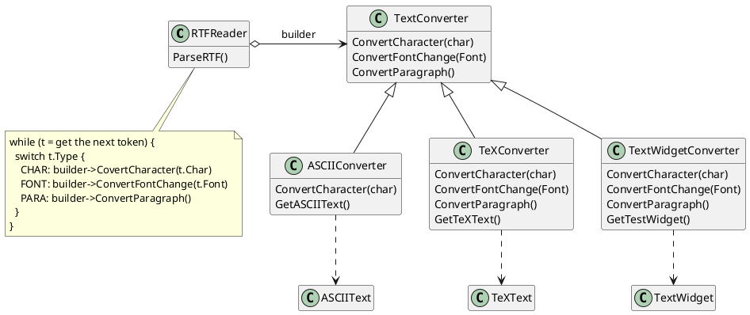
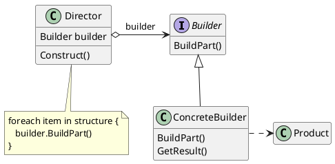
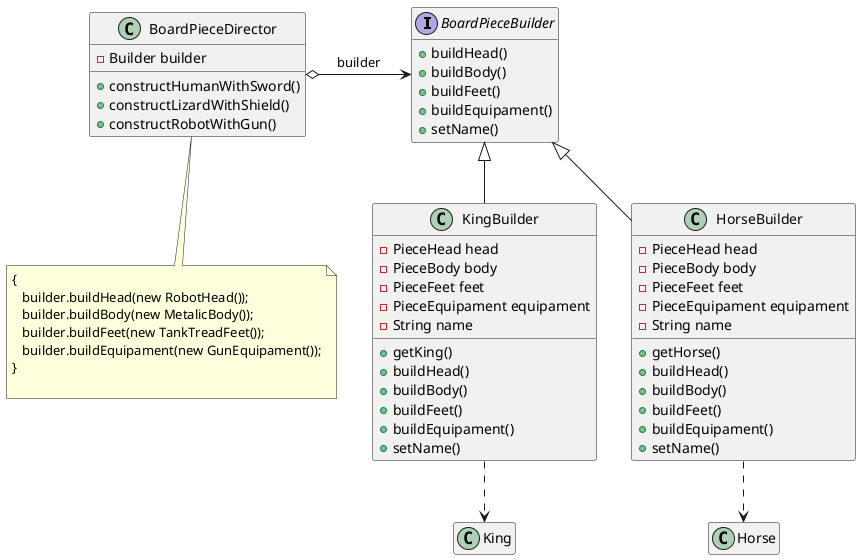

# Builder (GOF)


[^GAMMA]
[^Shvets]
 
 
## Intenção

Permite a separação da criação de objetos complexos de suas representações, produzindo diferentes tipos e representações do objeto com o mesmo processo de construção.

## Também conhecido como

Constructor

## Motivação

Um leitor de um documento em RTF (Rich Text Format) deveria ser capaz de converter RTF em muitos formatos de texto. O leitor poderia converter documentos RTF em texto ASCII comum ou widget de texto, que possa ser editado interativamente. O problema, contudo, é que o número de conversões possíveis é aberto. Por isso, deve ser fácil acrescentar uma nova conversão sem modificar o leitor. 

Uma solução é configurar a classe RTFReader com um objeto TextConverter que converte RTF para uma outra representação de textos. À medida que o RTFReader analisa o documento RTF, ele usa o objeto TextConverter para efetuar a conversão. Sempre que o RTFReader reconhece um símbolo RTF (texto simples, ou uma palavra de controle do RTF), ele emite uma solicitação para o TextConverter para converter esse símbolo. Os objetos TextConverter são responsáveis tanto por efetuar a conversão dos dados como pela representação do símbolo num formato particular.

As subclasses de TextConverter se especializam em diferentes conversões e formatos. Por exemplo, um ASCIIConverter ignora solicitações para converter qualquer coisa, exceto texto simples. Por outro lado, um TeXConverter implementará operações para todas as solicitações visando produzir uma representação TEX que capture toda a informação estilística do texto. Um TextWidgetConverter produzirá um objeto para uma interface de usuário complexa que permite ao usuário ver e editar o texto.


<figure>



<figcaption>Motivação Builder.</figcaption>
</figure>

Cada tipo de classe conversora implementa o mecanismo para criação e montagem de um objeto complexo, colocando-o atrás de uma interface abstrata. O
conversor é separado do leitor, que é responsável pela análise de um documento RTF.

O padrão Builder captura todos estes relacionamentos. Cada classe conversora é chamada um **builder** no padrão, e o leitor é chamado de **director**. Aplicado a este exemplo, o Builder separa o algoritmo para interpretar um formato de texto (isto é, o analisador de documentos RTF) de como um formato convertido é criado e representado. Isso nos permite reutilizar o algoritmo de análise (parsing) do RTFReader para criar diferentes representações de texto a partir de documentos RTF – simplesmente configure o RTFReader com diferentes subclasses de TextConverter.

## Aplicabilidade

Use o padrão Builder quando:

- O algoritmo para criação de um objeto complexo deve ser independente das partes que compõem o objeto e de como elas são montadas;

- Existem classes com construtores com muitos parâmetros opcionais ou classes que tenham muitas versões de construtores sobrecarregadas;

- Você precisa que seu código permita a criação de diferentes representações de um Objeto. Exemplo:
    - Casa
        - Casa de Madeira 
        - Casa de Pedra

- Você quer construir uma árvore de Objetos utilizando o **Composite**;


## Um pouco sobre o Composite

O [Composite](/XX_Composite.md) é um padrão de projeto estrutural que permite que a composição de objetos em estruturas de árvores que representam hierarquias partes-todo. Após a composição, estas estruturas podem ser utilizadas da mesma maneira que objetos individuais.

Usar o padrão Composite faz sentido apenas quando o modelo central de sua aplicação pode ser representada como uma árvore.
Por exemplo, imagine que você tem dois tipos de objetos:
**Produtos** e **Caixas**. Uma **Caixa** pode conter diversos **Produtos** bem como um número de **Caixas** menores. Essas **Caixas** menores também podem ter alguns **Produtos** ou até mesmo **Caixas** menores que elas, e assim em diante..

Nesse tipo de cenário, seria possivel utilizar o Builder para criar as árvores Composite complexas (representadas pelas **Caixas**) porque o Builder permite que você programe as etapas de construção para trabalhar recursivamente. Facilitando assim a criação de objetos em estruturas de árvore para a utilização do padrão Composite.

Builder e Composite são popularmente utilizados em conjunto, devido a essa combinação de construção e organização de objetos complexos.


## Estrutura
O Padrão Builder possui uma estrutura com 4 participantes, como ilustrado abaixo :

<figure>



<figcaption>Estrutura Builder.</figcaption>

</figure>

## Participantes

- **Builder** (TextConverter)
    - define uma interface com as configurações em comum para todos os objetos que são baseados nesse Builder. Director usa esta interface para chamar o método definido por um ConcreteBuilder.
- **ConcreteBuilder** (ASCIIConverter, TeXConverter, TextWidgetConverter)
    - implementa métodos para a construção e montagem em partes do produto, usando a interface de Builder.
    - Não expõe o produto durante a montagem, mantém a representação até o objeto ser recuperado.
    - ConcreteBuilders devem fornecer seus próprios métodos para recuperar os resultados de construções, já que os produtos gerados podem ser completamente diferentes.
- **Director** (RTFReader)  
    - Mantém uma instancia de um Builder passado pelo cliente.
    - Implementa métodos visando a execução sequencial correta e a organização das etapas de configuração para cada tipo de situação.
    - **Não é estritamente necessário**, é possivel que o padrão seja implementado com o cliente assumindo um papel parecido com o de director.

- **Product** (ASCIIText, TeXText, TextWidget)
    - representa o objeto complexo em construção. ConcreteBuilder constrói a representação interna do produto e define o as etapas de montagem;
    - inclui classes que definem as diversas partes que constituem o objeto complexo, inclusive as interfaces para a montagem das partes no resultado final.


## Colaborações e variação
Apesar do Builder presente no GOF sempre utilizar um diretor, a implementação de uma variação desse padrão utilizando o cliente como um "diretor" é popularmente usada.

Com isso, as colaborações podem variar:

- Com **Director** (GOF)
    - O cliente cria o objeto director e o configura com o objeto builder desejado.
    - Director notifica ao builder para executar o processo de montagem de uma parte do produto.
    - Builder trata solicitações do director e acrescenta partes ao produto.
    - O cliente recupera o produto após a montagem do builder.

- Sem **Director**
    - O cliente cria e mantém a instância do objeto builder desejado.
    - O cliente chama a função do builder para executar o processo de montagem de uma parte do produto.
    - Builder trata solicitações do cliente e acrescenta partes ao produto.
    - O cliente recupera o produto após a montagem do builder.

Com a interação direta do cliente com o builder no processo de construção, o cliente tem que saber como o processo de construção(etapas) funciona, porém, com a implementação do director, basta que o cliente saiba qual director usar naquela situação especifica para obter o produto final desejado.

## Consequências

O padrão Builder tem os seguintes benefícios e desvantagens:

### Benefícios 
1. Permite a construção de objetos passo a passo, pular certas etapas de construção ou rodar etapas recursivamente.
2. Mantém a lógica complexa de construção isolada da lógica de negócio do produto, melhorando a modularidade pelo encapsulamento da forma que um objeto é construido e representado.
3. Permite a variação da representação interna do produto, já que o diretor somente tem acesso a uma interface abstrata Builder, ocultando a estrutura interna do produto e como ele é construido, logo, para adicionar ou modificar uma representação só é preciso definir um novo tipo de construtor.


### Desvantagens 

1. A complexidade do código aumenta, já que o padrão necessita da criação de múltiplas classes novas.


## Implementação
Eis um exemplo para representar a implementação do padrão **Builder** em java:

```java
public interface Builder {
    public void buildPart(Part productPart); // define a montagem de uma parte
     // Part é uma classe abstrata
}
```

```java
public class ConcreteBuilder implements Builder {
    private Part productPart;

    @Override
    public void buildPart(Part productPart){
        this.productPart = productPart;
    };

     public Product getResult() {
        return new Product(productPart);
    }
}
```

```java
public class Director {
    private Builder builder;

    public Director(Builder builder){
        this.builder = builder;
    }

     public void constructProduct() {
        Part exempleProductPart = new SpecificProductPart();
        // SpecificProductPart representa uma classe que implementa a classe abstrata Part

        builder.buildPart(exempleProductPart);
    }
}
```

Para melhor contextualização, a classe do produto final seria escrita assim:

```java
public class Product {
    private final Part productPart;
   
    public Product(Part productPart){
        this.productPart = productPart;
    }

    public Part getPart(){
        return productPart;
    }    
}
```

Com essas implementações, este seria o código cliente(código da aplicação) **COM** o uso do director :

```java
public class Client {

    public static void main(String[] args) {
        // Director usa o objeto ConcreteBuilder dado pelo cliente.
        // Isto porque o código cliente sabe qual o builder correto a ser utilizado para gerar um produto específico.
        ConcreteBuilder builder = new ConcreteBuilder();

        Director director = new Director(builder);
        director.constructProduct();

        // O produto final é retornado pela instância de builder, 
        // já que director não enxerga e não depende de um concreteBuilder específico e seu produto final.
        Product product = builder.getResult();

        // ..Faz algo com o produto ou constrói outros produtos
    }
}
```

Este seria o código cliente(código da aplicação) **SEM** o uso do director: 

```java
public class Client {

    public static void main(String[] args) {
        // O cliente instancia o objeto do ConcreteBuilder desejado.
        // Isto porque o código cliente sabe qual o builder correto a ser utilizado para gerar um produto específico.
        ConcreteBuilder builder = new ConcreteBuilder();

        // a instancia de SpecificProductPart é necessária, pois é requisitada na função buildPart().
        Part exempleProductPart = new SpecificProductPart();

        builder.buildPart(exempleProductPart);

        // O produto final é retornado pela instância de builder.
        Product product = builder.getResult();

        // ..Faz algo com o produto ou constrói outros produtos
    }
}
```


## Exemplo de código

### Exemplo 1 - Jogo de tabuleiro 

Consideremos um contexto onde é preciso construir objetos complexos que representam as peças de um jogo de tabuleiro, cada peça tem uma cabeça, um corpo, pés e um equipamento (como uma lança). Isto é importante para que cada peça tenha um devido impacto baseado nas suas partes. As peças podem assumir papéis com nomenclaturas, como no xadrez onde existem peões, cavalos, rei e rainha. O código a seguir, utiliza o padrão Builder para facilitar a construção de peças padrões do jogo.


Para facilitar o entendimento, aqui está uma UML desse contexto:

<figure>



<figcaption>Builder aplicado no contexto de peças de tabuleiro.</figcaption>

</figure>

Este UML exemplifica o contexto do builder sendo usado para criar peças de tabuleiro, onde **PieceHead**, **PieceBody**, **PieceFeet** e **PieceEquipament** são classes abstratas que definem regras para a implementaçao das caracteristicas das peças do tabuleiro, e os builders são os construtores que levam em consideração o papel que a peça vai assumir para a construção do produto final.


Agora que temos todas as representações que precisamos, podemos começar a implementar o padrão Builder.

Código da interface que representa uma peça, apelidado de **BoardPieceBuilder** :

```java
public interface BoardPieceBuilder {
    public void buildHead(PieceHead head); // define a montagem da cabeça
    public void buildBody(PieceBody body); // define a montagem do corpo
    public void buildFeet(PieceFeet feet); // define a montagem dos pés
    public void buildEquipament(PieceEquipament equipament); // define a montagem do equipamento
    public void setName(String name); // define o nome personalizado da peça
}
```

A interface define os possiveis parâmetros para a construção de uma peça de tabuleiro, fazendo o papel do participante **Builder**.

Beseado nisso, agora é possivel implementar um construtor concreto, como nos exemplos a seguir:

```java
public class KingBuilder implements BoardPieceBuilder {
    private PieceHead head;
    private PieceBody body;
    private PieceFeet feet;
    private PieceEquipament equipament;
    private String name;

    public King getKing() {
        return new King(head, body, feet, equipament, name);
    }

    @Override
    public void buildHead(PieceHead head){
        this.head = head;
    };

    @Override
    public void buildBody(PieceBody body){
        this.body = body;
    };

    @Override
    public void buildFeet(PieceFeet feet){
        this.feet = feet;
    };

    @Override
    public void buildEquipament(PieceEquipament equipament){
         this.equipament = equipament;
    }; 

    @Override
    public void setName(String name){
        this.name = name;
    }
}
```

```java
public class HorseBuilder implements BoardPieceBuilder {
    private PieceHead head;
    private PieceBody body;
    private PieceFeet feet;
    private PieceEquipament equipament;
    private String name;

    public Horse getHorse() {
        return new Horse(head, body, feet, equipament, name);
    }

    @Override
    public void buildHead(PieceHead head){
        this.head = head;
    };

    @Override
    public void buildBody(PieceBody body){
        this.body = body;
    };

    @Override
    public void buildFeet(PieceFeet feet){
        this.feet = feet;
    };

    @Override
    public void buildEquipament(PieceEquipament equipament){
         this.equipament = equipament;
    }; 

    @Override
    public void setName(String name){
        this.name = name;
    }
}
```

KingBuilder e HorseBuilder fazem o papel de **ConcreteBuilder**, implementando as funções para as respectivas montagens do produto.

Abaixo é possivel ver, respectivamente, as classes que representam os produtos finais de KingBuilder e HorseBuilder.

```java
public class King {
    private final PieceHead head;
    private final PieceBody body;
    private final PieceFeet feet;
    private final PieceEquipament equipament;
    private final MovementType movementType;
    private String name;

    public King(PieceHead head, PieceBody body, PieceFeet feet, PieceEquipament equipament, String name){
        this.head = head;
        this.body = body;
        this.feet = feet;
        this.equipament = equipament;
        this.name = name;

        if(this.equipament == null){
            this.equipament = new NoEquipament();
        }

        if(this.equipament instanceof NoEquipament){
            this.movementType = new DefaultMovementType(this.body, this.feet, 'King');
        }else{
            this.movementType = new KingMovementType(this.head, this.feet, this.equipament);
        } 

        if(this.name.isEmpty()){
            this.name = getGeneratedName();
        }      
    }

    
    public String getGeneratedName(){
        return 'King Skeleton With Magic Staff';
        // Representação de um nome gerado 
    }

    public PieceHead getHead(){
        return head;
    }

    public PieceBody getBody(){
        return body;
    }

    public PieceFeet getFeet(){
        return feet;
    }

    public PieceEquipament getEquipament(){
        return equipament;
    }

    public MovementType getMovementType(){
        return movementType;
    }

    public setName(String name){
        this.name = name;
        
        if(this.name.isEmpty()){
            this.name = getGeneratedName();
        }
    }

}
```


```java
public class Horse {
    private final PieceHead head;
    private final PieceBody body;
    private final PieceFeet feet;
    private final PieceEquipament equipament;
    private final MovementType movementType;
    private String name;

    public Horse(PieceHead head, PieceBody body, PieceFeet feet, PieceEquipament equipament, String name){
        this.head = head;
        this.body = body;
        this.feet = feet;
        this.equipament = equipament;
        this.name = name;

        if(this.equipament == null){
            this.equipament =  new NoEquipament();
        }

        if(this.equipament instanceof NoEquipament){
            this.movementType = new DefaultMovementType(this.body, this.feet, 'Horse');
        }else{
            this.movementType = new HorseMovementType(this.feet, this.equipament);
        } 

        if(this.name.isEmpty()){
            this.name = getGeneratedName();
        }
            
    }

    public String getGeneratedName(){
        return 'Cyclope With Lance';
        // Representação de um nome gerado 
    }

    public PieceHead getHead(){
        return head;
    }

    public PieceBody getBody(){
        return body;
    }

    public PieceFeet getFeet(){
        return feet;
    }

    public PieceEquipament getEquipament(){
        return equipament;
    }

    public MovementType getMovementType(){
        return movementType;
    }

    public setName(String name){
        this.name = name;
        
        if(this.name.isEmpty()){
            this.name = getGeneratedName();
        }
    }

}
```

Com o Director(como explicado no GOF) é possivel separar e organizar a execução correta da montagem das peças, direcionando a solicitação do cliente :

```java
public class BoardPieceDirector {
   private BoardPieceBuilder builder;

    public BoardPieceDirector(BoardPieceBuilder builder){
        this.builder = builder;
    }

    public void constructHumanWithSword(){
        builder.buildHead(new HumanHead());
        builder.buildBody(new FleshBody());
        builder.buildFeet(new BipedsFeet());
        builder.buildEquipament(new SwordEquipament());
    }

    public void constructLizardWithShield(){
        builder.buildHead(new LizardHead());
        builder.buildBody(new ScalesBody());
        builder.buildFeet(new BipedsFeet());
        builder.buildEquipament(new ShieldEquipament());
    } 

    public void constructRobotWithGun(){
        builder.buildHead(new RobotHead());
        builder.buildBody(new MetalicBody());
        builder.buildFeet(new TankTreadFeet());
        builder.buildEquipament(new GunEquipament());
    }


}
```

Este director é responsável por construir as peças padrões do jogo, útil para guiar os builders sobre o que fazer e quando fazer.

Após a implementação, a utilização no cliente com o uso deste director seria:

```java
public class Client {

    public static void main(String[] args) {

        // Director (BoardPieceDirector) usa o objeto KingBuilder dado pelo cliente.
        // Isto porque o código cliente sabe qual o builder correto a ser utilizado para gerar um produto especifico.
        KingBuilder kingBuilder = new KingBuilder();

        BoardPieceDirector kingDirector = new BoardPieceDirector(kingBuilder);
        kingDirector.constructHumanWithSword();

        // O produto final é retornado pela instância de builder (neste caso, KingBuilder), 
        // já que director não enxerga e não depende de KingBuilder e seu produto final.
        King kingProduct = kingBuilder.getKing();

        
        // Outros Builders..
        
        HorseBuilder horseBuilder = new HorseBuilder();
        
        BoardPieceDirector horseDirector = new BoardPieceDirector(horseBuilder);
        horseDirector.constructLizardWithShield();

        Horse horseProduct = horseBuilder.getHorse();
    }
} 
``` 
Como podemos ver, o uso do director facilita a interação com os builders e mantém as etapas de construção fora do conhecimento do cliente.

### Exemplo 2 - Project Lombok, aplicação sem o director

Lombok é uma biblioteca java que facilita a implementação, gerando métodos como: getter, equals, construtores de classes completas apenas com annotations e etc.[^ProjectLombok] 

Nesta blibioteca existe uma annotation(@) que implementa um Builder, porém sem utilização do director.
 
Exemplo de implementação utilizando a annotation @Builder numa classe Cliente. 

```java
@Builder // Anotação do Lombok
public class Cliente {
     private String nome;
     private String cnpj;
     private String endereco;
}
``` 

A anotação @Builder acima da classe, define que a blibioteca Lombok deve gerar um Builder para esta classe, ao compilar a classe o Lombok gera uma outra classe chamada ClienteBuilder que faz todo o papel de um ConcreteBuilder por debaixo dos panos. Além disso ainda é possivel utilizar o encadeamento de métodos, uma sintaxe utilizada para invocar várias chamadas de método de uma vez.

Implementação no cliente (implementação popular utilizando o LOMBOK, sem a necessidade de um director):

```java
public class Client {

    public static void main(String[] args) {
       Cliente cliente1;
    
       // Encadeamento de métodos.
       cliente1 = Cliente.builder()
       .nome("Nome do Cliente")
       .cnpj("1234567890")
       .endereco("São Paulo")
       .build();
       //.build entrega a instância do cliente criado pelo builder.  
    }
}
``` 

Por causa da anotação e do Lombok, o concreteBuilder da classe Cliente não precisa ser instanciado para ser acessado, é possivel ter acesso diretamente pelo nome da classe, liberando assim a necessidade de ter mais complicações em implementar novas classes manualmente. Neste caso de aplicação do padrão Builder, um director não é necessario, já que o lombok simplifica bastante as chamadas de métodos com o encadeamento e também a implementação dos builders concretos.
  
## Usos conhecidos

**Project Lombok** (como mencionado acima), é uma blibioteca Java que utiliza Annotations para gerar código automatico de Builders para classes, facilitando a implementação de construtores e automatizando tarefas repetitivas, como implementar getters e setters para todas as classes.[^ProjectLombok]

**Doctrine - The Query Builder** é um ORM que permite que o cliente utilize uma API para construir uma DQL (Data query language) para comunicação com bancos de dados em vários passos, este é um exemplo real do padrão builder sendo implementado sem a utilização de um director.[^DoctrineQueryBuilder]

## Padrão relacionados
[Composite](/XX_Composite.md): Como já citado anteriormente, o padrão Composite é geralmente utilizado junto ao Builder devido a praticidade ao criar objetos complexos.

[Factory Method](/XX_Factory_Method.md): Muitos projetos começam com o Factory method por ser mais simples e depois evoluem para o Builder por ser mais flexível (apesar de mais complexo).

[Singleton](/XX_Singleton.md): Construtores Builder também podem ser implementados como Singletons.

## Referências

<!-- @include: ../bib/bib.md -->
