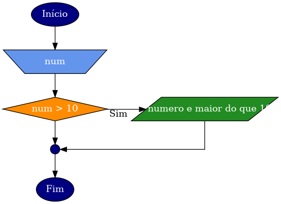

# Condicionais

[^BACKES] [^SOFFNER] [^LAPASINI]

Na programação estruturada, as instruções são executadas de forma sequencial. Em muitas situações, é necessário realizar uma verificação e analisar o resultado para determinar qual caminho seguir, o que é conhecido como desvio de fluxo. 

Por exemplo, quando compramos um carro, a taxa de juros pode ser diferente dependendo do valor da entrada. Da mesma forma, quando precisamos decidir se um aluno está aprovado, reprovado ou em exame com base em sua média escolar. 

Não podemos tratar essas situações apenas com os conceitos básicos de variáveis, tipos de variáveis, constantes, comando de atribuição, entrada e saída de dados. É necessário utilizar estruturas que nos permitam impor condições para a execução de instruções específicas ou criar condições que possibilitem o desvio do fluxo do programa.

::: tip Condição
Por condição entende-se qualquer expressão que tenha como resultado uma valor `verdadeiro` ou `falso`. 
:::


Uma condição em um programa pode conter expressões relacionais usando os operadores de comparação (> ,<, >=, <=, ==, !=), que resultam em um valor booleano (verdadeiro ou falso). Além disso, as condições podem conter expressões booleanas mais complexas, que combinam múltiplas expressões relacionais e operadores lógicos (AND, OR, NOT) para avaliar se a condição é verdadeira ou falsa.


## Estrutura

[^MANZANO]

::: tip 
A estrutura que permite desviar fluxo do programa é denominada de estrutura condicional, estrutura de seleção ou estrutura de controle 
:::

<figure>

```plantuml
@startuml
digraph G {
     //graph [rankdir=LR nodesep=0.5 ranksep=0.5];
     graph [nodesep=0.5 ranksep=0.5];
     graph [splines=ortho, nodesep=.5]

     ini[style="invis"];
     c1[shape=diamond label="Media >= 6" style=filled fillcolor="darkorange" fontcolor="white"];
     c1Tp1[style="invis"];
     c1Fp1[style="invis"];
     
     ini->c1
     {rank = same; c1;c1Tp1}
     c1->c1Tp1[xlabel=Sim]
     c1->c1Fp1[label=Não]

}
@enduml
```

<figcaption>Representação da tomada de decisão </figcaption>
</figure>


<figure>

```plantuml
@startuml
digraph G {
     //graph [rankdir=LR nodesep=0.5 ranksep=0.5];
     graph [nodesep=0.5 ranksep=0.5];
     graph [splines=ortho, nodesep=.5]

     ini[shape=ellipse label="In\ício"  style=filled fillcolor="navy" fontcolor="white"];
     p1[shape=invtrapezium label="N1,N2" style=filled fillcolor="cornflowerblue" fontcolor="white" width=1.2 fixedsize=shape];
     p2[shape=box label="media = (N1+N2)/2" style=filled fillcolor="steelblue" fontcolor="white"];
     c1[shape=diamond label="Media >= 6" style=filled fillcolor="darkorange" fontcolor="white"];
     c1Tp1[shape=parallelogram label="Aprovado" style=filled fillcolor="forestgreen" fontcolor="white" width=1.2 fixedsize=shape];
     c1Fp1[shape=parallelogram label="Reprovado" style=filled fillcolor="forestgreen" fontcolor="white" width=1.2 fixedsize=shape];
     c1join[shape=point label="" style=filled fillcolor="navy" fontcolor="white"  width=0.2 fixedsize=true ];
     fim[shape=ellipse label="Fim"  style=filled fillcolor="navy" fontcolor="white"];
     
     ini->p1->p2->c1
     c1join->fim
     {rank = same; c1;c1Tp1}
     c1->c1Tp1[xlabel=Sim]
     c1->c1Fp1[label=Não]
     c1Tp1->c1join
     c1Fp1->c1join[constraint=false]
}
@enduml
```

<figcaption>Exemplo de Fluxograma</figcaption>
</figure>

## Comando IF

O comando if é utilizado sempre que é necessário escolher entre dois caminhos dentro do programa ou quando se deseja executar um ou mais comandos que estejam sujeitos ao resultado de um teste. A forma geral de um comando if é:
```c
if(condição) { 
    sequência de comandos;
}
```

Na execução do comando if a condição será avaliada e:

- Se a condição for **verdadeira**, a sequência de comandos será executada.
- Se a condição for **falsa**, a sequência de comandos não será executada, e o progra-ma continuará a partir do primeiro comando seguinte ao final do comando if.





::: code-tabs

@tab c

```c
#include <stdio.h>
#include <stdlib.h>
int main(){
    int num;
    printf("Digite um numero: \n");
    scanf("%d",&num);
    if(num > 10){
        printf("O numero e maior do que 10");
    }        
    system("pause");  
    return 0;
}
```
@tab java

```java
import java.util.Scanner;
public class Programa{
    public static void main(String[] args) {
        Scanner teclado = new Scanner(System.in);
        int num;
        System.out.println("Digite um numero: ");
        num = teclado.nextInt();
        if(num > 10){
            System.out.println ("O numero e maior do que 10");
        }        
    }
}
```

:::

### Decisão composta

Ocorre quando duas alternativas dependem da mesma condição.

Formato padrão

```c
if (condição) {
    comandos
} else {
    outros comandos
}
```
exemplo:

::: code-tabs

@tab c

```c
if (media >= 6){
    printf("Aprovado \n");
}else{
    printf("Reprovado \n");
}
```

@tab java

```java
if (media >= 6){
    System.out.println("Aprovado");
}else{
    System.out.println("Reprovado");
}
```

:::

### Decisão múltipla
Ocorre quando um conjunto de valores discretos precisa ser testado e ações diferentes são associadas a esses valores.
Formato padrão: 
```c
switch (condição) {
    case x: 
        comando(y); 
        break;
}
```
EXEMPLO:
```c
switch (var){
   case 1: 
        printf("Opção 1 foi selecionada");
        break;
   case 2: 
        printf("Opção 2 foi selecionada");
        break;
   default: 
        printf("Nenhuma opção selecionada");
    }
```


## Exercícios

[Exercício](exercicios/02_condicional.md)

## Referências

@include(../bib/bib.md)


