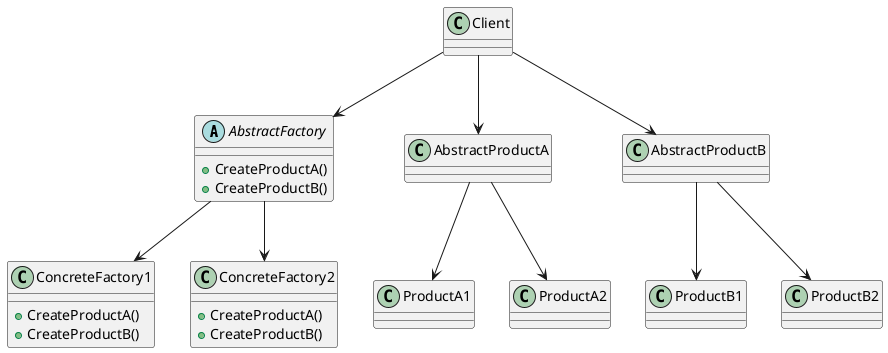
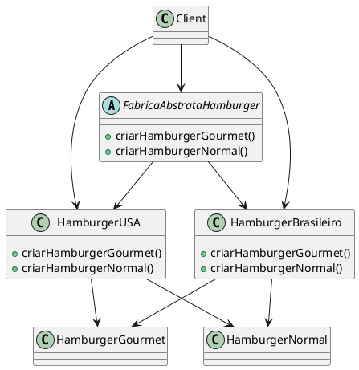

# ABSTRACT FACTORY

[^GAMMA]

## Intenção

Fornecer uma interface para criação de famílias de objetos relacionados ou dependentes sem especificar suas classes concretas.

## Também conhecido como

Kit

## Motivação

Considere um toolkit para construção de interfaces de usuários que suporte múltiplos estilos de interação (look-and-feel) tais como o Motif e o Presentation Manager. Diferentes estilos de interação definem diferentes apresentações e comportamento para os widgets de uma interface de usuário, tais como barras de rolamento, janelas e botões. Para ser portátil entre vários estilos de aparência, uma aplicação não deve codificar rigidamente seus widgets para um determinado padrão. Instanciando classes específicas de estilo de interação para os widgets pela aplicação toda, torna difícil mudar o estilo no futuro.

Podemos resolver esse problema definindo uma classe abstrata WidgetFactory que declara uma interface para criação de cada tipo básico de widget. Existe também uma classe abstrata para cada tipo de widget, e subclasses concretas implementam os widgets para interação. A interface de WidgetFactory tem uma operação que retorna um novo objeto widget para cada classe abstrata de widget. Os clientes chamam estas operações para obter instâncias de widget, mas não têm conhecimento das classes concretas que estão usando. Desta forma, os clientes ficam independentes do padrão de interação usado no momento.

<figure>


<figcaption>UML do toolkit</figcaption>
</figure>


Existe uma subclasse concreta de WidgetFactory para cada estilo de interação. Cada subclasse implementa as operações para criar o widget apropriado para aquele estilo de interação. Por exemplo, a operação CreateScrollBar aplicada à MotifWidgetFactory instancia e retorna uma barra de rolamento de acordo com o Motif, enquanto que a correspondente operação aplicada à PMWidgetFactory retorna uma barra de rolamento para o Presentation Manager. Os clientes criam widgets exclusivamente através da interface de WidgetFactory e não tem conhecimento das classes que implementam os widgets para um padrão em particular. Em outras palavras, os clientes têm somente que se comprometer com uma interface definida por uma classe abstrata, não uma determinada classe concreta. Uma WidgetFactory também implementa e garante as dependências entre as classes concretas de widgets. Uma barra de rolamento Motif deveria ser usada com um botão Motif e um editor de textos Motif, e essa restrição é garantida automaticamente como conseqüência de usar uma MotifWidgetFactory.

## Aplicabilidade

Use o padrão Abstract Factory quando:

- um sistema deve ser independente de como seus produtos são criados, compostos ou representados;
- um sistema deve ser configurado como um produto de uma família de múltiplos produtos;
- uma família de objetos-produto for projetada para ser usada em conjunto, e você necessita garantir esta restrição;
- você quer fornecer uma biblioteca de classes de produtos e quer revelar somente suas interfaces, não suas implementações.


## Estrutura



## Participantes
- **AbstractFactory** (WidgetFactory)
    - declara uma interface para operações que criam objetos-produto abstratos.

- **Concrete Factory** (MotifWidgetFactory, PMWidgetFactory)
    - implementa as operações que criam objetos-produto concretos.

- **AbstractProduct** (Window, ScrollBar)
    - declara uma interface para um tipo de objeto-produto

- **ConcreteProduct** (MotifWindow, MotifScrollBar)
    - define um objeto-produto a ser criado pela correspondente fábrica concreta.
    - implementa a interface de Abstract Product.

- **Client** 
    - Usa as interfaces declaradas pelas classes AbstractFactory e AbstractProduct.


## Colaborações

- Normalmente uma única instância de uma classe ConcreteFactory é criada em tempo de execução. Essa fábrica concreta cria objetos-produto que têm uma implementação particular. Para criar diferentes objetos-produto, os clientes deveriam usar uma fábrica concreta diferente.
- AbstractFactory adia a criação dos objetos-produto para as suas subclasses ConcreteFactory.


## Consequências

O padrão Abstract Factory tem os seguintes benefícios e desvantagens:

1. Ele isola as classes concretas. O padrão Abstract Factory ajuda a controlar as classes de objetos criadas por uma aplicação. Uma vez que a fábrica encapsula a responsabilidade e o processo de criar objetos-produto, isola os clientes das classes de implementação. Os clientes manipulam as instâncias através das suas interfaces abstratas. Nomes de classes-produto ficam isolados na implementação da fábrica concreta; eles não aparecem no código do cliente.
2. Ele torna fácil a troca de famílias de produtos. A classe de uma fábrica concreta aparece apenas uma vez numa aplicação – isto é, quando é instanciada. Isso torna fácil mudar a fábrica concreta que uma aplicação usa. Ela pode usar diferentes configurações de produtos simplesmente trocando a fábrica concreta. Uma vez que a fábrica abstrata cria uma família completa de produtos, toda família de produtos muda de uma só vez. No nosso exemplo de interface de usuário, podemos mudar de widgets do Motif para widgets do Presentation Manager simplesmente trocando os correspondentes objetosfábrica e recriando a interface.
3. Ela promove a harmonia entre produtos. Quando objetos-produto numa família são projetados para trabalharem juntos, é importante que uma aplicação use objetos de somente uma família de cada vez. AbstractFactory torna fácil assegurar isso.
4. É difícil de suportar novos tipos de produtos. Estender fábricas abstratas para produzir novos tipos de Produtos não é fácil. Isso se deve ao fato de que a interface de AbstractFactory fixa o conjunto de produtos que podem ser criados. Suportar novos tipos de produto exige estender a interface da fábrica, o que envolve mudar a classe AbstractFactory e todas as suas subclasses. Discutimos uma solução para este problema na seção de Implementação.


## Implementação

- A classe AbstractFactory é aquela que determina o tipo real do objeto concreto e o cria, mas retorna uma referência abstrata ao objeto concreto recém-criado.
- Isso determina o comportamento do cliente que pede à fábrica para criar um objeto de um determinado tipo abstrato e retornar o ponteiro abstrato para ele, impedindo que o cliente saiba algo sobre a criação real do objeto.
- O fato da fábrica retornar um ponteiro abstrato para o objeto criado significa que o cliente não tem conhecimento do tipo do objeto. Isso implica que não há necessidade de incluir nenhuma declaração de classe relacionada ao tipo concreto, o cliente lida o tempo todo com o tipo abstrato.
- Os objetos do tipo concreto, criados pela fábrica, são acessados pelo cliente apenas através da interface abstrata. A segunda implicação dessa maneira de criar objetos é que, ao adicionar novos tipos concretos, basta modificar o código do cliente e fazer com que ele use uma fábrica diferente, o que é muito mais fácil do que instanciar um novo tipo, o que requer alteração o código sempre que um novo objeto é criado.


A implementação clássica para o padrão Abstract Factory é a seguinte:


````java

abstract class AbstractProductA 
{
	public abstract void operationA1();
	public abstract void operationA2();
}

class ProductA1 extends AbstractProductA 
{
	ProductA1(String arg)
	{
		System.out.println("Hello "+arg);
	} 
	// Implement the code here
	public void operationA1() { };
	public void operationA2() { };
}

class ProductA2 extends AbstractProductA 
{
	ProductA2(String arg)
	{
		System.out.println("Hello "+arg);
	} 
	// Implement the code here
	public void operationA1() { };
	public void operationA2() { };
}

abstract class AbstractProductB 
{
	public abstract void operationB1();
	public abstract void operationB2();
}

class ProductB1 extends AbstractProductB 
{
	ProductB1(String arg)
	{
		System.out.println("Hello "+arg);
	} 
	// Implement the code here
}

class ProductB2 extends AbstractProductB 
{
	ProductB2(String arg)
	{
		System.out.println("Hello "+arg);
	} 
	// Implement the code here
}

abstract class AbstractFactory 
{
	abstract AbstractProductA createProductA();
	abstract AbstractProductB createProductB();
}

class ConcreteFactory1 extends AbstractFactory 
{
	AbstractProductA createProductA()
	{
		return new ProductA1("ProductA1");
	}
	AbstractProductB createProductB()
	{
		return new ProductB1("ProductB1");
	}
}

class ConcreteFactory2 extends AbstractFactory 
{
	AbstractProductA createProductA()
	{
		return new ProductA2("ProductA2");
	}
	AbstractProductB createProductB()
	{
		return new ProductB2("ProductB2");
	}
}


//Factory creator - an indirect way of instantiating the factories
class FactoryMaker 
{
	private static AbstractFactory pf=null;
	static AbstractFactory getFactory(String choice)
	{
		if(choice.equals("a"))
		{
			pf=new ConcreteFactory1();
		}
		else if(choice.equals("b"))
		{
			pf=new ConcreteFactory2();
		} 
		return pf;
	}
}


// Client
public class Client
{
	public static void main(String args[])
	{
		AbstractFactory pf=FactoryMaker.getFactory("a");
		AbstractProductA product=pf.createProductA();
		//more function calls on product
	}
}

````


## Exemplo de código

Nesse exemplo foi utilizado dois tipos de hambúger para de dois tipos de lugares do mundo para inlustar o mecanismo da
Abstract Factory:

1. Primeiro é criado uma classe abstract chamada **FabricaAbstrataHamburger** que contem duas assinturas de metódos:
- **criarHamburgerGourmet()** que retorna um objeto do tipo **HamburgerGourmet**
- **criarHamburgerNormal()** que retorna um objeto do tipo **HamburgerNormal**

````java

public interface FabricaAbstrataHamburger {
    public HamburgerGourmet criarHamburgerGourmet();
    public HamburgerNormal  criarHamburgerNormal();
    
}

````


2. Agora apartir dessa fábrica abstrata, criamos duas outras concretas:
- **HamburgerBrasileiro** que representa um hambúrger do tipo brasileiro
- **HamburgerUSA** que representa um hambúrger do tipo norte-americano

````java
public class HamburgerUSA implements FabricaAbstrataHamburger{
    
    @Override
    public HamburgerGourmet criarHamburgerGourmet(){
        
        return new HamburgerGourmet("Com Gergerlin", "Beacon", "Cheddar", "Molho barbecue");
        
    };
    @Override
    public HamburgerNormal criarHamburgerNormal(){
        
        return new HamburgerNormal("Com Gergerlin", "Beacon", "Cheddar", "sem");
        
    };
    
}


````

````java
public class HamburgerBrasileiro implements FabricaAbstrataHamburger{
    
    @Override
    public HamburgerGourmet criarHamburgerGourmet(){
        
        return new HamburgerGourmet("Com Gergerlin", "Picanha", "Cheddar", "Molho barbecue");
    };
    @Override
    public HamburgerNormal criarHamburgerNormal(){
        
        return new HamburgerNormal("Pão de hambúrger", "Carne de hambúrger ", "Quijo minas", "Sem");
        
    };
    
    
}


````

Ambos retornam nos metodos implemetados atravez da classe abstarata, dois objetos:
- No método **criarHamburgerGourmet()**, um obejto **HamburgerGourmet**
- No método **criarHamburgerNormal()**, um obejto **HamburgerNormal**


3. Agora só restou criar as duas classes que representar os objetos **HamburgerGourmet** e **HamburgerNormal** elas
repesentam os dois estilos de hambúrgers em si.


````java

class HamburgerGourmet {
    private String tipoDoPao;
    private String tipoDaCarne;
    private String tipoDoQueijo;
    private String tipoDoMolho;

    public HamburgerGourmet(String tipoDoPao, String tipoDaCarne, String tipoDoQueijo, String tipoDoMolho) {
        this.tipoDoPao    = tipoDoPao;
        this.tipoDaCarne  = tipoDaCarne;
        this.tipoDoQueijo = tipoDoQueijo;
        this.tipoDoMolho  = tipoDoMolho;
    }

    @Override
    public String toString() {
        return "HamburgerGourmet{" + "tipoDoPao=" + tipoDoPao + ", tipoDaCarne=" + tipoDaCarne + ", tipoDoQueijo=" + tipoDoQueijo + ", tipoDoMolho=" + tipoDoMolho + '}';
    }

    public String getTipoDoPao() {
        return tipoDoPao;
    }

    public void setTipoDoPao(String tipoDoPao) {
        this.tipoDoPao = tipoDoPao;
    }

    public String getTipoDaCarne() {
        return tipoDaCarne;
    }

    public void setTipoDaCarne(String tipoDaCarne) {
        this.tipoDaCarne = tipoDaCarne;
    }

    public String getTipoDoQueijo() {
        return tipoDoQueijo;
    }

    public void setTipoDoQueijo(String tipoDoQueijo) {
        this.tipoDoQueijo = tipoDoQueijo;
    }

    public String getTipoDoMolho() {
        return tipoDoMolho;
    }

    public void setTipoDoMolho(String tipoDoMolho) {
        this.tipoDoMolho = tipoDoMolho;
    }
    
}


````


````java

class HamburgerNormal {
    private String tipoDoPao;
    private String tipoDaCarne;
    private String tipoDoQueijo;
    private String tipoDoMolho;

    public HamburgerNormal(String tipoDoPao, String tipoDaCarne, String tipoDoQueijo, String tipoDoMolho) {
        this.tipoDoPao    = tipoDoPao;
        this.tipoDaCarne  = tipoDaCarne;
        this.tipoDoQueijo = tipoDoQueijo;
        this.tipoDoMolho  = tipoDoMolho;
    }

    @Override
    public String toString() {
        return "HamburgerNormal{" + "tipoDoPao=" + tipoDoPao + ", tipoDaCarne=" + tipoDaCarne + ", tipoDoQueijo=" + tipoDoQueijo + ", tipoDoMolho=" + tipoDoMolho + '}';
    }
    
   
    public String getTipoDoPao() {
        return tipoDoPao;
    }

    public void setTipoDoPao(String tipoDoPao) {
        this.tipoDoPao = tipoDoPao;
    }

    public String getTipoDaCarne() {
        return tipoDaCarne;
    }

    public void setTipoDaCarne(String tipoDaCarne) {
        this.tipoDaCarne = tipoDaCarne;
    }

    public String getTipoDoQueijo() {
        return tipoDoQueijo;
    }

    public void setTipoDoQueijo(String tipoDoQueijo) {
        this.tipoDoQueijo = tipoDoQueijo;
    }

    public String getTipoDoMolho() {
        return tipoDoMolho;
    }

    public void setTipoDoMolho(String tipoDoMolho) {
        this.tipoDoMolho = tipoDoMolho;
    }
      
}

````

4. Por fim vamos só visualizar os resultados:


````java
public class AbstractFactory {

    public static void main(String[] args) {
        HamburgerBrasileiro brBurger = new HamburgerBrasileiro();
        HamburgerUSA usaBurger       = new HamburgerUSA();
        
        System.out.println(brBurger.criarHamburgerNormal());
        System.out.println(brBurger.criarHamburgerGourmet());
        
        System.out.println(usaBurger.criarHamburgerNormal());
        System.out.println(usaBurger.criarHamburgerGourmet());
        
    }
}


````


````
//Saida

//Hambúrger Brasileiro
HamburgerNormal{tipoDoPao=Pão de hambúrger, tipoDaCarne=Carne de hambúrger , tipoDoQueijo=Queijo minas, tipoDoMolho=Sem}
HamburgerGourmet{tipoDoPao=Com Gergerlin, tipoDaCarne=Picanha, tipoDoQueijo=Cheddar, tipoDoMolho=Molho barbecue}

//Hambúrger Norte-americano
HamburgerNormal{tipoDoPao=Com Gergerlin, tipoDaCarne=Beacon, tipoDoQueijo=Cheddar, tipoDoMolho=sem}
HamburgerGourmet{tipoDoPao=Com Gergerlin, tipoDaCarne=Beacon, tipoDoQueijo=Cheddar, tipoDoMolho=Molho barbecue}


````
5. Vejamos esse código em um diagrama UML




## Usos conhecidos

InterViews usa o sufixo “Kit” [Lin92] para denotar classes AbstractFactory. Ela define fábricas abstratas WidgetKit e DialogKit para geração de objetos específicos da interface de usuário para interação. InterViews também inclui LayoutKit, que gera diferentes objetos por composição dependendo do layout desejado. Por exemplo, um layout que é conceitualmente horizontal pode exigir diferentes objetos compostos, dependendo da orientação do documento (retrato ou paisagem). ET++ [WGM88] usa o padrão Abstract Factory para obter portabilidade entre diferentes sistemas de janelas (X Windows e SunView, por exemplo). A classe abstrata base WindowSystem define a interface para criar objetos que representam recursos do sistema de janelas (MakeWindow, MakeFont, MakeColor, por exemplo). As subclasses concretas implementam as interfaces para um sistema de janelas específico. Em tempo de execução, ET++ cria uma instância de uma subclasse concreta WindowSystem que cria objetos concretos para os recursos do sistema.

## Padrão relacionados
As classes AbstractFactory são freqüentemente implementadas com métodos-fábrica Factory Method, mas elas também podem ser implementadasusando Prototype. Uma fábrica concreta é freqüentemente um singleton.

## Referências

- **ERICK GAMMA**, Padrões de Projetos: Soluções Reutilizáveis de Software Orientados a Objetos,  Bookman; 1ª edição (1 janeiro 2000)
- **ABSTRACT FACTORY PATTERN - STARTERTUTORIALS**, https://www.startertutorials.com/patterns/abstract-factory-pattern.html
- **REFACTORING GURU:** https://refactoring.guru/pt-br/design-patterns/abstract-factory

