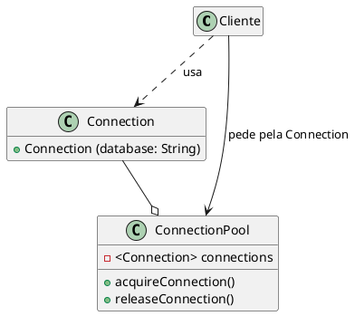
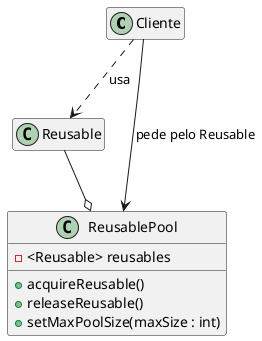

# Object Pool

 [^SourceMaking]
 [^ODesign] 
 [^BestPratice] 
 [^CsiUneb] 
 [^Microsoft]
 [^ASPNET]
 [^Unity]
 [^Unity3D]

## Intenção

O Object Pool tem como objetivo reaproveitar objetos, criando pré-instancias de objetos que poderão ser solicitados a qualquer momento.

## Também conhecido como

Pool de Objetos

## Motivação

Por exemplo se trabalhamos com bancos de dados, o processo de criar uma conexão é uma operação cara e pode exigir muito tempo, isso pode vir a sobrecarregar o banco de dados, ou seja, abrir muitas conexões pode afetar o desempenho por diversos motivos, por isso nesse caso seria recomendado a utilização do padrão de projeto **object pool**, que já terá pools de conexões prontas, que poderão ser reutilizadas sempre que um cliente solicitar, sem ter a necessidade de destruir e criar uma nova.

<figure>


<figcaption>Exemplo Object Pool.</figcaption>
</figure>

Quando um cliente precisar consultar o banco de dados, ele poderá instanciar um novo objeto connection especificando o nome do banco de dados que irá chamar o método de consulta que deverá retornar um objeto, enquanto isso o pool executa as seguintes ações:
- Procura um objeto reutilizável disponível e caso seja encontrado será devolvido ao cliente.
- Se nenhum objeto reutilizável for encontrado, ele tenta criar um novo. Se esta ação for bem-sucedida, o novo objeto reutilizável será retornado ao cliente.
- Se o pool não conseguir criar um novo objeto reutilizável, ele aguardará até que um objeto reutilizável seja liberado.

**Cliente** - É quem irá utilizar, e também solicitar a connection, para a connectionPool.

**Connection** - Representa o objeto que é instanciado pelo cliente.

**ConnectionPool** - É o que gerencia as conexões com o banco de dados. Ele mantém uma lista de objetos Connection e instancia novos objetos, se necessário.

Lembrando que o cliente é responsável por solicitar o objeto reutilizável, bem como liberá-lo para o pool. Caso esta ação não seja realizada, o objeto reutilizável será perdido, e será considerado indisponível.


## Aplicabilidade

Use o padrão Object Pool quando:

- Possuir objetos com alto custo e/ou tempo de criação;
- Os objetos que estão sendo usados podem ser reaproveitados;
- Os objetos forem intânciados com muita frequência, ou seja, várias partes do seu aplicativo requerem os mesmos objetos em momentos diferentes.


## Estrutura

<figure>



<figcaption>Estrutura Object Pool.</figcaption>
</figure>


## Participantes 

- **Reusable** (Connection)
    - Instâncias dessa classe colaboram com outros objetos por um período de tempo limitado, onde serão compartilhados por vários clientes por um período de tempo limitado e então não são mais necessárias para essa colaboração
- **Cliente** (Cliente)
    - Instâncias dessa classe usam os obejtos reutilizaveis (Reusable Objects).
- **ReusablePool** (ConnectionPool)
    - Instâncias dessa classes gerenciam os objetos reutilizáveis ​​para utilização pelos clientes, criando e manuseando uma pool de objetos.
    

## Colaborações

- O cliente interage com o ReusablePool, para solicitar através do método AcquireReusable() o objeto que deseja utilizar (reusable), o ReusablePool verifica se existe alguma intância do objeto disponivel na pool no momento, e caso tenha, devolve para o cliente e altera o status daquele objeto para "indisponível", assim ele tem o controle que aquele objeto não pode ser emprestado novamente, até que seja devolvido pelo cliente através do método releaseReusable(), no qual ele coloca o reusable (objeto que foi emprestado) novamente na pool e altera seu status para "disponivel" até o momento que for solicitado novamente.

## Consequências

O padrão Object Pool tem os seguintes benefícios e desvantagens:

- **Benefícios**
    
    - Oferece um aumento no desempenho.
    - Consegue gerenciar as conexões e fornece uma maneira de reutiliza-las e compartilha-las.
    - Pode fornecer o limite para o número máximo de objetos que podem ser criados.
    - Oferece a possibilidade de alterar o tamanho da pool

- **Desvantagens** 

    - Como existe um limite de objetos na pool, pode ocorrer falta de objetos disponiveis.
    - Para que o objeto volte para a pool, o cliente que o estava utilizando, precisa libera-lo, caso não o faça o objeto será perdido e não voltará para a pool.
    - Pode ocorrer falhas na politica de aquisição e criação dos recursos.
    - A posibilidade de alterar o tamanho da pool também pode gerar alguns problemas, como destruir objetos que estão em uso (caso o tamanho da pool seja diminuido)

## Implementação

Uma ideia de uso do padrão de projeto object pool, poderia ser em um jogo de damas, onde existe a opção de recuperar peças que já foram perdida. Cada jogador possui o seu cemitério, onde ficam suas peças que foram "mortas" pelo seu adversario, em certo ponto do jogo é possivel recuperar algumas peças que se encontram no cemitério;
Para que não seja necessário criar novas instâncias sempre que um jogador puder recuperar uma peça do cemitério, podemos utilizar o padrão de projeto e deixar uma pool de peças já prontas para serem usadas quando for preciso. Ao termino do jogo, ou quando forem "mortas" novamente, todas as peças serão devolvidas a pool.

Abaixo podemos ver um exemplo de como ficariam as classes com a utilização do object pool:

```java
public class Peca {

    private int idPeca;
    public Peca(int idPeca) {
        this.idPeca = idPeca;
    }
    @Override
        public boolean equals(Object obj)
        {
            if(this == obj)
                return true;
        
            if(obj == null || obj.getClass()!= this.getClass())
                return false;
            
            Peca peca = (Peca) obj;
            
            return (peca.idPeca == this.idPeca);
        }
}
```

```java
public class Cemiterio {

    private ArrayList<Peca> disponiveisParaUso;
    private ArrayList<Peca> pecasDeVoltaAoJogo;

    public Peca pegarPeca() {
        if (disponiveisParaUso.isEmpty()) { 
            return null;
        } 
        else {
                Peca referencia_em_uso = disponiveisParaUsos.get(0);
                pecasDeVoltaAoJogo.add(referencia_em_uso);
                disponiveisParaUso.remove(referencia_em_uso);              
                return referencia_em_uso; 
        }
    }   
    public Peca liberarPeca(Peca pecaDevolvida) { 
       for (Peca peca : pecasDeVoltaAoJogo) {
            if (peca.equals(pecaDevolvida)) {
                
                pecasDeVoltaAoJogo.remove(pecaDevolvida);           
                disponiveisParaUso.add(pecaDevolvida);
                return null; 
            }
            else 
                return pecaDevolvida;
        }   
    }

}
```


## Exemplo de código

Código generico de classes quando é utilizado o object pool.

```java
public class Objeto {

    private int idObjeto;
    //qualquer outros atributos que o objeto possua
    public Objeto(int idObjeto) {
        this.idObjeto = idObjeto;
    }
    @Override
        public boolean equals(Object obj)
        {
            if(this == obj)
                return true;
        
            if(obj == null || obj.getClass()!= this.getClass())
                return false;
            
            Objeto objeto = (Objeto) obj;
            
            return (objeto.idObjeto == this.idObjeto);
        }
}
```

```java
public class PoolDeObjeto {

    private ArrayList<Objeto> disponiveis;
    private ArrayList<Objeto> emUso;

    public Objeto pegarObjeto() {
        if (disponiveis.isEmpty()) { // ver se a lista está vazia, caso esteja retorna null
            return null;
        } 
        else {
                Peca referencia_em_uso = disponiveis.get(0);
                emUso.add(referencia_em_uso);
                disponiveis.remove(referencia_em_uso);              
                return  referencia_em_uso; // se a lista tem objetos disponiveis, retorna a referencia do objeto para o cliente
        }
    }   
    public Objeto liberarObjeto(Objeto objetoDevolvido) { 
       for (Objeto objeto : emUso) {                // verifica se o objeto devolvido está na lista dos objetos que foram emprestados
            if (objeto.equals(objetoDevolvido)) {

                emUso.remove(objetoDevolvido);           
                disponiveis.add(objetoDevolvido);  // caso o objeto devolvido esteja na lista emUso, ele volta para a lista de disponiveis
                return null; 
            }
            else 
                return objetoDevolvido; // caso não esteja, o objeto devolvido é retornado para o cliente
        }             
    }
}
```
## Usos conhecidos

- **ASP.NET Core** - É a versão de código aberto da ASP.NET, é uma estrutura de desenvolvimento para aplicativos Web, que utiliza o padrão de projeto **object pool** para fazer a reutilização de objetos. É utilizado uma pool de objetos em alguns locais para reutilizar instâncias de StringBuilder, que servem para alocar e gerenciar seus próprios buffers para armazenar dados de caracteres. A ASP.NET Core usa StringBuilder regularmente para implementar recursos, e reutilizá-los oferece um benefício de desempenho.
- **UNITY** - A unity é um motor de jogo (Game Engine) que permite a criação de videojogos para varias plataformas, oferecendo varias ferramentas de criação de jogos e também de aprendizado para o desenvolvedor, dentre essas ferramentas para uso, eles permitem a utilização do padrão de projeto object pool, que como eles descrevem, otimiza os projetos e diminui a carga que é colocada na CPU ao criar e destruir GameObjects repetidas vezes.


## Padrão relacionados

***Factory Method*** : O padrão Factory Method pode ser usado para encapsular a lógica de criação de objetos. No entanto, ele não os gerencia após sua criação, o padrão de object pool rastreia os objetos que ele cria.

***Singleton*** : Object Pools geralmente são implementados como Singletons.

## Referências

<!-- @include: ../bib/bib.md -->