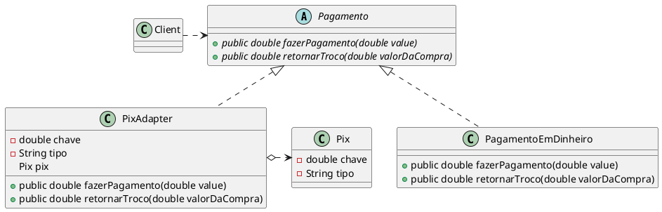

## Intenção

- Converter a interface de uma classe em outra interface, esperada pelos clientes. O
Adapter permite que classes com interfaces incompatíveis trabalhem em conjunto –
o que, de outra forma, seria impossível.

## Também conhecido como

- Wrapper

## Motivação

- Em algumas situações, a interface oferecida por um toolkit, projetada para ser
reutilizada não pode ser usada numa aplicação porque sua interface não
corresponde à interface específica.

## Aplicabilidade

1. Utilize a classe Adaptador quando você quer usar uma classe existente, mas sua interface não for compatível com o resto do seu código.
1. O padrão Adapter permite que você crie uma classe de meio termo que serve como um tradutor entre seu código e a classe antiga, uma classe de terceiros, ou qualquer outra classe com uma interface estranha.
1. Você pode estender cada subclasse e colocar a funcionalidade faltante nas novas classes filhas. Contudo, você terá que  duplicar o código em todas as novas classes, o que  cheira muito mal.


## Estrutura

<figure>


<figcaption>Estrutura genérica do Adapter</figcaption>
</figure>


## Participantes

**Target**
– define a interface específica do domínio que `Client` usa.
**Client**
– colabora com objetos compatíveis com a interface de `Target`.
**Adaptee**
– define uma interface existente que necessita ser adaptada.
**Adapter**
– adapta a interface do `Adaptee` à interface de `Target`.


## Colaborações
-  Os clientes chamam operações em uma instância de `Adapter`. Por sua vez, o
adapter chama operações de `Adaptee` que executam a solicitação.


## Consequências

Pró: Você pode introduzir novos tipos de
adaptadores no programa sem quebrar o código cliente existente, desde que eles trabalhem com os adaptadores através
da interface cliente.

Contra: A complexidade geral do código aumenta porque você precisa
introduzir um conjunto de novas interfaces e classes. Algumas
vezes é mais simples mudar a classe serviço para que ela se
adeque com o resto do seu código.

## Implementação

**Este exemplo simples mostra como um adaptador pode fazer com que objetos incompatíveis funcionem juntos.**

**Buracos Redondos**

```java
package refactoring_guru.adapter.example.round;

public class RoundHole {
    private double radius;

    public RoundHole(double radius) {
        this.radius = radius;
    }

    public double getRadius() {
        return radius;
    }

    public boolean fits(RoundPeg peg) {
        boolean result;
        result = (this.getRadius() >= peg.getRadius());
        return result;
    }
}

```

**Pinos Redondos**

```java
package refactoring_guru.adapter.example.round;

public class RoundPeg {
    private double radius;

    public RoundPeg() {}

    public RoundPeg(double radius) {
        this.radius = radius;
    }

    public double getRadius() {
        return radius;
    }
}

```

**Pinos Quadrados**

```java
package refactoring_guru.adapter.example.square;

public class SquarePeg {
    private double width;

    public SquarePeg(double width) {
        this.width = width;
    }

    public double getWidth() {
        return width;
    }

    public double getSquare() {
        double result;
        result = Math.pow(this.width, 2);
        return result;
    }
}

```

**Adaptador de pinos quadrados para buracos redondos**

```java

package refactoring_guru.adapter.example.adapters;

import refactoring_guru.adapter.example.round.RoundPeg;
import refactoring_guru.adapter.example.square.SquarePeg;

public class SquarePegAdapter extends RoundPeg {
    private SquarePeg peg;

    public SquarePegAdapter(SquarePeg peg) {
        this.peg = peg;
    }

    @Override
    public double getRadius() {
        double result;
        result = (Math.sqrt(Math.pow((peg.getWidth() / 2), 2) * 2));
        return result;
    }
}
```


**Código Cliente**

```java
package refactoring_guru.adapter.example;

import refactoring_guru.adapter.example.adapters.SquarePegAdapter;
import refactoring_guru.adapter.example.round.RoundHole;
import refactoring_guru.adapter.example.round.RoundPeg;
import refactoring_guru.adapter.example.square.SquarePeg;

public class Demo {
    public static void main(String[] args) {
        RoundHole hole = new RoundHole(5);
        RoundPeg rpeg = new RoundPeg(5);
        if (hole.fits(rpeg)) {
            System.out.println("Round peg r5 fits round hole r5.");
        }

        SquarePeg smallSqPeg = new SquarePeg(2);
        SquarePeg largeSqPeg = new SquarePeg(20);
     
        SquarePegAdapter smallSqPegAdapter = new SquarePegAdapter(smallSqPeg);
        SquarePegAdapter largeSqPegAdapter = new SquarePegAdapter(largeSqPeg);
        if (hole.fits(smallSqPegAdapter)) {
            System.out.println("Square peg w2 fits round hole r5.");
        }
        if (!hole.fits(largeSqPegAdapter)) {
            System.out.println("Square peg w20 does not fit into round hole r5.");
        }
    }
}

```

**Resulados**
```console

Round peg r5 fits round hole r5.
Square peg w2 fits round hole r5.
Square peg w20 does not fit into round hole r5.

```

## Exemplo de código

Uma pequena loja de roupas deseja dar um upgrade na sua forma de recebe dinheiro dos clientes, ele resolvem adicionar um novo método de
pagamento em seu sistema, esse método é o Pix. Porém o empredimento não tem capital suficiente atualmente para implementar outro sistema.
A solução foi "adaptar" as funcionalidades atuais de pagamento por dinheiro para quê funcionem com o Pix.

<figure>


</figure>
<figcaption>UML do código</figcaption>

Essa interface `Pagamento` é resposavel por gerir os métodos para que seja realizada um pagamento em dinheiro.
@[code](./code/gof/Adapter/Pagamento.java)

Aqui simplesmente a classe `PagamentoEmDinheiro` implementa de `Pagamento` e agora é possivel realizar transações de dinheiro em espécie.
@[code](./code/gof/Adapter/PagamentoEmDinheiro.java)

Todavia nosso problemas surge já que não é possivel fazer transações do tipo Pix.
O que vamos fazer é **adaptar** uma classe chamada `Pagamento` para que ela funcione usando elementos da
classe `Pix` e assim o usuário possa fazer pagamento em Pix usando a interface pagamento.

Classe `Pix`.
@[code](./code/gof/Adapter/Pix.java)

Classe `Pix Adapter`. Essa classe implementa de `Pagamento` e o **adapta** usando um objeto `Pix`.
@[code](./code/gof/Adapter/PixAdapter.java)

Porfim vamos ver como isso ficaria na prática.
@[code](./code/gof/Adapter/Client.java)

**Resultado**

```console

O pagamento foi feito em dinheiro: R$ 11.0 Reais
Seu troco é R$ 1.0

O pagamento foi feito no Pix: R$ 11.0
Chave: 2233.4
Tipo: Chave Aleatória
 - Essa função não está disponível no Pix

```

## Usos conhecidos

- Suponha que você tenha um sistema legado que se comunica usando um protocolo específico, como SOAP, mas você deseja modernizar sua aplicação e utilizar uma arquitetura baseada em APIs RESTFUL. Nesse caso, o Adapter pode ser usado para adaptar a interface SOAP para uma interface RESTFUL, permitindo a comunicação entre os sistemas antigo e novo.

## Padrões semelhantes

**Facade** - O `Facade` define uma nova interface para objetos existentes, enquanto que o Adapter tenta fazer uma interface existente ser utilizável. O Adapter geralmente envolve apenas um objeto, enquanto que o Facade trabalha com um inteiro subsistema de objetos.

**Bridge** - O `Bridge` é geralmente definido com antecedência, permitindo que você desenvolva partes de uma aplicação independentemente umas das outras. Por outro lado, o Adapter é comumente usado em aplicações existentes para fazer com que classes incompatíveis trabalhem bem juntas.

## Referências

BIGARDI, G. B. Arquitetura e desenvolvimento de software — Parte 7 — Adapter. Disponível em: <https://gbbigardi.medium.com/arquitetura-e-desenvolvimento-de-software-parte-7-adapter-a122818c2a27>. Acesso em: 27 maio. 2023.

VANINI, F. Programação Orientada a Objetos Padrões de Projeto (design patterns). [s.l: s.n.]. Disponível em: <https://www.ic.unicamp.br/~vanini/mc302/PadroesDeProjeto.pdf>. Acesso em: 28 maio. 2023.

‌GAMMA, E. et al. Padrões de projeto : soluções reutilizáveis de software orientado a objetos. Porto Alegre: Bookman, 2006.

Adapter. Disponível em: <https://refactoring.guru/pt-br/design-patterns/adapter>. Acesso em: 28 maio. 2023.

‌