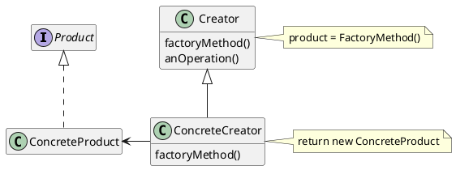

# Factory Method (GOF)


## Intenção

[^GAMMA]

Definir uma interface para criar um objeto, mas deixar as subclasses decidirem que classe instanciar. O Factory Method permite adiar a instanciação para subclasses.


## Também conhecido como


Virtual Constructor.


## Motivação


Os frameworks utilizam classes abstratas para definir e manter relacionamentos entre objetos, eles também são responsáveis pela criação desses objetos.


Considere um cenário onde existe um framework desenvolvido para criar aplicações que permitam aos usuários lidar com vários documentos. Duas abstrações-chave nesse framework são as classes `Application` (Aplicação) e `Document` (Documento). As duas classes são abstratas, e os clientes devem criar subclasses para realizar suas implementações específicas para a aplicação. Por exemplo, para criar uma aplicação de desenho, criamos as classes `DrawingApplication` e `DrawingDocument`. A classe Application é responsável pelo gerenciamento dos documentos e pode criá-los quando necessário, por exemplo, quando o usuário seleciona Open (Abrir) ou New (Novo) no Menu.


No entanto, a classe Application não pode prever qual subclasse de Document será necessária, já que essa escolha é específica para cada aplicação. A classe Application sabe apenas quando um documento deve ser criado, mas não tem conhecimento sobre qual tipo de Document deve ser instanciado. Isso gera um dilema: o framework precisa criar instâncias de classes, mas só possui conhecimento sobre as classes abstratas, as quais não podem ser instanciadas diretamente.


É aí que o padrão Factory Method oferece uma solução para esse problema. Ele encapsula o conhecimento sobre qual subclasse de Document deve ser criada e transfere essa responsabilidade para fora do framework.


```java


// Classe abstrata Document
public abstract class Document {
    // Métodos abstratos que devem ser implementados pelas subclasses
    public abstract void new();
    public abstract void open();
    public abstract void close();
    public abstract void save();
}


// Classe concreta DrawingDocument
public class DrawingDocument extends Document {
    // Atributos
    @Override
    public void new() {
        // Código para criar documento
    }
    @Override
    public void open() {
        // Código para abrir documento
    }
    @Override
    public void close() {
        // Código para fechar documento
    }
    @Override
    public void save() {
        // Código para salvar documento
    }
    @Override
    public void create() {
        // Código para criar documento
    }
}


// Classe abstrata Application
public abstract class Application {
    // Factory Method que cria instâncias de Document
    public abstract Document createDocument();

    // Métodos responsáveis por gerenciar os documentos
    public void newDocument() {
        Document document = createDocument();
        document.create();
    }

    public void openDocument() {
        Document document = createDocument();
        document.open();
    }
}


// Classe concreta DrawingApplication
public class DrawingApplication extends Application {
    @Override
    public Document createDocument() {
        return new DrawingDocument();
    }
}


// Exemplo de uso do framework
public class Main {
    public static void main(String[] args) {
        Application application = new DrawingApplication();
        application.createDocuments();
    }
}


```


No código acima criado de acordo com o cenário estabelecido temos a classe abstrata `Document` que define a estrutura de um documento e a classe `DrawingDocument` que é uma implementação da classe `Document`.


A classe `Application` representa o framework que possui o Factory Method `createDocument()`, que tem o objetivo de criar instâncias de documentos (`Document`). O framework não tem conhecimento de qual subclasse de `Document` será necessária, então ela delega toda responsabilidade para as classes concretas, como `DrawingApplication`, que implementa o método `createDocument()` retornando uma instância de `DrawingDocument`.


Esse exemplo demonstra a flexibilidade que o padrão Factory Method pode entregar, onde permite que o framework crie objetos sem conhecer a subclasse específica que deve ser instanciada.


## Aplicabilidade


Use o padrão Factory Method quando:
- Uma classe não pode antecipar a classe de objetos que deve criam;
- Uma classe quer que suas subclasses especifiquem os objetos que criam;
- Classes delegam responsabilidade para uma dentre várias subclasses auxiliares, e você quer localizar o conhecimento de qual subclasse auxiliar que é a delegada;
- Quando não souber de antemão os tipos e dependências exatas dos objetos com os quais seu código deve funcionar;
- Quando desejar fornecer aos usuários da sua biblioteca ou framework uma maneira de estender seus componentes internos.


## Estrutura


<figure>





<figcaption>Estrutura Factory Method.</figcaption>
</figure>


## Participantes


- **Product** (Document)
    - define a interface de objetos que o método fábrica cria.
- **ConcreteProduct** (MyDocument)
    -  implementa a interface de Product.
- **Creator** (Application)
    - Declara o método fábrica, o qual retorna um objeto do tipo Product. Creator
    pode também definir uma implementação por omissão do método factory
    que retorna por omissão um objeto ConcreteProduct.
    - Pode chamar o método factory para criar um objeto Product.
- **ConcreteCreator** (MyApplication)
    - Redefine o método-fábrica para retornar a uma instância de um
    ConcreteProduct.


## Colaborações


-  Creator depende das suas subclasses para definir o método fábrica de maneira que retorne uma instância do ConcreteProduct apropriado.


## Consequências


### Vantagens


- O Factory Method elimina a necessidade de anexar classes específicas das aplicações no código. O código lida somente com a interface de Product; portanto, ele pode trabalhar com quaisquer classe ConcreteProduct definidas pelo usuário.


- Fornece ganchos para subclasses. Criar objetos dentro de uma classe com um método fábrica é sempre mais flexível do que criar um objeto diretamente. Factory Method dá às subclasses um gancho para fornecer uma versão estendida de um objeto.


- Conecta hierarquias de classe paralelas. Nos exemplos que consideramos até aqui o método-fábrica é somente chamado por Creators. Mas isto não precisa ser obrigatoriamente assim; os clientes podem achar os métodos-fábrica úteis, especialmente no caso de hierarquias de classe paralelas. Hierarquias de classe paralelas ocorrem quando uma classe delega alguma das suas responsabilidades para uma classe separada.


### Desvantagens


- Uma desvantagem em potencial dos métodos fábrica é que os clientes podem ter que fornecer subclasses da classe Creator somente para criar um objeto ConcreteProduct em particular. Usar subclasses é bom quando o cliente tem que fornecer subclasses a Creator de qualquer maneira, caso contrário, o cliente deve lidar com outro ponto de evolução.


## Implementação

[^REFACTORING_GURU]

Considere os passos à seguir, para aplicar o padrão Factory Method:


1. Faça todos os produtos implementarem a mesma interface. Essa interface deve declarar métodos que fazem sentido em todos os produtos.


2. Adicione um método fábrica vazio dentro da classe criadora. O tipo de retorno do método deve corresponder à interface comum do produto.


3. No código da classe criadora, encontre todas as referências aos construtores de produtos. Um por um, substitua-os por chamadas ao método fábrica, enquanto extrai o código de criação do produto para o método fábrica.
    - Pode ser necessário adicionar um parâmetro temporário ao método fábrica para controlar o tipo de produto retornado.


4. Crie um conjunto de subclasses criadoras para cada tipo de produto listado no método fábrica. Sobrescreva o método fábrica nas subclasses e extraia os pedaços apropriados do código de construção do método base.


5. Se houver muitos tipos de produtos e não fizer sentido criar subclasses para todos eles, você poderá reutilizar o parâmetro de controle da classe base nas subclasses.


6. Se, após todas as extrações, o método fábrica base ficar vazio, você poderá torná-lo abstrato. Se sobrar algo, você pode tornar isso em um comportamento padrão do método.

## Exemplo de código

No cenário do código a seguir, retrata uma empresa de transportes que contém carros e motos. A empresa busca atender passageiros da cidade, pegando a pessoa e levando para o destino desejado. Como a empresa contém vários carros e motos, foi criada uma fábrica para cada tipo de transporte.

```java

public interface Transportes {
    public void pegarPassageiro(String nomePassageiro);
    public void levarPassageiro(String nomePassageiro);
    public void pararTransporte();
}

public class Moto implements Transportes {
    String nomeTransporte;

    public Moto (String nomeTransporte) {
        this.nomeTransporte = nomeTransporte;
    }

    public void pegarPassageiro(String nomePassageiro) {
        // Lógica do método...
        System.out.println("A caminho do passageiro(a): " + nomePassageiro);
    }

    public void levarPassageiro(String nomePassageiro) {
        // Lógica do método...
        System.out.println("Levando passageiro(a) " + nomePassageiro + " ao seu destino.");
    }

    public void pararTransporte() {
        // Lógica do método...
        System.out.println("Parando transporte");
    }
}

public class Carro implements Transportes {
    String nomeTransporte;

    public Carro (String nomeTransporte) {
        this.nomeTransporte = nomeTransporte;
    }

    public void pegarPassageiro(String nomePassageiro) {
        // Lógica do método...
        System.out.println("A caminho do passageiro(a): " + nomePassageiro);
    }

    public void levarPassageiro(String nomePassageiro) {
        // Lógica do método...
        System.out.println("Levando passageiro(a) " + nomePassageiro + " ao seu destino.");
    }

    public void pararTransporte() {
        // Lógica do método...
        System.out.println("Parando transporte");
    }
}

public abstract class FactoryTransportes {
    public abstract Transportes criarTransporte(String nomeTransporte);
}

public class FactoryMoto extends FactoryTransportes {

    @Override
    public Transportes criarTransporte(String nomeTransporte) {
        return new Moto(nomeTransporte);
    }
    
}

public class FactoryCarro extends FactoryTransportes {

    @Override
    public Transportes criarTransporte(String nomeTransporte) {
        return new Carro(nomeTransporte);
    }
    
}

public class Main {
    public static void main(String[] args) {
        FactoryCarro fabricaCarros = new FactoryCarro();

        Carro gol = (Carro) fabricaCarros.criarTransporte("Gol vermelho");
        gol.levarPassageiro("João");
        Carro uno = (Carro) fabricaCarros.criarTransporte("Uno preto");
        uno.pegarPassageiro("Maria");

        Moto biz = (Moto) fabricaCarros.criarTransporte("Honda Biz 125");
        biz.levarPassageiro("Ana");
    }
}

```

## Usos conhecidos


- Sistemas de Interface Gráfica do Usuário, muitos sistemas que envolvem interfaces gráficas, utilizam o Factory Method para criar objetos de componentes de interface do usuário, como botões, caixas de texto e janelas.


- A classe `View` do framework Model/View/Controller no Smalltalk-80, tem um método chamado defaultController, responsável por criar uma instância controlador. Isso pode parecer com o método fábrica, mas a verdadeira implementação do método fábrica é encontrada no método defaultControllerClass, que retorna a classe da qual defaultController cria instâncias.


- Sistema ORB Orbix da IONA Technologies[ION94], utiliza do padrão Factory Method para criar tipos apropriados de proxy, quando um objeto utiliza solicita uma referência para um objeto remoto. O padrão facilita a substituição do proxy padrão para um outro que seja adequado para a interação.


## Padrão relacionados


- [Abstract Factory](06_Abstract_Factory.md): Abstract Factory e Factory Method podem ser combinados de maneira que o Abstract Factory cria famílias de objetos dependentes, sem que seja necessário especificar suas classes concretas e o Factory Method pode ser utilizado para criar objetos individuais dentro dessas famílias.
- [Template Methods]: Template Method e Factory Method podem ser utilizados juntos da seguinte maneira, o Factory Method é utilizado dentro do Template Method, possibilitando a criação de objetos específicos durante a execução de um algoritmo.
- [Prototype](Prototype.md): Prototype e Factory Method podem ser combinados quando se cria um objeto protótipo dentro do método fábrica, sendo assim os objetos são clonados sem que seja necessário criar o objeto do zero, após clonar você pode fazer a alterações necessárias.


## Referências

<!-- @include: ../bib/bib.md -->


