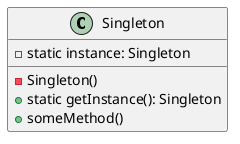

# Singleton (GOF) 

[^GAMMA]


O padrão de projeto Singleton é um padrão de criação que garante a existência de apenas uma instância de uma determinada classe em todo o sistema, fornecendo um ponto de acesso global a essa instância.

## Motivação

A motivação para o uso do padrão Singleton é garantir que apenas uma única instância de uma classe seja criada em todo o sistema. Isso pode ser útil em cenários em que uma classe representa um recurso compartilhado, como um pool de conexões de banco de dados, um cache de objetos ou um gerenciador de configurações. Além disso, o Singleton pode ser usado para limitar o número de instâncias de uma classe (Multiton), o que pode ser útil em cenários em que a criação de várias instâncias pode ter um impacto negativo no desempenho ou na utilização de recursos do sistema.

## Aplicabilidade

O padrão Singleton é aplicável em situações em que é necessário garantir que apenas uma única instância de uma classe seja criada em todo o sistema. Alguns exemplos de uso do padrão Singleton incluem:

- Criação de objetos que representam recursos compartilhados, como bancos de dados, arquivos de log ou cache de objetos.
- Gerenciamento de configurações do sistema, garantindo que apenas uma única instância do objeto de configuração seja criada e usada em todo o sistema.
- Controle de acesso a um recurso compartilhado, garantindo que apenas uma única instância do objeto de controle de acesso seja criada em todo o sistema.

## Estrutura

A estrutura do padrão Singleton é composta por uma única classe, que é responsável por garantir a criação de apenas uma única instância dessa classe em todo o sistema. A seguir, é apresentado um diagrama de classes UML que ilustra a estrutura do padrão Singleton:
<figure>



<figcaption>Estrutura do Singleton</figcaption>
</figure>

O diagrama mostra que a classe Singleton tem um método estático `getInstance()` que é responsável por garantir que apenas uma única instância da classe seja criada em todo o sistema. O construtor da classe é definido como privado, garantindo que a classe só possa ser instanciada a partir do próprio método `getInstance()`. A classe também possui um método `someMethod()` que pode ser usado para acessar o comportamento da instância Singleton.

## Participantes

Os participantes do padrão Singleton são:

- Singleton: é a classe que representa o objeto que deve ter apenas uma única instância em todo o sistema. A classe geralmente define um método estático `getInstance()` que é responsável por garantir a criação da única instância e por fornecer um ponto de acesso global a essa instância.
 
## Colaborações

O padrão Singleton geralmente não tem colaborações com outras classes. A classe Singleton é responsável por garantir a criação de apenas uma única instância da classe em todo o sistema e por fornecer um ponto de acesso global a essa instância.

## Consequências

O padrão Singleton apresenta vários benefícios:

1. Acesso controlado à instância única. Como a classe Singleton encapsula a sua única instância, possui controle total sobre como e quando os clientes a acessam.
2. Espaço de nomes reduzido. O padrão Singleton representa uma melhoria em relação ao uso de variáveis globais. Ele evita a poluição do espaço de nomes com variáveis globais que armazenam instâncias únicas.
3. Permite um refinamento de operações e da representação. A classe Singleton pode ter subclasses e é fácil configurar uma aplicação com uma instância dessa classe estendida. Você pode configurar a aplicação com uma instância da classe de que necessita em tempo de execução.
4. Permite um número variável de instâncias. O padrão torna fácil mudar de idéia, permitindo mais de uma instância da classe Singleton. Além disso, você pode usar a mesma abordagem para controlar o número de instâncias que a aplicação utiliza. Somente a operação que permite acesso à instância de Singleton necessita ser mudada(Multiton), [Object Pool](/nao_gof/ObjectPool)).
5. Mais flexível do que operações de classe. Uma outra maneira de empacotar a funcionalidade de um singleton é usando operações de classe (ou seja, funções-membro estáticas em C++ ou métodos de classe em Smalltalk). Porém, as técnicas de ambas as linguagens tornam difícil mudar um projeto para permitir mais que uma instância de uma classe. Além disso, as funções- membro estáticas em C++ nunca são virtuais, o que significa que as subclasses não podem redefini-las polimorficamente.

## Implementação

Existem diferentes maneiras de implementar o padrão Singleton, mas a ideia básica é sempre garantir que apenas uma única instância da classe seja criada em todo o sistema.

Uma implementação típica do padrão Singleton em Java pode ser a seguinte:

```java
public class Singleton {
    // Instância estática da classe Singleton
    private static Singleton instance;
    
    // Construtor privado para evitar a criação de instâncias da classe fora dela mesma
    private Singleton() {
        // ...
    }
    
    // Método estático que retorna a única instância da classe Singleton
    public static Singleton getInstance() {
        if (instance == null) {
            instance = new Singleton();
        }
        return instance;
    }
    
    // Métodos da classe Singleton
    public void someMethod() {
        // ...
    }
}
```

Nesta implementação, a classe Singleton define um construtor privado que garante que a classe só possa ser instanciada a partir do próprio método `getInstance()`. A classe também tem uma variável estática `instance` que armazena a única instância da classe. O método `getInstance()` é responsável por garantir que apenas uma única instância da classe seja criada em todo o sistema, verificando se a variável `instance` já foi inicializada. Se a variável ainda não foi inicializada, o método cria uma nova instância da classe e a atribui à variável `instance`. Em seguida, o método retorna a instância criada ou a instância já existente.

O uso do padrão Singleton é simples e pode ser feito de forma transparente para o usuário da classe. Para obter a única instância da classe Singleton, basta chamar o método estático `getInstance()`. Por exemplo:

```java
Singleton instance = Singleton.getInstance();
instance.someMethod();
```

É importante observar que a implementação do padrão Singleton deve ser cuidadosa para evitar problemas com concorrência, ou seja, garantir que a criação da instância seja feita de forma segura em ambientes multi-threaded. Para isso, pode ser necessário usar sincronização ou outras técnicas para garantir a segurança da implementação.

Uma sugestão de implementação para evita o problema do Singleton no multi-threaded é instanciar o objeto na própria declaração do atributo.

```java
public class Singleton {
    // Instância estática da classe Singleton
    private static Singleton instance = new Singleton();
    
    // Construtor privado para evitar a criação de instâncias da classe fora dela mesma
    private Singleton() {
        // ...
    }
    
    // Método estático que retorna a única instância da classe Singleton
    public static Singleton getInstance() {
        return instance;
    }
    
    // Métodos da classe Singleton
    public void someMethod() {
        // ...
    }
}
```


## Multiton


Permitir a criação de uma quantidade limitada de instâncias de determinada classe e fornecer um modo para recuperá-las. [^K19]

O java implementa através do ENUM;


```java
public class Tema {
    private String nome ;
    private Color corDoFundo ;
    private Color corDaFonte ;
    private static Map <String,Tema> temas = new HashMap <String,Tema>() ;
    public static final String SKY = "Sky";
    public static final String FIRE = "Fire" ;
    static {
        Tema tema1 = new Tema() ;
        tema1.setNome( Tema.SKY ) ;
        tema1.setCorDoFundo( Color.BLUE ) ;
        tema1.setCorDaFonte( Color.BLACK ) ;
        Tema tema2 = new Tema() ;
        tema2.setNome( Tema.FIRE ) ;
        tema2.setCorDoFundo( Color.RED ) ;
        tema2.setCorDaFonte( Color.WHITE ) ;
        temas.put( tema1.getNome() , tema1 ) ;
        temas.put( tema2.getNome() , tema2 ) ;
    }
    private Tema() {
    }
    public static Tema getInstance( String nomeDoTema ) {
        return Tema.temas.get( nomeDoTema ) ;
    }
    // GETTERS AND SETTERS privates
}
```

```java
public enum Tema {
    SKY("Sky", Color.BLUE, Color.BLACK), FIRE("Fire", Color.RED, Color.WHITE );

    private String nome ;
    private Color corDoFundo ;
    private Color corDaFonte ;
    private Tema(String nome, Color corDoFundo ,  Color corDaFonte ) {
        this.nome=nome ;
        this.corDoFundo=corDoFundo ;
        this.corDaFonte=corDaFonte ;
    }
    // GETTERS 
}
```


## Referências

!!!include(src/ref.md)!!!


