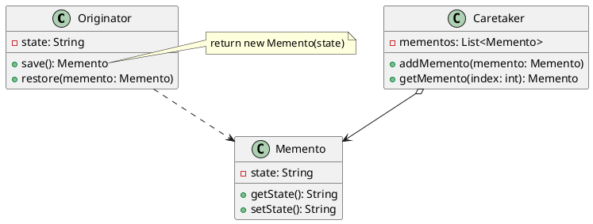
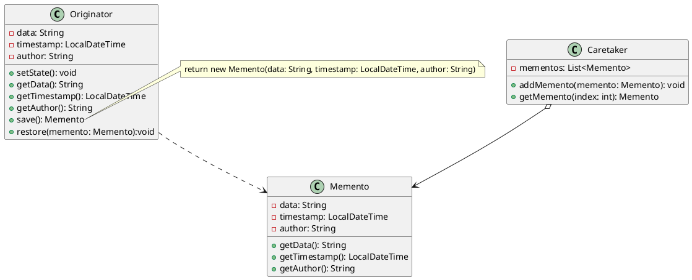
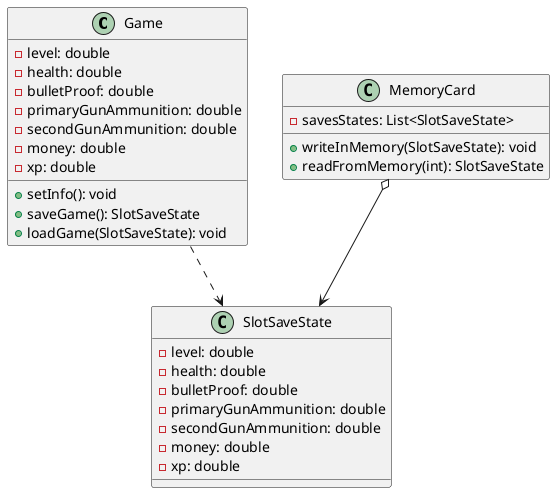

# MEMENTO

[^GAMMA]

## Intenção

O ``Memento`` é um ``padrão de projeto comportamental`` que permite que você salve e restaure o estado anterior de um
objeto sem revelar os detalhes de sua implementação.

## Também conhecido como

Lembrança, Retrato ou Snapshot

## Motivação

Algumas vezes é necessário registrar o estado interno de um objeto. Isso é necessário na implementação de mecanismos de ``checkpoints e de desfazer`` (operações) que permitem aos usuários retroceder de operações-tentativas ou recuperar-se de erros. Você deve salvar informação de estado em algum lugar, de modo que possa restaurar os objetos aos seus estados prévios. Porém, objetos normalmente encapsulam parte ou todos os seus estados, tornando-os inacessíveis a outros objetos e impossíveis de serem salvos externamente. Expor este estado violaria o encapsulamento, o que pode comprometer a confiabilidade e a extensibilidade da aplicação.
## Aplicabilidade

**Use o padrão Memento quando:**

1 - Utilize o padrão Memento quando você quer produzir retratos do estado de um objeto para ser capaz de restaurar um estado
anterior do objeto.

2 - Utilize o padrão quando o acesso direto para os campos: getters, setters de um objeto viola seu encapsulamento.


## Estrutura


<figure>


<figcaption>UML do código</figcaption>
</figure>


## Participantes

1 - A classe ``Originator`` pode produzir retratos de seu próprio estado, bem como restaurar seu estado de retratos quando
necessário.

2 - O ``Memento`` é um objeto de valor que age como um retrato do estado da originadora. É uma prática comum fazer o memento imutável e passar os dados para ele apenas uma vez, através do construtor.

3 - A classe ``Caretaker`` sabe não só “quando” e “por quê” capturar o estado da originadora, mas também quando o estado deve ser
restaurado.

## Prós e Contras

**Prós**

1 - Você pode produzir retratos do estado de um objeto sem violar seu encapsulamento.

2 - Você pode simplificar o código da originadora permitindo que a cuidadora mantenha o histórico do estado da originadora.

**Contras**

1 - A aplicação pode consumir muita RAM se os clientes criarem mementos com muita frequência.

2 - Cuidadoras devem acompanhar o ciclo de vida da originadora para serem capazes de destruir mementos obsoletos

## Implementação

```java

import java.time.LocalDateTime;
import java.util.ArrayList;
import java.util.List;

class Originator {
    private String data;
    private LocalDateTime timestamp;
    private String author;

    public void setState(String data, LocalDateTime timestamp, String author) {
        this.data      = data;
        this.timestamp = timestamp;
        this.author    = author;
    }

    public String getData() {
        return data;
    }

    public LocalDateTime getTimestamp() {
        return timestamp;
    }

    public String getAuthor() {
        return author;
    }
    
    public Memento save() {
        return new Memento(data, timestamp, author);
    }

    public void restore(Memento memento) {
        data      = memento.getData();
        timestamp = memento.getTimestamp();
        author    = memento.getAuthor();
    }

}

class Memento {
    private String data;
    private LocalDateTime timestamp;
    private String author;

    public Memento(String data, LocalDateTime timestamp, String author) {
        this.data      = data;
        this.timestamp = timestamp;
        this.author    = author;
    }

    public String getData() {
        return data;
    }

    public LocalDateTime getTimestamp() {
        return timestamp;
    }

    public String getAuthor() {
        return author;
    }
}

class Caretaker {
    private List<Memento> mementos = new ArrayList<>();

    public void addMemento(Memento memento) {
        mementos.add(memento);
    }

    public Memento getMemento(int index) {
        return mementos.get(index);
    }
}

public class MementoExample {
    public static void main(String[] args) {

        Originator originator = new Originator();
        Caretaker caretaker   = new Caretaker();

        originator.setState("Data 0", LocalDateTime.MAX, "Name00");
        caretaker.addMemento(originator.save());
        
        originator.setState("Data 1", LocalDateTime.MIN, "Name01");
        caretaker.addMemento(originator.save());
        
        
        originator.restore(caretaker.getMemento(0));
        System.out.println("Current Data: " + originator.getData());
        System.out.println("Time: "         + originator.getTimestamp());
        System.out.println("Author: "       + originator.getAuthor());

       
    }
}

```

<figure>


<figcaption>UML do código</figcaption>
</figure>


## Exemplo de código

Uma empresa "N" está desenvolvendo um game de ação e eles desejam criar "pontos de restauração" temporários para que o jogador possa salvar o seu progresso durante o jogo e futuramente possa volta a certas partes do jogo. Para isso, a equipe de desenvolvimento descobriu como resolver esse problema usando um padrão de projeto "Memento".


**A classe ``Game`` representa o estado atual do jogo;**
```java
package com.mycompany.padrao_memento;

public class Game {
    private double level;
    private double health;
    private double bulletProof;
    private double primaryGunAmmunition;
    private double secondGunAmmunition;
    private double money;
    private double xp;

    public void setInfo(double level, double health, double bulletProof, double primaryGunAmmunition, double secondGunAmmunition, double money, double xp) {
        this.level                = level;
        this.health               = health;
        this.bulletProof          = bulletProof;
        this.primaryGunAmmunition = primaryGunAmmunition;
        this.secondGunAmmunition  = secondGunAmmunition;
        this.money                = money;
        this.xp                   = xp;
    }
   
    
public SlotSaveState saveGame(){
    return new SlotSaveState(this.level, this.health, this.bulletProof, this.primaryGunAmmunition, this.secondGunAmmunition, this.money, this.xp);


}

public void loadGame(SlotSaveState savegame){
    this.level                = savegame.getLevel();
    this.health               = savegame.getHealth();
    this.bulletProof          = savegame.getBulletProof();
    this.primaryGunAmmunition = savegame.getPrimaryGunAmmunition();
    this.secondGunAmmunition  = savegame.getSecondGunAmmunition();
    this.money                = savegame.getMoney();
    this.xp                   = savegame.getXp();
    
}

}

```

**A classe ``SlotSaveState`` representa um slote vazio que pode ser preenchido com infomações de um devido estado do game, ou seja pode ser um momento especifico do jogo;**
```java
package com.mycompany.padrao_memento;

public class SlotSaveState {
    private double level;
    private double health;
    private double bulletProof;
    private double primaryGunAmmunition;
    private double secondGunAmmunition;
    private double money;
    private double xp;
    
    
    public SlotSaveState(double level, double health, double bulletProof, double primaryGunAmmunition, double secondGunAmmunition, double money, double xp) {
        this.level                = level;
        this.health               = health;
        this.bulletProof          = bulletProof;
        this.primaryGunAmmunition = primaryGunAmmunition;
        this.secondGunAmmunition  = secondGunAmmunition;
        this.money                = money;
        this.xp                   = xp;
    }

    @Override
    public String toString() {
        return "SlotSaveState{" + "level=" + level + ", health=" + health + ", bulletProof=" + bulletProof + ", primaryGunAmmunition=" + primaryGunAmmunition + ", secondGunAmmunition=" + secondGunAmmunition + ", money=" + money + ", xp=" + xp + '}';
    }

    public double getLevel() {
        return level;
    }

    public double getHealth() {
        return health;
    }

    public double getBulletProof() {
        return bulletProof;
    }

    public double getPrimaryGunAmmunition() {
        return primaryGunAmmunition;
    }

    public double getSecondGunAmmunition() {
        return secondGunAmmunition;
    }

    public double getMoney() {
        return money;
    }

    public double getXp() {
        return xp;
    }
    
    
    
    
}

```

**E por fim a classe ``MemoryCard`` que representa a abstração de um memory card que pode armazenar os saves de um dado estado do game;**
```java

package com.mycompany.padrao_memento;
import java.util.ArrayList;
import java.util.List;

public class MemoryCard {
    private List <SlotSaveState> savesStates = new ArrayList();
    
   
    public void writeInMemory(SlotSaveState save){
        savesStates.add(save);
        
    }
    
    public SlotSaveState readFromMemory(int index){
        return savesStates.get(index);
        
    }
     
    
}
```


**Vamos rodar o código**

```java
package com.mycompany.padrao_memento;

public class User {

    public static void main(String[] args) {
        
        MemoryCard memoryCard = new MemoryCard();
        
        Game state00 = new Game();
        
        state00.setInfo(20, 80, 70, 80, 10, 2.000, 3.600);
        memoryCard.writeInMemory(state00.saveGame());
        
        state00.setInfo(40, 30, 90, 80, 10, 2.000, 4.000);
        memoryCard.writeInMemory(state00.saveGame());
        
        System.out.println(memoryCard.readFromMemory(1));
        
        
        
    }
}

```

**Saída**

```console

SlotSaveState{level=40.0, health=30.0, bulletProof=90.0, primaryGunAmmunition=80.0, secondGunAmmunition=10.0, money=2.0, xp=4.0}

```


<figure>



<figcaption>UML do código</figcaption>
</figure>


## Usos conhecidos

Usado em comandos de ``undo`` e ``redo`` em sistemas operacionais e programas aplicativos, principalmente em editores de conteúdo.

## Padrões relacionados

Algumas vezes o ``Prototype`` pode ser uma alternativa mais simples a um Memento. Isso funciona se o objeto no estado no qual você quer armazenar na história, é razoavelmente intuitivo e não tem ligações para recursos externos, ou as ligações são fáceis de se restabelecer.

Você pode usar o Memento junto com o ``Iterator`` para capturar o estado de iteração atual e revertê-lo se necessário.

## Referências

‌GAMMA, E. et al. Padrões de projeto : soluções reutilizáveis de software orientado a objetos. Porto Alegre: Bookman, 2006.
Livro Moderno sobre Padrões de Projeto: Mergulho nos Padrões de Projeto. Disponível em: <https://refactoring.guru/pt-br/design-patterns/book>.

‌