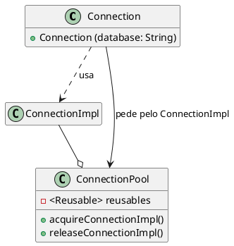
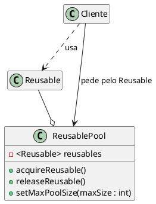

# Object Pool

 [^SourceMaking]
 [^ODesign] 
 [^BestPratice] 
 [^CsiUneb] 
 [^Microsoft]

## Intenção

O Object Pool tem como objetivo reaproveitar objetos, criando pré-instancias de objetos que poderão ser solicitados a qualquer momento.

## Também conhecido como

Pool de Objetos

## Motivação

Por exemplo se trabalhamos com bancos de dados, o processo de criar uma conexão é uma operação cara e pode exigir muito tempo, isso pode vir a sobrecarregar o banco de dados, ou seja, abrir muitas conexões pode afetar o desempenho por diversos motivos, por isso nesse caso seria recomendado a utilização do padrão de projeto **object pool**, que já terá pools de conexões prontas, que poderão ser reutilizadas sempre que um cliente solicitar, sem ter a necessidade de destruir e criar uma nova.

<figure>


<figcaption>Exemplo Object Pool.</figcaption>
</figure>

Quando um cliente precisar consultar o banco de dados, ele poderá instanciar um novo objeto connection especificando o nome do banco de dados que irá chamar o método de consulta que deverá retornar um objeto, enquanto isso o pool executa as seguintes ações:
- Procura um objeto reutilizável disponível e caso seja encontrado será devolvido ao cliente.
- Se nenhum objeto reutilizável for encontrado, ele tenta criar um novo. Se esta ação for bem-sucedida, o novo objeto reutilizável será retornado ao cliente.
- Se o pool não conseguir criar um novo objeto reutilizável, ele aguardará até que um objeto reutilizável seja liberado.

**Connection** - Representa o objeto que é instanciado pelo cliente. Da perspectiva do cliente, este objeto é criado e manipula as operações do banco de dados, é o único objeto visível para o cliente. O cliente não sabe que usa algumas conexões compartilhadas.

**ConnectionImpl** - É o objeto que implementa as operações de banco de dados que são expostas por Connection para o cliente.

**ConnectionPool** - É o que gerencia as conexões com o banco de dados. Ele mantém uma lista de objetos ConnectionImpl e instancia novos objetos, se necessário.

Lembrando que o cliente é responsável por solicitar o objeto reutilizável, bem como liberá-lo para o pool. Caso esta ação não seja realizada o objeto reutilizável será perdido, sendo considerado indisponível pelo ResourcePool.


## Aplicabilidade

Use o padrão Object Pool quando:

- Possuir objetos com alto custo e/ou tempo de criação;
- Os objetos que estão sendo usados podem ser reaproveitados;
- Os objetos forem intânciados com muita frequência, ou seja, várias partes do seu aplicativo requerem os mesmos objetos em momentos diferentes.


## Estrutura

<figure>



<figcaption>Estrutura Object Pool.</figcaption>
</figure>


## Participantes 

- **Reusable** (ConnectionImpl)
    - Instâncias dessa classe colaboram com outros objetos por um período de tempo limitado, onde serão compartilhados por vários clientes por um período de tempo limitado e então não são mais necessárias para essa colaboração
- **Cliente** (Connection)
    - Instâncias dessa classe usam os obejtos reutilizaveis (Reusable Objects).
- **ReusablePool** (ConnectionPool)
    - Instâncias dessa classes gerenciam os objetos reutilizáveis ​​para utilização pelos clientes, criando e manuseando uma pool de objetos.
    

## Colaborações

- O cliente interage com o ReusablePool, para solicitar através do método AcquireReusable() o objeto que deseja utilizar (reusable), o ReusablePool verifica se existe alguma intância do objeto disponivel na pool no momento, e caso tenha, devolve para o cliente e altera o status daquele objeto para "indisponível", assim ele tem o controle que aquele objeto não pode ser emprestado novamente, até que seja devolvido pelo cliente através do método releaseReusable(), no qual ele coloca o reusable (objeto que foi emprestado) novamente na pool e altera seu status para "disponivel" até o momento que for solicitado novamente.

## Consequências

O padrão Object Pool tem os seguintes benefícios e desvantagens:

- **Benefícios**
    
    - Oferece um aumento no desempenho.
    - Consegue gerenciar as conexões e fornece uma maneira de reutiliza-las e compartilha-las.
    - Pode fornecer o limite para o número máximo de objetos que podem ser criados.
    - Oferece a possibilidade de alterar o tamanho da pool

- **Desvantagens** 

    - Como existe um limite de objetos na pool, pode ocorrer falta de objetos disponiveis.
    - Para que o objeto volte para a pool, o cliente que o estava utilizando, precisa libera-lo, caso não o faça o objeto será perdido e não voltará para a pool.
    - Pode ocorrer falhas na politica de aquisição e criação dos recursos.
    - A posibilidade de alterar o tamanho da pool também pode gerar alguns problemas, como destruir objetos que estão em uso (caso o tamanho da pool seja diminuido)

## Implementação


## Exemplo de código

<!-- um jogo de damas onde o tabuleiro tem espaços especiais, e caso uma peça pare em cima desse espaço, receberá alguma instrução do que deve ser feito, uma dessas instruções é ganhar uma peça que está no monte (caso aja alguma disponivel), outra intrução é devolver uma peça para o monte caso tenha pego alguma -->

```java
public class Peca {

    private int idPeca;
    private boolean disponivel;

    public Peca(int idPeca) {

        this.idPeca = idPeca;
        this.disponivel = true;
    }

    public void setDisponibilidade(boolean disponibilidade) {
        this.disponivel = disponibilidade;
    }

    public boolean getDisponibilidade() {
        return this.disponivel;
    }
}
```

```java
public class Monte {

    private List<Peca> pool_de_pecas;

    public Peca pegarPeca() {
        // disponibiliza a peça para o cliente solicitado
     }

    public void liberarPeca() {
        // o cliente devolve a peça, e ela volta para a lista
    }

}
```
## Usos conhecidos

O ASP.NET Core utiliza o padrão de projeto **object pool** para fazer a reutilização de objetos. É utilizado uma pool de objetos em alguns locais para reutilizar instâncias de StringBuilder, que servem para alocar e gerenciar seus próprios buffers para armazenar dados de caracteres. A ASP.NET Core usa StringBuilder regularmente para implementar recursos, e reutilizá-los oferece um benefício de desempenho.


## Padrão relacionados

***Factory Method*** : O padrão Factory Method pode ser usado para encapsular a lógica de criação de objetos. No entanto, ele não os gerencia após sua criação, o padrão de object pool rastreia os objetos que ele cria.

***Singleton*** : Object Pools geralmente são implementados como Singletons.

## Referências

@include(../bib/bib.md)