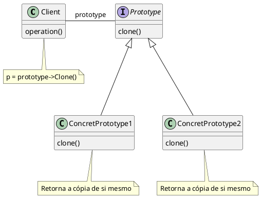

# Prototype (GOF)


## Intenção


Especificar os tipos de objetos a serem criados usando uma instância-protótipo e criar novos objetos pela cópia desse protótipo.


## Também conhecido como


Clone ou clonagem de objetos.


## Motivação


É possível construir um editor para partituras musicais, customizando um framework geral para editores gráficos, acrescentando novos objetos que representam notas, pausas e pentagramas. O editor poderia conter:
- Uma paleta de ferramentas para acrescentar esses objetos de música à partitura.
- A paleta incluiria ferramentas para:
    - Selecionar
    - Mover
    - Manipular objetos de outras formas


O usuário poderia:
- Adicionar semínimas em partituras
- Mover notas para cima ou para baixo


Criação da classe abstrata Graphic para componentes gráficos. Com os métodos draw() para desenhar componentes gráficos e clone() para clonar o componente gráfico.


```java
abstract class Graphic {
    public abstract void draw();
   
    public abstract Graphic clone();
}
```


Criação da subclasse concreta de Graphic para as notas musicais. Com o método construtor Note() e os métodos herdados da classe Graphic.


```java
class Note extends Graphic {
    private String pitch;
    private int duration;
   
    public Note(String pitch, int duration) {
        this.pitch = pitch;
        this.duration = duration;
    }
   
    public void draw() {
        //gerar imagem
    }
   
    public Graphic clone() {
        return new Note(this.pitch, this.duration);
    }
}
```


Criação da subclasse concreta de Graphic para as pausas musicais. Com o método construtor Rest() e os métodos herdados da classe Graphic.


```java
class Rest extends Graphic {
    private int duration;
   
    public Rest(int duration) {
        this.duration = duration;
    }
   
    public void draw() {
        //gerar imagem
    }
   
    public Graphic clone() {
        return new Rest(this.duration);
    }
}
```


Criação da class abstrata para as ferramentas do editor gráfico. Com os métodos activate(), deactivate() e manipulate(). Para ativar/desativar a ferramenta e para manipular um componente gráfico.


```java
abstract class Tool {
    public abstract void activate();
   
    public abstract void deactivate();
   
    public abstract void manipulate(Graphic graphic);
}
```


Criação da subclasse concreta de Tool para a criação de objetos gráficos. Com o método construtor para criar os objetos gráficos, os métodos herdados pela classe Tool e método para clonar a própria classe.


```java
class GraphicTool extends Tool {
    private Graphic prototype;
    private boolean active;


    public GraphicTool(Graphic prototype) {
        this.prototype = prototype;
        this.active = false;
    }
   
    public void activate() {
        this.active = true;
    }


    public void deactivate() {
        this.active = false;
    }


    public void manipulate(Graphic graphic) {
    }


    public Graphic createGraphic() {
        return this.prototype.clone();
    }
}
```


Exemplo do código de aplicação, onde instância a classe Note, criando uma nota e a instância da classe GraphicTool para adicionar as notas na partitura.


```java
public class MusicEditor {
    public static void main(String[] args) {
        Graphic notePrototype = new Note("C", 4);
        Graphic notePrototype2 = (Note) Note.clone();


        GraphicTool noteTool = new GraphicTool(notePrototype);
    }
}
```


## Aplicabilidade


Utilize o padrão Prototype quando:
- o seu código não dever depender de classes concretas de objetos que você precisa copiar;
    - O padrão Prototype fornece o código cliente com uma interface geral para trabalhar com todos os objetos que suportam clonagem. Essa interface faz o código do cliente ser independente das classes concretas dos objetos que ele clona.
- você precisa reduzir o número de subclasses que somente diferem a forma que inicializam seus respectivos objetos;
    - O padrão Prototype permite que você use um conjunto de objetos construídos, configurado de diversas formas, como protótipos.
- o custo de criar um novo objeto é muito grande.
    - O padrão Prototype permite que ao invés de chamar o new, apenas clonamos um objeto existente.


## Estrutura


<figure>





<figcaption>Estrutura Prototype</figcaption>
</figure>


 - **Client** - é o código fora da estrutura do Prototype, que deseja clonar o objeto protótipo.
 - **Prototype** - uma interface para garantir que todos os objetos protótipo tenham o método "clone".
 - **ConcretePrototype1|2** - são objetos protótipos.


## Participantes


- **Prototype** (Graphic)
    - declara uma interface para clonar a si próprio.
- **ConcretePrototype** (Note, Rest, GraphicTool)
    - implementa uma operação para clonar a si próprio
- **Client** (MusicEditor)
    - cria um novo objeto solicitando a um protótipo que clone a si próprio.


## Colaborações


-  Um cliente solicita a um protótipo que este clone a si próprio.


## Consequências


O padrão Prototype tem os seguintes benefícios e desvantagens:


1. **Acrescenta e remove produtos em tempo de execução.** O cliente pode instalar e remover protótipos em tempo de execução, isso o torna mais flexível do que outros padrões.
2. **Ele isola as classes concretas.** Os clientes manipulam as instâncias através das interfaces abstratas, pois o cliente é isolado das classes de implementação.
3. **Especifica novos objetos pela variação de valores.** O cliente pode exibir um novo comportamento através da delegação de responsabilidades para o protótipo. Pois você define novos tipos de objetos pela instanciação das classes existentes e registrando as instâncias como protótipos dos objetos-clientes.
4. **Especifica novos objetos pela variação da estrutura.** Muitas aplicações constróem objetos com partes e subpartes. Por exemplo, editores para o projeto de circuitos que constroem circuitos a partir de subcircuitos. Com esse formato ao realizar o clone dos circuitos, os valores dos subcircuitos não serão alterados e se forem os valores vão ser alterados em todos os clones, gerando incosistencia nos dados. Então é necessário que o objeto-circuito composto implemente um clone por replicação (deep copy), circuitos com diferentes estruturas podem ser protótipos.
5. **Não é necessário ficar criando novos objetos ou utilizar o Factory Method para construir novos objetos.** O padrão Prototype permite que simplismente se crie um clone do protótipo.
6. **Configura dinamicamente uma aplicação com classes.** Alguns ambientes de tempo de execução permitem carregar classes dinamicamente numa aplicação. Uma aplicação que quer criar instâncias de uma classe dinamicamente carregada não será capaz de referenciar o seu constructor estaticamente. Em vez disso, o ambiente de tempo de execução cria uma instância de cada classe automaticamente, quando carregada, e registra a instância junto a um gerenciador de protótipo.
7. **Campos de objetos privados.** Quando você quer fazer a cópia exata de um objeto, será necessário ir em todos os campos e coletar seus valores para copiar e em alguns casos existem campos privados, que não serão visíveis de fora do objeto.
8. **Depedência da classe.** Ao criar um clone de uma classe, seu código vai se tornar dependente da classe em questão.
9. **Classe concreta desconhecida.** Em algumas ocasiões o cliente vai saber somente da interface em que o objeto segue, sem saber qual a classe concreta em que está se relacionando.


## Implementação


Ao implementar protótipos levam-se em consideração os seguintes aspectos:


1. **Usar um gerenciador de protótipos.** Um gerenciador de protótipos é uma memória associativa que retorna o protótipo correspondente a uma chave fornecida. Ele tem operações para registrar um protótipo com uma chave e para removê-lo do registro. Os clientes podem mudar ou mesmo pesquisar o registro em tempo de execução. Isso permite aos clientes estenderem e fazerem um inventário do sistema sem necessidade de escrever linhas de código.
2. **Implementar a operação Clone.** A parte mais difícil do padrão Prototype é a implementação correta da operação Clone. Ela é particularmente difícil quando as estruturas de objetos contêm referências circulares. Na maioria das vezes utilizar shallow copy é suficiente, porém ao utiliza-lá os apontadores dos endereços serão compartilhados entre a cópia e o original. Já utilizando a deep copy, porém clonar protótipos com estruturas complexas normalmente exige uma cópia por replicação (deep copy), porque o clone e o original devem ser independentes. Portanto, você deve garantir que os componentes do clone são clones dos componentes do protótipo. A clonagem força a decidir o que, se for o caso, será compartilhado.
3. **Iniciar clones.** Enquanto alguns clientes ficam perfeitamente contentes com o clone tal como ele é, outros desejarão iniciar alguns ou todos os seus estados internos com valores de sua escolha. Você geralmente não pode passar esses valores para operação Clone porque o seu número variará entre as classes de protótipo. Alguns protótipos podem necessitar de múltiplos parâmetros de inicialização; outros não necessitarão de nenhum. Passar parâmetros para a operação Clone impede uma interface uniforme de clonagem.


## Exemplo de código


Vários objetos do nosso sistema poderiam ter essa capacidade de clonar. Seria interessante definir uma interface para padronizar e marcar os objetos com essas características.


```java
public interface Prototype<T> {
    T clone();
}
```


Depois, devemos implementar a interface Prototype nas classes que devem possuir a característica que desejamos.


```java
public class Campanha implements Prototype<Campanha> {
    // Atributos e métodos da classe
    public Campanha clone() {
        //Lógica para criar uma cópia da campanha 'this'
    }
}
```


Quando o usuário quiser criar uma campanha com as mesmas configurações de uma campanha já criada, devemos escrever um código semelhante a este:


```java
Campanha campanha1 = ...
Campanha campanha2 = campanha1.clone();
campanha2.setNome("K19 - Campanha de Verão");
campanha2.getAnuncios().get(0).setTitulo("K19 - Padrões de Projeto");
campanha2.getAnuncios().get(0).setTexto("Novo treinamento de Padrões de Projeto da K19");
```


A seguir tem outro exemplo de código em Java, utilizando o padrão Prototype que é usado para utilizar um modelo existente, para que seja clonado em vez de ser criado do zero, economizando rescursos de processamento e simplificando a criação de objetos semelhantes.


Interface "Prototipo" declara um método clone, que deve ser implementado em todas as classes que desejam ser clonáveis.

@[code](./code/gof/prototype/Prototype.java)

Classe abstrata `Formas`, onde vai conter todos os atributos e métodos necessários para as formas.

@[code](./code/gof/prototype/Formas.java)

Classes das formas que vão conter a classe abstrata "Formas" como superclasse e implementa a interface `Prototipo`:


Círculo:

@[code](./code/gof/prototype/Circulo.java)

Quadrado:

@[code](./code/gof/prototype/Quadrado.java)


Triângulo:

@[code](./code/gof/prototype/Triangulo.java)


Classe "Colecao", onde vai criar os grupos/coleções e implementa a interface "Prototipo":

@[code](./code/gof/prototype/Colecao.java)

Classe "Cliente", onde vai conter o código de compilação:

@[code](./code/gof/prototype/Cliente.java)

## Usos conhecidos


Talvez o primeiro exemplo do padrão Prototype se encontre no sistema Sketchpad de Ivan Sutherland [Sut63]. A primeira aplicação amplamente conhecida do padrão numa linguagem orientada a objeto foi em ThingLab, na qual os usuários poderiam formar um objeto composto e então promovê-lo a um protótipo pela sua instalação numa biblioteca de objetos reutilizáveis [Bor81]. Goldberg e Robson mencionam protótipos como um padrão [GR83], mas Coplien [Cop92] fornece uma descrição muito mais completa. Ele descreve idiomas relacionados ao padrão prototype para C++ e dá muitos exemplos e variações. O Etgdb é um depurador (debugger) de front-end, baseado em ET++, que fornece uma interface de apontar e clicar para diferentes depuradores orientados a linhas. Cada depurador tem uma subclasse DebuggerAdaptor correspondente. Por exemplo, GdbAdaptor adapta o etgdb à sintaxe dos comandos do gdb de GNU, enquanto que SunDbxAdaptor adapta o etgdb ao depurador da Sun. O Etgdb não tem um conjunto de classes DebuggerAdaptor codificadas rigidamente nele próprio. Em vez disso, lê o nome do adaptor a ser usado de uma variável fornecida pelo ambiente, procura um protótipo com o nome especificado em uma tabela global e, então, clona o protótipo. Novos depuradores podem ser acrescentados ao etgdb ligando-o ao DebuggerAdaptor que funciona para um depurador novo. A “biblioteca de técnicas de interações”, no ModeComposer, armazena protótipos de objetos que suportam várias técnicas de interação [Sha90]. Qualquer técnica de interação criada pelo Mode Composer pode ser usada como um protótipo colocando-a nesta biblioteca. O padrão Prototype permite ao Mode Composer suportar um conjunto ilimitado de técnicas de interação. O exemplo do editor musical discutido anteriormente se baseia no framework para desenhos do Unidraw [VL90].


## Padrão relacionados
[Abstract Factory]: Prototype e Abstract Factory são padrões que competem entre si em várias situações. Um Abstract Factory pode armazenar um conjunto de protótipos a partir dos quais podem ser clonados e retornados objetos-produto.
[Composite e Decorator]: Podem se beneficiar do uso do Prototype.


## Referências


- k19-k51-design-patterns-em-java
- Gamma Erich - Padrões de Projetos - Soluções Reutilizáveis
- Otávio Miranda - Prototype Teoria - Padrões de Projeto - Parte 8/45 - https://youtu.be/Z-_smcjkdwM
- Otávio Miranda - Prototype Prática - Padrões de Projeto - Parte 9/45 - https://youtu.be/NMwokH-kKZE


<!-- @include: ../bib/bib.md -->
