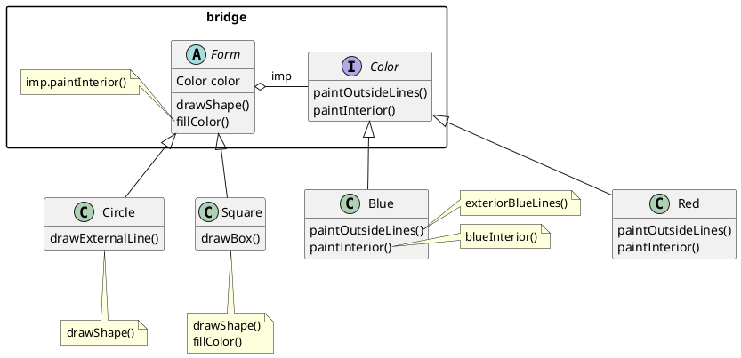
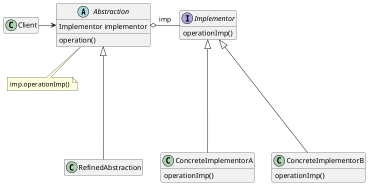
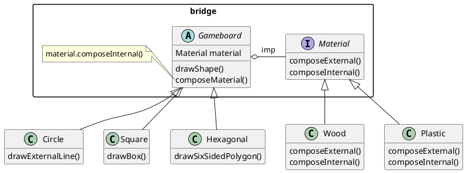

# Bridge (GOF)

[^GAMMA]

## Intenção
Desacoplar uma classe grande ou um conjunto de classes intimamente ligadas em duas hierarquias, separando abstração e implementação para que possam ser desenvolvidas independentemente umas das outras.

## Também conhecido como

 - Handle/Body

 - Ponte (em português)
## Motivação

Digamos que você tem uma classe de formas geométricas `Form` com um par de subclasses : `Circle` e `Square`. Você quer estender essa hierarquia de classe para incorporar cores, então você planeja criar as subclasses de cores `Blue` e `Red`. Contudo, já que você já tem duas subclasses, você precisa criar quatro combinações de classe tais como `BlueSquare` e `RedCircle`.

Adicionar novos tipos de forma e cores à hierarquia irá fazê-la crescer exponencialmente. Por exemplo, para adicionar uma forma de triângulo você vai precisar introduzir duas subclasses, uma para cada cor. E depois disso, adicionando uma nova cor será necessário três subclasses, uma para cada tipo de forma.

Esse problema ocorre porque estamos tentando estender as classes de forma em duas dimensões diferentes: por forma e por cor. Isso é um problema muito comum com herança de classe.

O padrão **Bridge** tenta resolver esse problema ao trocar de herança para composição do objeto. Isso significa que você extrai uma das dimensões em uma hierarquia de classe separada, para que as classes originais referenciem um objeto da nova hierarquia, ao invés de ter todos os seus estados e comportamentos dentro de uma classe.

<figure>



<figcaption>Exemplo Bridge.</figcaption>
</figure>

Seguindo essa abordagem nós podemos extrair o código relacionado à cor em sua própria classe com duas subclasses: `Red` e `Blue`. A classe `Form` então ganha um campo de referência apontando para um dos objetos de cor. Agora a forma pode delegar qualquer trabalho referente a cor para o objeto ligado a cor. Aquela referência vai agir como uma ponte entre as classes `Form` e `Color`. 

De agora em diante, para adicionar novas cores não será necessário mudar a hierarquia da forma e vice versa.

## Aplicabilidade

Use o padrão **Bridge** quando:

- Quando você quer dividir e organizar uma classe monolítica (isto é, com elementos muito acoplados, atuando como uma unidade) que tem diversas variantes da mesma funcionalidade;
- Tanto as abstrações como suas implementações tiverem de ser extensíveis por meio de subclasses. Neste caso,o padrão Bridge permite combinar as diferentes abstrações e implementações e estendê-las independentemente;
- Quando você deseja evitar um vínculo permanente entre abstração e implementação, também sendo capaz de trocar de implementação durante o momento de execução;


## Estrutura

<figure>



<figcaption>Estrutura Bridge.</figcaption>
</figure>


## Participantes

- **Abstraction** (Form)
    - define a interface da abstração;
    - mantém uma referência para um objeto do tipo Implementor;
- **RefinedAbstraction** (Circle, Square)
    - estende a interface definida por Abstraction;
- **Implementor** (Color)
    - define a interface para as classes de implementação. As duas interfaces podem ser bem diferentes. A interface de Implementor fornece somente operações primitivas e Abstraction define operações de nível mais alto baseadas nessas primitivas;
- **ConcreteImplementor** (Blue, Red)
    - implementa a interface de Implementor e define sua implementação concreta;


## Colaborações

- Abstraction repassa as solicitações dos clientes para o seu objeto Implementor.

## Consequências

O padrão Bridge tem os seguintes benefícios e desvantagens:

### Benefícios 
1. Possibilita a extensão das hierarquias de Abstraction e Implementor independentemente.
2. O código do cliente trabalha somente com abstrações em alto nível, isolando o cliente de detalhes de implementação.
3. Princípio aberto/fechado: Permite adicionar novas abstrações e implementações independentemente uma das outras.
4. Desacopla a interface da implementação. Uma implementação não fica presa a uma interface. Possibilitando um objeto mudar sua implementação em tempo de execução.

### Desvantagens 

1. Por utilizar uma classe altamente coesa através da hierarquia complexa de classes o código pode ficar muito complicado.

## Implementação

Eis um exemplo para representar a implementação do padrão Bridge em java:

```java
public abstract class Abstraction {
    private Implementor implementor;

    abstract void operation();
}
```

Exemplo de `extends`:
```java
public class RefinedAbstraction extends Abstraction {
    private Implementor implementor;
    
    RefinedAbstraction(Implementor implementor){
        this.implementor = implementor;
    }
    
    public void setImplementor(Implementor implementor){
        this.implementor = implementor;
    }

    public void operation(){
      implementor.operationImp();
    };
}
```

Classe responsável pela implementação:

```java
public interface Implementor {
    void operationImp();
}
```
Com isto, aqui está um exemplo de um dos ConcreteImplementor que `implements` esta interface.

```java

public class ConcreteImplementorA implements Implementor {
  private boolean called = false;

    @Override
    public void operationImp() {
      called = true;
      System.out.println(called);
    }
}
```

Com essas implementações, o código cliente ficaria deste jeito:

```java
public class Client{
  public static void main(String[] args) {
	  ConcreteImplementorA implementor = new ConcreteImplementorA();
	
    RefinedAbstraction refined = new RefinedAbstraction(implementor);
	
    refined.operation();
    // true
  }
}
```

A depender das próximas implementações, o resultado de `refined.operation();` seria bem diferente, o que permite a expansão de implementações e abstrações sem a necessidade de mudar as classes anteriores.


## Exemplo de código

Digamos que você quer representar um tabuleiro de um jogo, existem diferentes formas de tabuleiros e também materiais usados para a confecção, como tabuleiro quadrado de madeira ou tabuleiro circular de plástico. Para os casos onde é antecipada a necessidade da adição de tipos independentes no futuro do projeto, o padrão Bridge faz um bom papel.

Veja a seguir um UML, seguido do código deste exemplo utilizando o padrão bridge:

<figure>


<figcaption>Gameboard com materiais utilizando Bridge.</figcaption>
</figure>

Código de abstração:

```java
public abstract class GameBoard {
  private Material material;

  abstract void drawShape();
  abstract void composeMaterial();
}
```

Exemplo de `extends`:

```java
public class Hexagonal extends GameBoard {
    private Material material;
    
    Hexagonal(Material material){
      this.material = material;
    }
    
    public void setMaterial(Material material){
      this.material = material;
    }

    public void drawShape(){
      System.out.println("drawn a hexagonal shape");
    };

    public void composeMaterial(){
      material.composeExternal();
    }
}
```
Exemplo de implementação:

```java
public interface Material {
    void composeExternal();
    void composeInternal();
}
```

Exemplos de `implements` da interface Material:

```java

public class Wood implements Material {
  private boolean external = false;
  private boolean internal = false;

    @Override
    public void composeExternal() {
      external = true;
      
      System.out.println("external wood executed");

      if(internal == true){
        internal = false;
        System.out.println("internal wood canceled");
      }
    }

    @Override
    public void composeInternal() {
      internal = true;
      System.out.println("internal wood executed");
      
      if(external == true){
        external = false;
        System.out.println("external wood canceled");
      }      
    }
}
```

```java
public class Plastic implements Material {
  private boolean external = false;
  private boolean internal = false;

    @Override
    public void composeExternal() {
      external = true;
      System.out.println("external plastic executed");
    }

    @Override
    public void composeInternal() {
      internal = true;
      System.out.println("internal plastic executed");
    }
}
```

Com essas implementações, o código cliente ficaria deste jeito:

```java
public class Client{
  public static void main(String[] args) {
	  Wood woodMaterial = new Wood();
	
    GameBoard hexagonalGameBoard = new Hexagonal(woodMaterial);
	
    hexagonalGameBoard.drawShape();
    hexagonalGameBoard.composeMaterial();

    // Respectivas saídas:
    // "drawn a hexagonal shape"
    // "external wood executed"
  }
}
```

A abstração do tipo GameBoard passa a conter um tipo de implementação Material, a partir disto, cada nova implementação ou abstração pode crescer independemente uma da outra, facilitando adições ao projeto.

## Usos conhecidos

**Lists no Java**: O padrão **Bridge** é utilizado no método ToArray na interface List do Java (java.util.List), o método atua como uma ponte entre API's com base em arrays e API's com base em collection para a criação de um array.[^JavaList]

## Padrão relacionados
[Adapter](/posts/XX_Adapter.md): O padrão Adapter é útil para fazer com que classes não relacionadas trabalhem em conjunto. Ele é normalmente aplicado a sistemas que já foram projetados. Por outro lado, Bridge é definido com antecedência em projetos, pensado desde o início, para permitir que abstrações e implementações possam variar independentemente.

[Builder](/posts/05_Builder.md): O padrão Builder e Bridge podem ser combinados: a classe director tem um papel de abstração, enquanto que diferentes construtores agem como implementações.

## Referências

<!-- @include: ../bib/bib.md -->