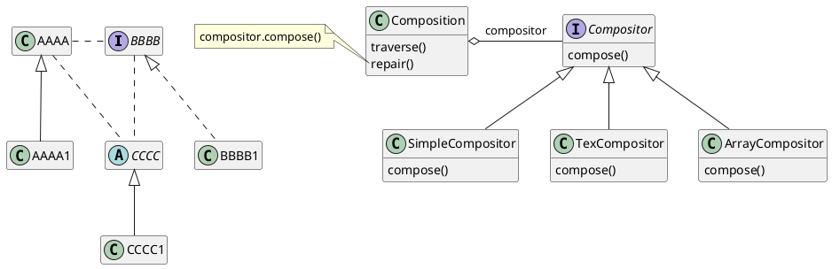
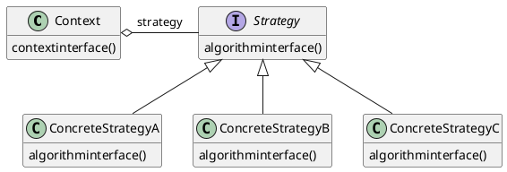

# XX (Modelo)

[^GAMMA]

## Intenção

...


## Também conhecido como

...

## Motivação

Cenário onde o padrão pode ajusadar
<figure>



<figcaption>Apresentação cenário.</figcaption>
</figure>

elementos dos cenário: 

- **aaa**:aaa
- **bbb**:bbb
- **ccc**:ccc

## Aplicabilidade

Use o padrão XXX quando:
## Estrutura

<figure>



<figcaption>Estrutura do XX.</figcaption>
</figure>


## Participantes

- **XX** (aaa)
    - define ...
- **YY** (bbb)
    - implementa ...
- **ZZZ** (ccc)
    - é...

## Colaborações

- XX e Outro padrão interagem para...
- 
## Consequências

O padrão XX tem os seguintes benefícios e desvantagens:

## Implementação

Outro exemplo de aplicação do padrão...

```java
public class XX{
    //...
}
```


### Usos Conhecidos

Frameworks onde o padrão é aplicado

## Padrão relacionados
[Flyweight]: objetos Strategy geralmente são bons flyweights.


## Referências

<!-- @include: ../bib/bib.md -->
