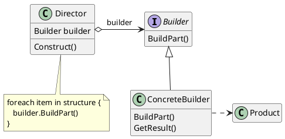
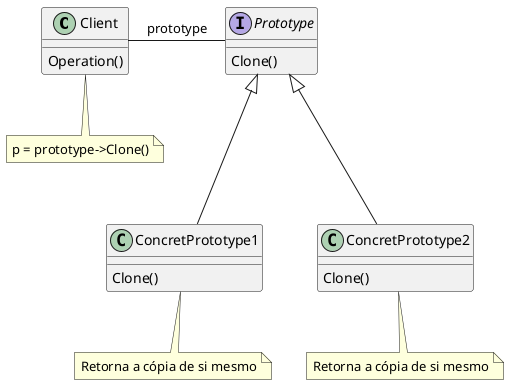
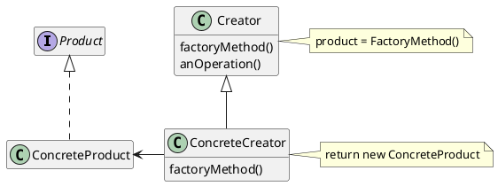

# Builder

## Intenção

- Separar a construção de um objeto complexo da sua representação de modo que o mesmo processo de construção possa criar diferentes representações.

## Estrutura
<figure>


<figcaption>Estrutura Builder</figcaption>
</figure>

## Participantes

- **Builder** (TextConverter)
    - define uma interface com as configurações em comum para todos os objetos que são baseados nesse Builder. Director usa esta interface para chamar o método definido por um ConcreteBuilder.
- **ConcreteBuilder** (ASCIIConverter, TeXConverter, TextWidgetConverter)
    - implementa métodos para a construção e montagem em partes do produto, usando a interface de Builder.
    - Não expõe o produto durante a montagem, mantém a representação até o objeto ser recuperado.
    - ConcreteBuilders devem fornecer seus próprios métodos para recuperar os resultados de construções, já que os produtos gerados podem ser completamente diferentes.
- **Director** (RTFReader)  
    - Mantém uma instancia de um Builder passado pelo cliente.
    - Implementa métodos visando a execução sequencial correta e a organização das etapas de configuração para cada tipo de situação.
    - **Não é estritamente necessário**, é possivel que o padrão seja implementado com o cliente assumindo um papel parecido com o de director.

- **Product** (ASCIIText, TeXText, TextWidget)
    - representa o objeto complexo em construção. ConcreteBuilder constrói a representação interna do produto e define o as etapas de montagem;
    - inclui classes que definem as diversas partes que constituem o objeto complexo, inclusive as interfaces para a montagem das partes no resultado final.


## Código do Framework

- Utiliza-se o padrão builder nesse código para poder construir uma peca. A classe PecaBuilder gera as assinatura de método para sem herdadas por PecaBuilderXadrez e PecaBuilderDamas que implementarão esse método que retornam para a mesma instancia cada atributo com uma peca e por fim em 
cadeia se usa o método build() para finalizar e retornar todas as informações que foram adicionadas aquele objeto. 

```java
interface PecaBuilder{
    public PecaBuilder setTipo(String tipo);
    public PecaBuilder setCor(String cor);
    public PecaBuilder setMovimento(Movimento movimento);
    public Peca build();
    
}

class PecaBuilderXadrez implements PecaBuilder{
    private String tipo;
    private String cor;
    private Movimento movimento;

    public PecaBuilderXadrez setTipo(String tipo) {
        this.tipo = tipo;
        return this;
        
    }

    public PecaBuilderXadrez setCor(String cor) {
        this.cor = cor;
        return this;
        
    }

    public PecaBuilderXadrez setMovimento(Movimento movimento) {
        this.movimento = movimento;
        return this;
       
    }

    public Peca build() {
        return new PecaXadrez(tipo, cor, movimento);
        
    }
    
}

class PecaBuilderDamas implements PecaBuilder{
    private String tipo;
    private String cor;
    private Movimento movimento;

   
    public PecaBuilderDamas setTipo(String tipo) {
        this.tipo = tipo;
        return this;
        
    }

    public PecaBuilderDamas setCor(String cor) {
        this.cor = cor;
        return this;
        
    }

    public PecaBuilderDamas setMovimento(Movimento movimento) {
        this.movimento = movimento;
        return this;
       
    }

    public Peca build() {
        return new PecaDamas(tipo, cor, movimento);
        
    }
    
}

```
```java
Movimento movimento = new Baixo();

PecaBuilderDamas construtorDePecaDamas   = new PecaBuilderDamas();
Peca pecaDamas00                         = construtorDePecaDamas.setCor("Branca").setTipo("Dama").setMovimento(movimento).build();
pecaDamas00.mover(movimento);

PecaBuilderXadrez construtorDePecaXadrez = new PecaBuilderXadrez();
Peca pecaXadrez00                        = construtorDePecaXadrez.setCor("Preta").setTipo("Torre").setMovimento(movimento).build();
pecaXadrez00.mover(movimento);

```
# Participantes(Framework)

1. **Peca (Classe Abstrata)**: Esta é uma classe abstrata que define a estrutura básica de uma peça. Ela tem três atributos: tipo, cor e movimento. 
Além disso, ela define dois métodos abstratos: mover(Movimento movimento) e clone().

2. **PecaXadrez (Classe)**: Esta é uma classe concreta que estende a classe abstrata Peca. Ela implementa os métodos abstratos mover(Movimento movimento) e clone(). O método mover(Movimento movimento) usa o objeto movimento para mover a peça. O método clone() retorna uma nova instância de PecaXadrez com os mesmos atributos tipo, cor e movimento.

3. **PecaDamas (Classe)**: Esta é outra classe concreta que no caso representa uma peca de Damas. Ela estende da classe abstrata Peca e ela implementa os mesmos métodos abstratos igual a peca de Xadez.

4. **Movimento (Interface)**: Representa uma interface que pode ser implementada por uma série de movimentos personalizados de cada tipo de jogo. Ela contem o metodo mover(), que deve ser implementada de maneira a poder fazer com que cada tipo de movimento seja personalizado. 

4. **PecaBuilder (Interface)**: Está é a interface Builder que define os métodos para construir as partes do objeto Produto. No caso, os métodos são: setTipo(String tipo), setCor(String cor), setMovimento(Movimento movimento) e o build().

5. **PecaBuilderXadrez (Classe)**: Esta é uma classe ConcreteBuilder que implementa a interface PecaBuilder. Ela define e mantém a representação que cria e retorna o objeto Produto. No caso, o objeto Produto é PecaXadrez. A classe PecaBuilderXadrez usa métodos para definir tipo, cor e movimento e, finalmente, **o método build()** para criar e retornar o objeto Produto.

6. **PecaBuilderDamas (Classe)**: Esta é outra classe ConcreteBuilder que implementa a interface PecaBuilder. Ela também
retorna um objeto Produto, que nesse caso é uma PecaDamas.


# Prototype

## Intenção

- Especificar os tipos de objetos a serem criados usando uma instância-protótipo e criar
novos objetos pela cópia desse protótipo.

## Estrutura
<figure>


<figcaption>Estrutura Prototype</figcaption>
</figure>

## Participantes
- **Prototype** (Graphic)
    - declara uma interface para clonar a si próprio.

- **ConcretePrototype** (Note, Rest, GraphicTool)
    - implementa uma operação para clonar a si próprio

- **Client** (MusicEditor)
    - cria um novo objeto solicitando a um protótipo que clone a si próprio.

## Código do Framework

- Nesse código a Classe Peca representa uma abstração de uma peca genérica, que por sua vez e herdada por PecaXadez e PecaDamas, ambas recebem o método clone() que deve ser reescrito para retornar uma instância idêntica à mesma, ou seja com os mesmos atributos.

```java
abstract class Peca {
    private String tipo;
    private String cor;
    private Movimento movimento;
    public abstract void mover(Movimento movimento);
    public abstract Peca clone();
}


class PecaXadrez extends Peca{
    private String tipo;
    private String cor;
    private Movimento movimento;

    public PecaXadrez(String tipo, String cor, Movimento movimento) {
        this.tipo      = tipo;
        this.cor       = cor;
        this.movimento = movimento;
    }
    
    @Override
    public void mover(Movimento movimento){
        movimento.mover();
    }
    
    @Override
    public Peca clone(){
        return new PecaXadrez(tipo, cor, movimento);
    }
    
}

class PecaDamas extends Peca{
    private String tipo;
    private String cor;
    private Movimento movimento;

    public PecaDamas(String tipo, String cor, Movimento movimento) {
        this.tipo      = tipo;
        this.cor       = cor;
        this.movimento = movimento;
    }
    
    @Override
    public void mover(Movimento movimento){
        movimento.mover();
    }
    
    
    
    @Override
    public Peca clone(){
        return new PecaDamas(tipo, cor, movimento);
    }
    
}

```

```java
Movimento movimento = new Baixo();
Peca pecaDamas      = new PecaDamas("Dama", "Preta", movimento);
Peca pecaDamasClone = pecaDamas.clone();

```
# Participantes(Framework)

1. **Peca (Classe Abstrata)**: Esta é uma classe abstrata que define a estrutura básica de uma peça. Ela tem três atributos: tipo, cor e movimento. 
Além disso, ela define dois métodos abstratos: mover(Movimento movimento) e clone(). 

2. **PecaXadrez (Classe)**: Esta é uma classe concreta que estende a classe abstrata Peca. Ela implementa os métodos abstratos mover(Movimento movimento) e clone(). O método mover(Movimento movimento) usa o objeto movimento para mover a peça. O método clone() retorna uma nova instância de PecaXadrez com os mesmos atributos tipo, cor e movimento.

3. **PecaDamas (Classe)**: Esta é outra classe concreta que no caso representa uma peca de Damas. Ela estende da classe abstrata Peca e ela implementa os mesmos métodos abstratos, também pode ter sua instância clonada pelo método clone().

4. **Movimento (Interface)**: Representa uma interface que pode ser implementada por uma série de movimentos personalizados de cada tipo de jogo. Ela contem o metodo mover(), que deve ser implementada de maneira a poder fazer com que cada tipo de movimento seja personalizado. 


# Factory Method

## Intenção

- Definir uma interface para criar um objeto, mas deixar as subclasses decidirem que classe instanciar. O Factory Method permite adiar a instanciação para subclasses.

## Estrutura

<figure>


<figcaption>Estrutura Factory Method</figcaption>
</figure>

## Participantes

- **Product** (Document)
    - define a interface de objetos que o método fábrica cria.
- **ConcreteProduct** (MyDocument)
    -  implementa a interface de Product.
- **Creator** (Application)
    - Declara o método fábrica, o qual retorna um objeto do tipo Product. Creator
    pode também definir uma implementação por omissão do método factory
    que retorna por omissão um objeto ConcreteProduct.
    - Pode chamar o método factory para criar um objeto Product.
- **ConcreteCreator** (MyApplication)
    - Redefine o método-fábrica para retornar a uma instância de um
    ConcreteProduct.

## Código do Framework

- Nesse código de exemplo para a criação de pecas de Xadrez e Damas foi usado com o padrão builder o padrão Factory Method. As classes PecaBuilderXadrez e PecaBuilderDamas são as fábricas concretas de PecaBuilder responsáveis por criar os produtos PecaDamas e PecaXadrez que herdam da classe Peca.


```java

abstract class Peca {
    private String tipo;
    private String cor;
    private Movimento movimento;
    public abstract void mover(Movimento movimento);
    public abstract Peca clone();
}


class PecaXadrez extends Peca{
    private String tipo;
    private String cor;
    private Movimento movimento;

    public PecaXadrez(String tipo, String cor, Movimento movimento) {
        this.tipo      = tipo;
        this.cor       = cor;
        this.movimento = movimento;
    }
    
    @Override
    public void mover(Movimento movimento){
        movimento.mover();
    }
    
    @Override
    public Peca clone(){
        return new PecaXadrez(tipo, cor, movimento);
    }
    
}

class PecaDamas extends Peca{
    private String tipo;
    private String cor;
    private Movimento movimento;

    public PecaDamas(String tipo, String cor, Movimento movimento) {
        this.tipo      = tipo;
        this.cor       = cor;
        this.movimento = movimento;
    }
    
    @Override
    public void mover(Movimento movimento){
        movimento.mover();
    }
    
    
    
    @Override
    public Peca clone(){
        return new PecaDamas(tipo, cor, movimento);
    }
    
}


interface PecaBuilder{
    public PecaBuilder setTipo(String tipo);
    public PecaBuilder setCor(String cor);
    public PecaBuilder setMovimento(Movimento movimento);
    public Peca build();
    
}

class PecaBuilderXadrez implements PecaBuilder{
    private String tipo;
    private String cor;
    private Movimento movimento;

    
   
    public PecaBuilderXadrez setTipo(String tipo) {
        this.tipo = tipo;
        return this;
        
    }

    public PecaBuilderXadrez setCor(String cor) {
        this.cor = cor;
        return this;
        
    }

    public PecaBuilderXadrez setMovimento(Movimento movimento) {
        this.movimento = movimento;
        return this;
       
    }

    public Peca build() {
        return new PecaXadrez(tipo, cor, movimento);
        
    }
    
}


class PecaBuilderDamas implements PecaBuilder{
    private String tipo;
    private String cor;
    private Movimento movimento;

   
    public PecaBuilderDamas setTipo(String tipo) {
        this.tipo = tipo;
        return this;
        
    }

    public PecaBuilderDamas setCor(String cor) {
        this.cor = cor;
        return this;
        
    }

    public PecaBuilderDamas setMovimento(Movimento movimento) {
        this.movimento = movimento;
        return this;
       
    }

    public Peca build() {
        return new PecaDamas(tipo, cor, movimento);
        
    }
    
}


```

```java
Movimento movimento = new Baixo();
        
PecaBuilderDamas construtorDePecaDamas = new PecaBuilderDamas();
Peca pecaDamas                         = construtorDePecaDamas.setCor("Preta").setTipo("Dama").setMovimento(movimento).build();
pecaDamas.mover(movimento);


PecaBuilderXadrez construtorDePecaXadrez = new PecaBuilderXadrez();
Peca pecaXadrez                          = construtorDePecaXadrez.setCor("Branca").setTipo("Rainha").setMovimento(movimento).build();
pecaXadrez.mover(movimento);

```

# Participantes(Framework)

1. **Peca (Classe Abstrata)**: Esta é uma classe abstrata que define a estrutura básica de uma peça. Ela tem três atributos: tipo, cor e movimento. 
Além disso, ela define dois métodos abstratos: mover(Movimento movimento) e clone().

2. **PecaXadrez (Classe)**: Esta é uma classe concreta que estende a classe abstrata Peca. Ela implementa os métodos abstratos mover(Movimento movimento) e clone(). O método mover(Movimento movimento) usa o objeto movimento para mover a peça. O método clone() retorna uma nova instância de PecaXadrez com os mesmos atributos tipo, cor e movimento.

3. **PecaDamas (Classe)**: Esta é outra classe concreta que no caso representa uma peca de Damas. Ela estende da classe abstrata Peca e ela implementa os mesmos métodos abstratos igual a peca de Xadez.

4. **Movimento (Interface)**: Representa uma interface que pode ser implementada por uma série de movimentos personalizados de cada tipo de jogo. Ela contem o metodo mover(), que deve ser implementada de maneira a poder fazer com que cada tipo de movimento seja personalizado. 

4. **PecaBuilder (Interface)**: Está é a interface Builder que define os métodos para construir as partes do objeto Produto. No caso, os métodos são: setTipo(String tipo), setCor(String cor), setMovimento(Movimento movimento) e o build().

5. **PecaBuilderXadrez (Classe)**: Esta é uma classe ConcreteBuilder que implementa a interface PecaBuilder. Ela define e mantém a representação que cria e retorna o objeto Produto. No caso, o objeto Produto é PecaXadrez. A classe PecaBuilderXadrez usa métodos para definir tipo, cor e movimento e, finalmente, **o método build()** para criar e retornar o objeto Produto.

6. **PecaBuilderDamas (Classe)**: Esta é outra classe ConcreteBuilder que implementa a interface PecaBuilder. Ela também
retorna um objeto Produto, que nesse caso é uma PecaDamas.


