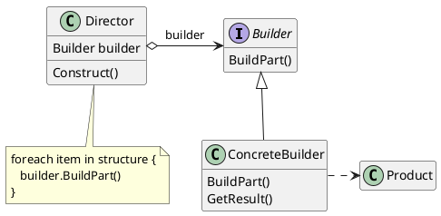
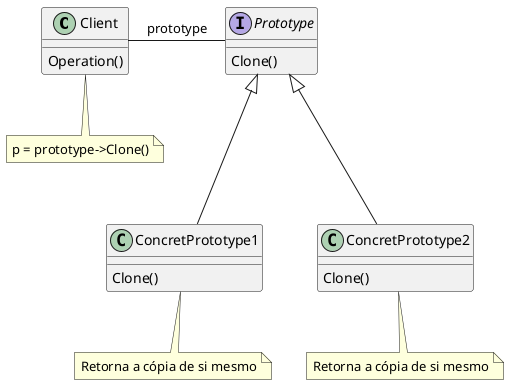
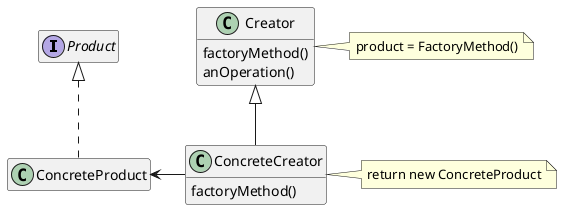
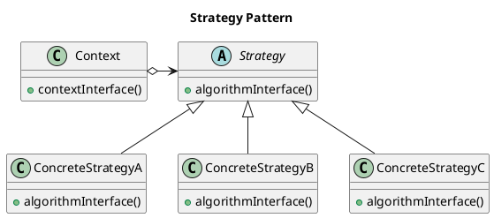
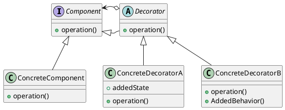

# 1. Builder

## Intenção

- Separar a construção de um objeto complexo da sua representação de modo que o mesmo processo de construção possa criar diferentes representações.

## Estrutura
<figure>


<figcaption>Estrutura Builder</figcaption>
</figure>

## Participantes

- **Builder(PecaBuilder)**
    - define uma interface com as configurações em comum para todos os objetos que são baseados nesse Builder. Director usa esta interface para chamar o método definido por um ConcreteBuilder.
- **ConcreteBuilder(PecaBuilderXadrez, PecaBuilderDamas)** 
    - implementa métodos para a construção e montagem em partes do produto, usando a interface de Builder.
    - Não expõe o produto durante a montagem, mantém a representação até o objeto ser recuperado.
    - ConcreteBuilders devem fornecer seus próprios métodos para recuperar os resultados de construções, já que os produtos gerados podem ser completamente diferentes.
- **Director(Main)**   
    - Mantém uma instancia de um Builder passado pelo cliente.
    - Implementa métodos visando a execução sequencial correta e a organização das etapas de configuração para cada tipo de situação.
    - **Não é estritamente necessário**, é possivel que o padrão seja implementado com o cliente assumindo um papel parecido com o de director.

- **Product(PecaXadrez, PecaDamas)** 
    - representa o objeto complexo em construção. ConcreteBuilder constrói a representação interna do produto e define o as etapas de montagem;
    - inclui classes que definem as diversas partes que constituem o objeto complexo, inclusive as interfaces para a montagem das partes no resultado final.


## Código do Framework

- Utiliza-se o padrão builder nesse código para poder construir uma peca. A classe PecaBuilder gera as assinatura de método para sem herdadas por PecaBuilderXadrez e PecaBuilderDamas que implementarão esse método que retornam para a mesma instancia cada atributo com uma peca e por fim em 
cadeia se usa o método build() para finalizar e retornar todas as informações que foram adicionadas aquele objeto. 

```java

abstract class Peca {
    private String tipo;
    private String cor;
    private Movimento movimento;
    public abstract void mover(Movimento movimento);
    public abstract Peca clone();
}


class PecaXadrez extends Peca{
    private String tipo;
    private String cor;
    private Movimento movimento;

    public PecaXadrez(String tipo, String cor, Movimento movimento) {
        this.tipo      = tipo;
        this.cor       = cor;
        this.movimento = movimento;
    }
    
    @Override
    public void mover(Movimento movimento){
        movimento.mover();
    }
    
    @Override
    public Peca clone(){
        return new PecaXadrez(tipo, cor, movimento);
    }
    
}

class PecaDamas extends Peca{
    private String tipo;
    private String cor;
    private Movimento movimento;

    public PecaDamas(String tipo, String cor, Movimento movimento) {
        this.tipo      = tipo;
        this.cor       = cor;
        this.movimento = movimento;
    }
    
    @Override
    public void mover(Movimento movimento){
        movimento.mover();
    }
    
    
    
    @Override
    public Peca clone(){
        return new PecaDamas(tipo, cor, movimento);
    }
    
}
```

```java
interface PecaBuilder{
    public PecaBuilder setTipo(String tipo);
    public PecaBuilder setCor(String cor);
    public PecaBuilder setMovimento(Movimento movimento);
    public Peca build();
    
}

class PecaBuilderXadrez implements PecaBuilder{
    private String tipo;
    private String cor;
    private Movimento movimento;

    public PecaBuilderXadrez setTipo(String tipo) {
        this.tipo = tipo;
        return this;
        
    }

    public PecaBuilderXadrez setCor(String cor) {
        this.cor = cor;
        return this;
        
    }

    public PecaBuilderXadrez setMovimento(Movimento movimento) {
        this.movimento = movimento;
        return this;
       
    }

    public Peca build() {
        return new PecaXadrez(tipo, cor, movimento);
        
    }
    
}

class PecaBuilderDamas implements PecaBuilder{
    private String tipo;
    private String cor;
    private Movimento movimento;

   
    public PecaBuilderDamas setTipo(String tipo) {
        this.tipo = tipo;
        return this;
        
    }

    public PecaBuilderDamas setCor(String cor) {
        this.cor = cor;
        return this;
        
    }

    public PecaBuilderDamas setMovimento(Movimento movimento) {
        this.movimento = movimento;
        return this;
       
    }

    public Peca build() {
        return new PecaDamas(tipo, cor, movimento);
        
    }
    
}

```
```java
Movimento movimento = new Baixo();

PecaBuilderDamas construtorDePecaDamas   = new PecaBuilderDamas();
Peca pecaDamas00                         = construtorDePecaDamas.setCor("Branca").setTipo("Dama").setMovimento(movimento).build();
pecaDamas00.mover();

PecaBuilderXadrez construtorDePecaXadrez = new PecaBuilderXadrez();
Peca pecaXadrez00                        = construtorDePecaXadrez.setCor("Preta").setTipo("Torre").setMovimento(movimento).build();
pecaXadrez00.mover();

```


# 2. Prototype

## Intenção

- Especificar os tipos de objetos a serem criados usando uma instância-protótipo e criar
novos objetos pela cópia desse protótipo.

## Estrutura
<figure>


<figcaption>Estrutura Prototype</figcaption>
</figure>

## Participantes
- **Prototype(Peca)** 
    - declara uma interface para clonar a si próprio.

- **ConcretePrototype(PecaXarez, PecaDamas)**
    - implementa uma operação para clonar a si próprio

- **Client(Main)** 
    - cria um novo objeto solicitando a um protótipo que clone a si próprio.

## Código do Framework

- Nesse código a Classe Peca representa uma abstração de uma peca genérica, que por sua vez e herdada por PecaXadez e PecaDamas, ambas recebem o método clone() que deve ser reescrito para retornar uma instância idêntica à mesma, ou seja com os mesmos atributos.

```java
abstract class Peca {
    private String tipo;
    private String cor;
    private Movimento movimento;
    public abstract void mover(Movimento movimento);
    public abstract Peca clone();
}


class PecaXadrez extends Peca{
    private String tipo;
    private String cor;
    private Movimento movimento;

    public PecaXadrez(String tipo, String cor, Movimento movimento) {
        this.tipo      = tipo;
        this.cor       = cor;
        this.movimento = movimento;
    }
    
    @Override
    public void mover(Movimento movimento){
        movimento.mover();
    }
    
    @Override
    public Peca clone(){
        return new PecaXadrez(tipo, cor, movimento);
    }
    
}

class PecaDamas extends Peca{
    private String tipo;
    private String cor;
    private Movimento movimento;

    public PecaDamas(String tipo, String cor, Movimento movimento) {
        this.tipo      = tipo;
        this.cor       = cor;
        this.movimento = movimento;
    }
    
    @Override
    public void mover(Movimento movimento){
        movimento.mover();
    }
    
    
    
    @Override
    public Peca clone(){
        return new PecaDamas(tipo, cor, movimento);
    }
    
}

```

```java
Movimento movimento = new Baixo();
Peca pecaDamas      = new PecaDamas("Dama", "Preta", movimento);
Peca pecaDamasClone = pecaDamas.clone();

```


# 3. Factory Method

## Intenção

- Definir uma interface para criar um objeto, mas deixar as subclasses decidirem que classe instanciar. O Factory Method permite adiar a instanciação para subclasses.

## Estrutura

<figure>


<figcaption>Estrutura Factory Method</figcaption>
</figure>

## Participantes

- **Product(Peca)**
    - define a interface de objetos que o método fábrica cria.
- **ConcreteProduct(PecaXadez, PecaDamas)** 
    -  implementa a interface de Product.
- **Creator(PecaBuilder)** 
    - Declara o método fábrica, o qual retorna um objeto do tipo Product. Creator
    pode também definir uma implementação por omissão do método factory
    que retorna por omissão um objeto ConcreteProduct.
    - Pode chamar o método factory para criar um objeto Product.
- **ConcreteCreator(PecaBuilderXadez, PecaBuilderDamas)**
    - Redefine o método-fábrica para retornar a uma instância de um
    ConcreteProduct.

## Código do Framework

- Nesse código de exemplo para a criação de pecas de Xadrez e Damas foi usado com o padrão builder o padrão Factory Method. As classes PecaBuilderXadrez e PecaBuilderDamas são as fábricas concretas de PecaBuilder responsáveis por criar os produtos PecaDamas e PecaXadrez que herdam da classe Peca.


```java

abstract class Peca {
    private String tipo;
    private String cor;
    private Movimento movimento;
    public abstract void mover(Movimento movimento);
    public abstract Peca clone();
}


class PecaXadrez extends Peca{
    private String tipo;
    private String cor;
    private Movimento movimento;

    public PecaXadrez(String tipo, String cor, Movimento movimento) {
        this.tipo      = tipo;
        this.cor       = cor;
        this.movimento = movimento;
    }
    
    @Override
    public void mover(Movimento movimento){
        movimento.mover();
    }
    
    @Override
    public Peca clone(){
        return new PecaXadrez(tipo, cor, movimento);
    }
    
}

class PecaDamas extends Peca{
    private String tipo;
    private String cor;
    private Movimento movimento;

    public PecaDamas(String tipo, String cor, Movimento movimento) {
        this.tipo      = tipo;
        this.cor       = cor;
        this.movimento = movimento;
    }
    
    @Override
    public void mover(Movimento movimento){
        movimento.mover();
    }
    
    
    
    @Override
    public Peca clone(){
        return new PecaDamas(tipo, cor, movimento);
    }
    
}


interface PecaBuilder{
    public PecaBuilder setTipo(String tipo);
    public PecaBuilder setCor(String cor);
    public PecaBuilder setMovimento(Movimento movimento);
    public Peca build();
    
}

class PecaBuilderXadrez implements PecaBuilder{
    private String tipo;
    private String cor;
    private Movimento movimento;

    
   
    public PecaBuilderXadrez setTipo(String tipo) {
        this.tipo = tipo;
        return this;
        
    }

    public PecaBuilderXadrez setCor(String cor) {
        this.cor = cor;
        return this;
        
    }

    public PecaBuilderXadrez setMovimento(Movimento movimento) {
        this.movimento = movimento;
        return this;
       
    }

    public Peca build() {
        return new PecaXadrez(tipo, cor, movimento);
        
    }
    
}


class PecaBuilderDamas implements PecaBuilder{
    private String tipo;
    private String cor;
    private Movimento movimento;

   
    public PecaBuilderDamas setTipo(String tipo) {
        this.tipo = tipo;
        return this;
        
    }

    public PecaBuilderDamas setCor(String cor) {
        this.cor = cor;
        return this;
        
    }

    public PecaBuilderDamas setMovimento(Movimento movimento) {
        this.movimento = movimento;
        return this;
       
    }

    public Peca build() {
        return new PecaDamas(tipo, cor, movimento);
        
    }
    
}


```

```java
Movimento movimento = new Baixo();
        
PecaBuilderDamas construtorDePecaDamas = new PecaBuilderDamas();
Peca pecaDamas                         = construtorDePecaDamas.setCor("Preta").setTipo("Dama").setMovimento(movimento).build();
pecaDamas.mover(movimento);


PecaBuilderXadrez construtorDePecaXadrez = new PecaBuilderXadrez();
Peca pecaXadrez                          = construtorDePecaXadrez.setCor("Branca").setTipo("Rainha").setMovimento(movimento).build();
pecaXadrez.mover(movimento);

```


# 4. Strategy

## Intenção

Definir uma família de algoritmos, encapsular cada uma delas e torná-las intercambiáveis. Strategy permite que o algoritmo varie independentemente dos clientes que o utilizam.


## Estrutura

<figure>


<figcaption>Estrutura Strategy</figcaption>
</figure>

## Participantes

- **Strategy(MovimentoEspecial)**
    - define uma interface comum para todos os algoritmos suportados. Context
    usa esta interface para chamar o algoritmo definido por uma
    ConcreteStrategy.

- **ConcreteStrategy(Roque, CapturaMultipla)**
    - implementa o algoritmo usando a interface de Strategy.

- **Context(Main)**
    - é configurado com um objeto ConcreteStrategy;
    - mantém uma referência para um objeto Strategy;
    - pode definir uma interface que permite a Strategy acessar seus dados. 

## Código do Framework

- Nessa parte do código foi usado o padrão Strategy para criar diferentes estrategias de movimentos para as pecas. A classe Movimento é uma interface que fornece o método de mover(). Todas as classes concretas no código representam movimentos diferentes que implementam dessa interface.

```java

abstract class MovimentoEspecial implements Movimento{
    public abstract void mover();
}

class Roque extends MovimentoEspecial{

    @Override
    public void mover() {
        System.out.println("O rei fui movido duas casas em direção à torre e a torre foi movida para o outro lado do rei...");
    }
    
}


class CapturaMultipla extends MovimentoEspecial{

    @Override
    public void mover() {
        System.out.println("Você realizou uma captura em sequência de várias peças...");
    }
    
}

```

```java
Movimento movimento00 = new Baixo();
Movimento movimento00 = new Cima();

PecaBuilderXadrez construtorDePecaXadrez = new PecaBuilderXadrez();
Peca pecaXadrez00                        = construtorDePecaXadrez.setCor("Preta").setTipo("Torre").setMovimento(movimento).build();
pecaXadrez00.mover();

```


# 5. Decorator

## Intenção

- Dinamicamente, agregar responsabilidades adicionais a um objeto. Os Decorators fornecem uma alternativa flexível ao uso de subclasses para extensão de funcionalidades.

## Estrutura
<figure>


<figcaption>Estrutura Decorator</figcaption>
</figure>

## Participantes

- **Component(Peca)**
    - define a interface para objetos que podem ter responsabilidades acrescentadas aos mesmos dinamicamente.
- **ConcreteComponent(PecaXadrez, PecaDamas)**
    - define um objeto para o qual responsabilidades adicionais podem ser
    atribuídas.
- **Decorator(PecaDecorator)**
    - mantém uma referência para um objeto Component e define uma interface
    que segue a interface de Component.
- **ConcreteDecorator(PecaComMovimentoEspecialXadrezDecorator, PecaComMovimentoEspecialDamasDecorator)**
    - acrescenta responsabilidades ao componente.

## Código do Framework

- A decoração que será adicionada na peca é a de adicionar novos movimentos usando o padrão Decorator. A classe abstrata PecaDecorator cria uma Peca com a adição do método moverEspecial(), que consegue criar uma peca com esse novo método embutido, que permite fazer um movimento especial usando uma classe que implementa de MovimentoEspecial (Ex: Roque), que por sua vez implementa da interface Movimento.


```java

abstract class MovimentoEspecial implements Movimento{
    public abstract void mover();
}

class Roque extends MovimentoEspecial{

    @Override
    public void mover() {
        System.out.println("O rei fui movido duas casas em direção à torre e a torre foi movida para o outro lado do rei...");
    }
    
}


class capturaMultipla extends MovimentoEspecial{

    @Override
    public void mover() {
        System.out.println("Você realizou uma captura em sequência de várias peças...");
    }
    
}
```

```java

abstract class PecaDecorator extends Peca {
    private Peca peca;
    private MovimentoEspecial MovimentoEspecial;

    @Override
    public abstract void mover(Movimento movimento);
    
    public abstract void moverEspecial();

    @Override
    public abstract Peca clone();
}


class PecaComMovimentoEspecialDamasDecorator extends PecaDecorator{
    private PecaDamas peca;
    private MovimentoEspecial movimentoEspecial;

    public PecaComMovimentoEspecialDamasDecorator(PecaDamas peca, MovimentoEspecial movimentoEspecial) {
        this.peca              = peca;
        this.movimentoEspecial = movimentoEspecial;
    }
    
    
    @Override
    public void mover(Movimento movimento) {
        movimento.mover();
    }

 
    public void moverEspecial() {
        movimentoEspecial.mover();
    }

    @Override
    public Peca clone() {
        return new PecaComMovimentoEspecialDamasDecorator((PecaDamas) peca.clone(), movimentoEspecial);
    }
  
}


```


```java

Movimento movimento = new Baixo();

PecaBuilderXadrez construtorDePecaXadrez = new PecaBuilderXadrez();
Peca pecaXadrez00                        = construtorDePecaXadrez.setCor("Branca").setTipo("Peão").setMovimento(movimento).build();
        
MovimentoEspecial movimentoEspXadrez                  = new Roque();
PecaComMovimentoEspecialXadrezDecorator espPecaXadrez = new PecaComMovimentoEspecialXadrezDecorator((PecaXadrez)pecaXadrez00, movimentoEspXadrez);
       
espPecaXadrez.moverEspecial();

```


