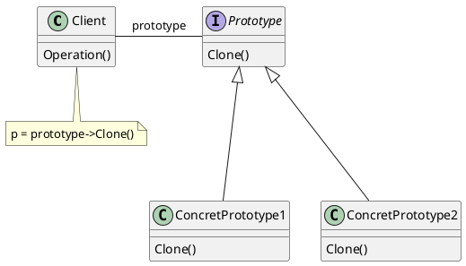
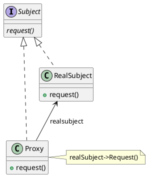
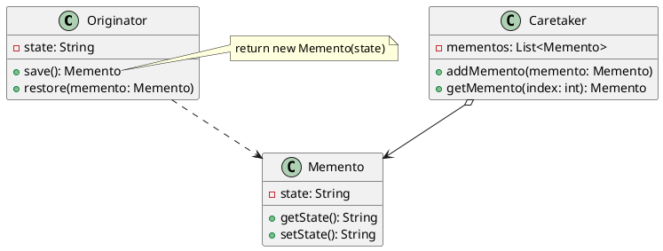
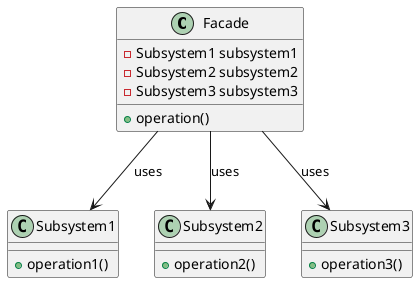
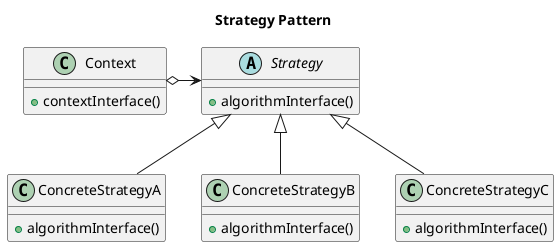
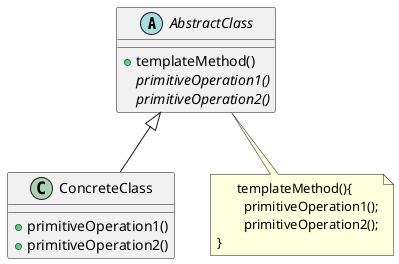
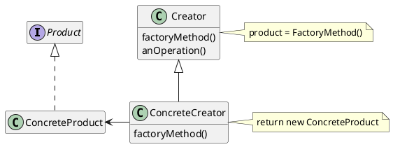
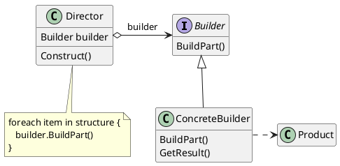
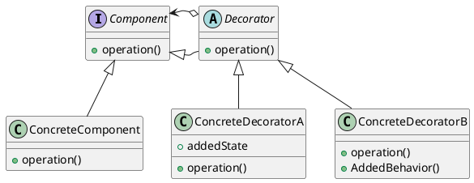

# 1. Prototype

## Intensão
- Especificar os tipos de objetos a serem criados usando uma instância-protótipo e criar novos objetos pela cópia desse protótipo.
## Estrutura
<figure>

<figcaption>Estrutura Prototype</figcaption>
</figure>

## Participantes
- **Prototype(Peca)** 
    - declara uma interface para clonar a si próprio.

- **ConcretePrototype(Dama, Peao, Torre)**
    - implementa uma operação para clonar a si próprio

- **Client(Main)** 
    - cria um novo objeto solicitando a um protótipo que clone a si próprio.
## Utilização
- Esse padrão é útil para clonar instancias de pecas de Xadrez e Damas com configurações especificas. Todas as pecas que herdam da classe Peca tem um método clonarPeca() que retorna uma instancia com os mesmos atributos.

## Código do framework

@[Peca](./code/TiposDePecas/Peca.java)
@[Dama](./code/TiposDePecas/Dama.java)
@[Peao](./code/TiposDePecas/Peao.java)
@[Torre](./code/TiposDePecas/Torre.java)

# 2. Proxy

## Intensão
- Fornece um substituto (surrogate) ou marcador da localização de outro objeto paracontrolar o acesso a esse objeto.
## Estrutura
<figure>

<figcaption>Estrutura Proxy</figcaption>
</figure>

## Participantes
- **Proxy (PecaProxy)** 
    - mantém uma referência que permite ao proxy acessar o objeto real (real
    subject). O proxy pode referenciar um Subject se as interfaces de RealSubject
    e Subject forem as mesmas;
    - fornece uma interface idêntica a de Subject, de modo que o proxy possa
    substitur o objeto real (real subject).
    - controla o acesso ao objeto real e pode ser responsável pela sua criação e
    exclusão.
    - outras responsabilidades dependem do tipo de proxy:
    - remote proxies são responsáveis pela codificação de uma solicitação e de
    seus argumentos, bem como pelo envio da solicitação codificada para o
    objeto real num espaço de endereçamento diferente;
    - virtual proxies podem manterinformações adicionais sobre o objeto real,
    de maneira que possam postergar o acesso ao mesmo. Por exemplo, o
    ImageProxy da seção Motivação armazena a extensão da imagem real;
    - protection proxies verificam se quem chama tem as permissões de acesso
    requeridas para executar uma consulta.

- **Subject (Peca)**
    - define uma interface comum para RealSubject e Proxy, de maneira que um
    Proxy possa ser usado em qualquer lugar em que um RealSubject é
    esperado.

- **RealSubject (Dama, Peao, Torre)**
    - Define o objeto real que o proxy representa.
## Utilização
- O padrão proxy foi usado para fazer a verificação dos movimentos das pecas antes que elas se movam dentro do tabuleiro. PecaProxy checa se a peca não vai se movimentar para fora dos limites do tabuleiro.

## Código do framework
@[PecaProxy](./code/TiposDePecas/PecaProxy.java)
@[Peca](./code/TiposDePecas/Peca.java)
@[Dama](./code/TiposDePecas/Dama.java)
@[Peao](./code/TiposDePecas/Peao.java)
@[Torre](./code/TiposDePecas/Torre.java)

# 3. Memento

## Intensão
- O Memento é um padrão de projeto comportamental que permite que você salve e restaure o estado anterior de um objeto sem revelar os detalhes de sua implementação.
## Estrutura
<figure>

<figcaption>Estrutura Memento</figcaption>
</figure>

## Participantes
- **Memento (Estado)**
    - armazena o estado interno do objeto Originator. O memento pode armazenar pouco ou muito do estado interno do originator, conforme necessário
    e segundo critérios do seu originador.
    - protege contra acesso por objetos que não o originador. Mementos têm
    efetivamente duas interfaces. O Caretaker vê uma interface mínima do
    memento – ele somente pode passar o memento para outros objetos. O
    originador, diferentemente, vê uma interface ampla, que lhe permite acessar
    todos os dados necessários para se restaurar ao seu estado prévio.
    Idealmente, somente o originador que produziu o memento teria o acesso
    permitido ao seu estado interno.

- **Originator (Dama, Peao, Torre)**
    - cria um memento contendo um instantâneo do seu estado interno corrente.
    - usa o memento para restaurar o seu estado interno.

- **Caretaker (EstadosPeca)**
    - é responsável pela custódia do memento.
    - nunca opera ou examina os conteúdos de um memento.

## Utilização
- O Memento age como um savestate dentro do framework, permitindo quê a cada movimento o local e o estado da peca seja salvo. A classe Peca pode salvar e restaurar seu estado. Estado representa um estado da peca e EstadosPeca salva vários estados de uma peca juntos.

## Código do framework
@[Peca](./code/TiposDePecas/Peca.java)
@[Estado](./code/SalvarJogo/Estado.java)
@[EstadosPeca](./code/SalvarJogo/EstadosPeca.java)

# 4. Façade

## Intensão
- Fornecer uma interface unificada para um conjunto de interfaces em um subsistema. Façade define uma interface de nível mais alto que torna o subsistema mais fácil de ser usado.
## Estrutura
<figure>

<figcaption>Estrutura Façade</figcaption>
</figure>

## Participantes
- **Façade (InterfaceJogo)**
    - conhece quais as classes do subsistema são responsáveis pelo atendimento
    de uma solicitação;
    - delega solicitações de clientes a objetos apropriados do subsistema.
- **Classes de subsistema (Todas as outras)**
    - implementam a funcionalidade do subsistema;
    - encarregam-se do trabalho atribuído a elas pelo objeto Façade;
    - não têm conhecimento da façade; isto é, não mantêm referências para a
    mesma.

## Utilização
- O Façade serve para criar uma interface que oculta as implementações mais complexas do jogador final. InterfaceJogo cria uma fachada para facilitar que o usuário final tenha facilidade em usar o framework.

## Código do framework
@[InterfaceJogo](./code/Fachada/InterfaceJogo.java)

# 5. Strategy

## Intensão
- Definir uma família de algoritmos, encapsular cada uma delas e torná-las intercambiáveis. Strategy permite que o algoritmo varie independentemente dos clientes que o utilizam.
## Estrutura
<figure>

<figcaption>Estrutura Strategy</figcaption>
</figure>

## Participantes
- **Strategy(Movimento)**
    - define uma interface comum para todos os algoritmos suportados. Context
    usa esta interface para chamar o algoritmo definido por uma
    ConcreteStrategy.

- **ConcreteStrategy(MovimentoCima, MovimentoBaixo, etc...)**
    - implementa o algoritmo usando a interface de Strategy.

- **Context (Main)**
    - é configurado com um objeto ConcreteStrategy;
    - mantém uma referência para um objeto Strategy;
    - pode definir uma interface que permite a Strategy acessar seus dados.
## Utilização
- Esse padrão serve para criar diferentes estrategias de movimentos para serem usadas pelas pecas de Xadrez e Damas. 

## Código do framework
@[Peca](./code/TiposDePecas/Peca.java)
@[Movimento](./code/Movimentos/Movimento.java)
@[MovimentoDiagonalDireita](./code/Movimentos/MovimentoDiagonalDireita.java)
@[MovimentoCima](./code/Movimentos/MovimentoCima.java)

# 6. Template Method

## Intensão
- O template method tem como objetivo definir o esqueleto de um algortimo em uma operação, que poderá ser utilizado por uma subclasse.
## Estrutura
<figure>

<figcaption>Estrutura Template Method</figcaption>
</figure>

## Participantes
- **AbstractClass (Tabuleiro)**
    - define operações primitivas abstratas que as subclasses concretas definem
    para implementar passos de um algoritmo.
    - implementa um método-template que define o esqueleto de um algoritmo.
    O método-template invoca operações primitivas, bem como operações
    definidas em AbstractClass ou ainda outros objetos. 
- **ConcreteClass (TabuleiroConcreto)**
    - implementa as operações primitivas para executarem os passos específicos
    do algoritmo da subclasse.

## Utilização
- Esse padrão cria um método de template para inicializar um tabuleiro.

## Código do framework
@[Tabuleiro](./code/Tabuleiro.java)
@[TabuleiroConcreto](./code/TabuleiroConcreto.java)

# 7. Factory Method

## Intensão
- Definir uma interface para criar um objeto, mas deixar as subclasses decidirem que classe instanciar. O Factory Method permite adiar a instanciação para subclasses.
## Estrutura
<figure>

<figcaption>Estrutura Factory Method</figcaption>
</figure>

## Participantes
- **Product(Peca)**
    - define a interface de objetos que o método fábrica cria.
- **ConcreteProduct(Dama, Peao, Torre)** 
    -  implementa a interface de Product.
- **Creator(PecaBuilder)** 
    - Declara o método fábrica, o qual retorna um objeto do tipo Product. Creator
    pode também definir uma implementação por omissão do método factory
    que retorna por omissão um objeto ConcreteProduct.
    - Pode chamar o método factory para criar um objeto Product.
- **ConcreteCreator(DamaBuilder, PeaoBuilder, TorreBuilder)**
    - Redefine o método-fábrica para retornar a uma instância de um
    ConcreteProduct.
## Utilização

- O Factory Method é usado para retornar um produto concreto por meio de uma fábrica concreta. Nessa caso, Damabuilder é uma fábrica concreta que retorna um produto concreto que é uma peca de dama.

## Código do framework
@[Peca](./code/TiposDePecas/Peca.java)
@[Dama](./code/TiposDePecas/Dama.java)
@[PecaBuilder](./code/TiposDePecas/PecaBuilder.java)
@[DamaBuilder](./code/TiposDePecas/DamaBuilder.java)
@[Peao](./code/TiposDePecas/Peao.java)
@[PeaoBuilder](./code/TiposDePecas/PeaoBuilder.java)
@[Torre](./code/TiposDePecas/Torre.java)
@[TorreBuilder](./code/TiposDePecas/TorreBuilder.java)

# 8. Builder

## Intensão
- Separar a construção de um objeto complexo da sua representação de modo que o mesmo processo de construção possa criar diferentes representações.
## Estrutura
<figure>

<figcaption>Estrutura Builder</figcaption>
</figure>

## Participantes
- **Builder(PecaBuilder)**
    - define uma interface com as configurações em comum para todos os objetos que são baseados nesse Builder. Director usa esta interface para chamar o método definido por um ConcreteBuilder.
- **ConcreteBuilder(DamaBuilder, PeaoBuilder, TorreBuilder)** 
    - implementa métodos para a construção e montagem em partes do produto, usando a interface de Builder.
    - Não expõe o produto durante a montagem, mantém a representação até o objeto ser recuperado.
    - ConcreteBuilders devem fornecer seus próprios métodos para recuperar os resultados de construções, já que os produtos gerados podem ser completamente diferentes.
- **Director(Main)**   
    - Mantém uma instancia de um Builder passado pelo cliente.
    - Implementa métodos visando a execução sequencial correta e a organização das etapas de configuração para cada tipo de situação.
    - **Não é estritamente necessário**, é possivel que o padrão seja implementado com o cliente assumindo um papel parecido com o de director.

- **Product(Dama, Peao, Torre)** 
    - representa o objeto complexo em construção. ConcreteBuilder constrói a representação interna do produto e define o as etapas de montagem;
    - inclui classes que definem as diversas partes que constituem o objeto complexo, inclusive as interfaces para a montagem das partes no resultado final.
## Utilização

- Nesse caso o Padrão builder foi usado para constuir cada produto concreto que são as pecas de Xadez e Damas, com um builder especifico para cada um.

## Código do framework
@[Peca](./code/TiposDePecas/Peca.java)
@[Dama](./code/TiposDePecas/Dama.java)
@[PecaBuilder](./code/TiposDePecas/PecaBuilder.java)
@[DamaBuilder](./code/TiposDePecas/DamaBuilder.java)
@[Peao](./code/TiposDePecas/Peao.java)
@[PeaoBuilder](./code/TiposDePecas/PeaoBuilder.java)
@[Torre](./code/TiposDePecas/Torre.java)
@[TorreBuilder](./code/TiposDePecas/TorreBuilder.java)

# 9. Decorator

## Intensão
- Dinamicamente, agregar responsabilidades adicionais a um objeto. Os Decorators fornecem uma alternativa flexível ao uso de subclasses para extensão de funcionalidades.
## Estrutura
<figure>

<figcaption>Estrutura Decorator</figcaption>
</figure>

## Participantes
- **Component(Peca)**
    - define a interface para objetos que podem ter responsabilidades acrescentadas aos mesmos dinamicamente.
- **ConcreteComponent(Peao)**
    - define um objeto para o qual responsabilidades adicionais podem ser
    atribuídas.
- **Decorator()**
    - mantém uma referência para um objeto Component e define uma interface
    que segue a interface de Component.
- **ConcreteDecorator(PromocaoPeaoDecorator)**
    - acrescenta responsabilidades ao componente.
## Utilização
- O Decorator foi usado para adicionar a funcionalidade de promover um peao ao outra peca no Xadez.

## Código do framework
@[Peao](./code/TiposDePecas/Peao.java)
@[PromocaoPeaoDecorator](./code/TiposDePecas/PromocaoPeaoDecorator.java)
